# Enterprise Domain Build 🔧

## Overview

**Project:** Deploy a fully functional Windows domain environment simulating a small business IT infrastructure
**Type:** Home Lab / System Administration
**Focus:** Active Directory, DNS, Group Policy, NTFS permissions, domain join, RBAC

---

## Table of Contents

| # | Section | What's Covered |
|:--|:--------|:---------------|
| 1 | [VMware Network Configuration](#1-vmware-network-configuration) | Isolated host-only network, subnet design |
| 2 | [Domain Controller Deployment](#2-domain-controller-deployment-dc01) | Static IP, DNS config |
| 3 | [AD DS Installation & Promotion](#3-active-directory-domain-services-installation) | Forest creation, DSRM, domain verification |
| 4 | [OU Structure Design](#4-organizational-unit-ou-design) | Enterprise OU hierarchy |
| 5 | [Security Groups & Users](#5-security-groups--user-provisioning) | RBAC model, admin account, department users |
| 6 | [File Shares & NTFS Hardening](#6-file-shares--ntfs-permission-hardening) | Dual-layer permissions, inheritance control |
| 7 | [Domain Join & Access Testing](#7-domain-join--access-control-validation) | Client setup, Kerberos auth, permission validation |
| 8 | [Troubleshooting](#8-troubleshooting--misconfigured-share-path) | Diagnosing and fixing a misconfigured share |

---

## Lab Architecture

```
┌──────────────────────────────────────────────────────────┐
│              VMnet2 — Host-Only Network                  │
│              Subnet: 192.168.10.0/24                     │
│              DHCP: Disabled                              │
│                                                          │
│   ┌──────────────────────┐    ┌─────────────────────┐    │
│   │  DC01                │    │  WS01               │    │
│   │  Windows Server 2025 │    │  Windows 11 Ent.    │    │
│   │  192.168.10.10       │    │  192.168.10.20      │    │
│   │  AD DS · DNS         │    │  Domain-joined      │    │
│   │  File Shares         │    │  6 GB RAM · 2 vCPU  │    │
│   │  6 GB RAM · 4 vCPU   │    │                     │    │
│   └──────────────────────┘    └─────────────────────┘    │
│            ▲                              │              │
│            └────── Kerberos · DNS ────────┘              │
└──────────────────────────────────────────────────────────┘
```

| Machine | OS | IP | Role |
|:--------|:---|:---|:-----|
| DC01 | Windows Server 2025 Datacenter (Eval) | 192.168.10.10 | Domain Controller, DNS, File Server |
| WS01 | Windows 11 Enterprise (Eval) | 192.168.10.20 | Domain-joined workstation |

---

## My Process

### 1) VMware Network Configuration

I created an isolated host-only network in VMware Workstation Pro to simulate an internal corporate LAN. DHCP was disabled so the Domain Controller handles all DNS resolution and IP addressing is manually controlled.

| Setting | Value |
|:--------|:------|
| Network | VMnet2 — Host-only |
| Subnet | 192.168.10.0 /24 |
| DHCP | Disabled |

---

### 2) Domain Controller Deployment (DC01)

I provisioned a Windows Server 2025 VM with 4 vCPUs and 6 GB RAM, then configured a static IP address. DNS points to itself because once AD DS is installed, this server becomes the authoritative DNS server for the domain.

```
IP Address:    192.168.10.10
Subnet Mask:   255.255.255.0
Gateway:       (none — isolated network)
DNS Server:    192.168.10.10  ← Points to itself
```

I verified the configuration with `ipconfig`:

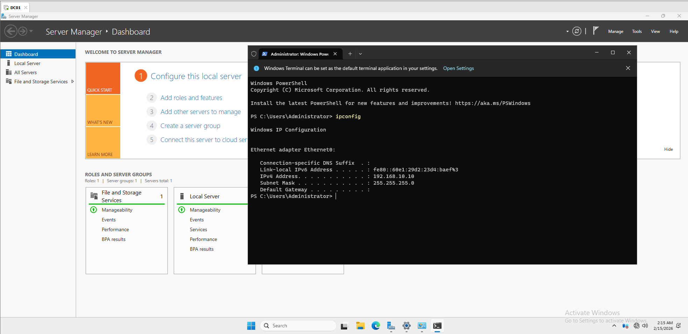

**Why DNS points to itself:** Active Directory is completely dependent on DNS for service location (SRV records). If DNS is misconfigured, domain promotion fails. This is the most common beginner mistake when setting up AD.

---

### 3) Active Directory Domain Services Installation

**i.** With the static IP confirmed, I installed the AD DS role through Server Manager → Add Roles and Features:

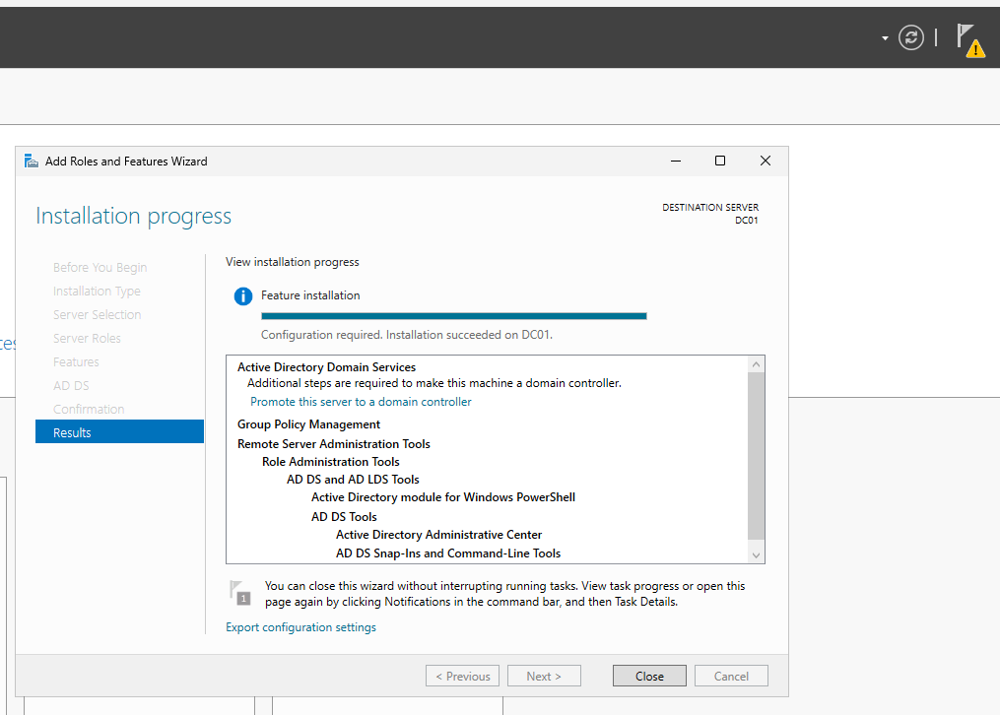

**ii.** I promoted the server to a Domain Controller. I selected **Add a new forest** and set the root domain name to `corp.local`:

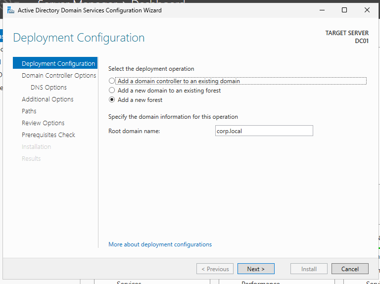

**iii.** I configured the Domain Controller options and set the DSRM recovery password:

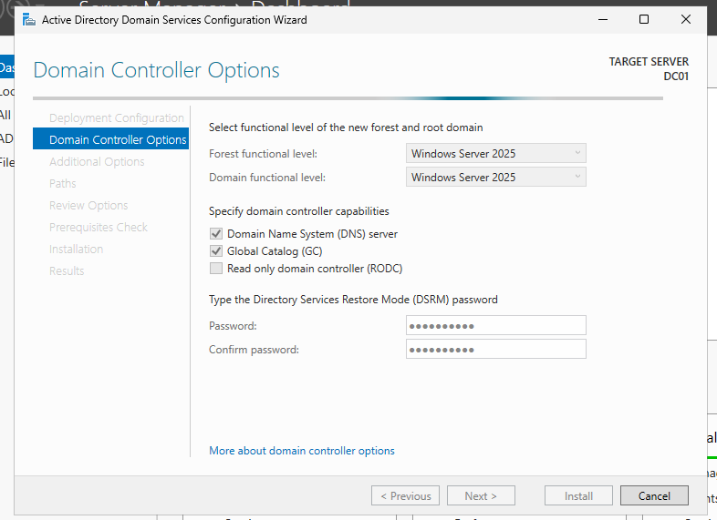

**iv.** After the server rebooted, the login screen confirmed the domain was live — showing `CORP\Administrator` instead of a local account:

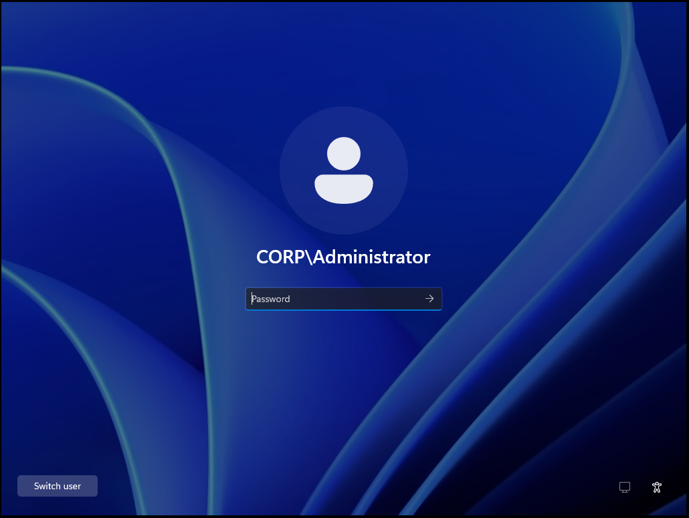

**v.** I verified the domain was functioning by running `whoami` → `corp\administrator`.

---

### 4) Organizational Unit (OU) Design

Instead of using the default AD containers, I designed a realistic enterprise OU hierarchy that separates admin accounts, service accounts, workstations, servers, and departments. The underscore prefix keeps custom OUs sorted above default containers.

```
corp.local
 ├── _Admins
 │    └── itadmin (Domain Admins + IT_Admins)
 ├── _ServiceAccounts
 ├── _Workstations
 ├── _Servers
 ├── _Departments
 │    ├── HR         → jsmith, mgarcia
 │    ├── Finance    → rlee, ppatel
 │    ├── IT         → tnguyen, adavis
 │    └── Sales      → cjohnson, lmartin
 └── _SecurityGroups
      ├── HR_Share_Modify
      ├── Finance_Share_Modify
      ├── IT_Admins
      └── All_Employees
```

**i.** Here is the top-level OU structure inside Active Directory Users and Computers:

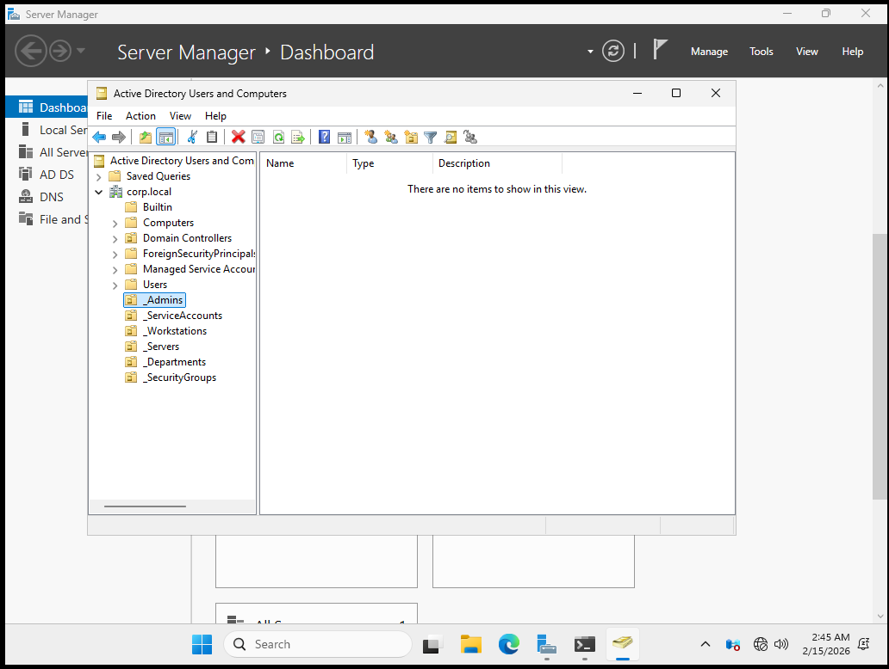

**ii.** And the department sub-OUs nested under `_Departments`:

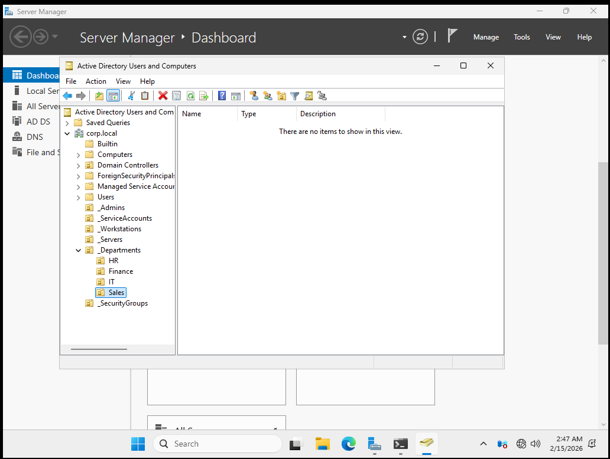

---

### 5) Security Groups & User Provisioning

I created security groups **before** creating users — permissions always attach to groups, not individuals. This follows the Role-Based Access Control (RBAC) model used in enterprise environments.

| Group | Scope | Type | Purpose |
|:------|:------|:-----|:--------|
| HR_Share_Modify | Global | Security | HR file share access |
| Finance_Share_Modify | Global | Security | Finance file share access |
| IT_Admins | Global | Security | Elevated IT privileges |
| All_Employees | Global | Security | Company-wide read access |

**i.** All four groups created in the `_SecurityGroups` OU:


**ii.** I created a dedicated **itadmin** account in the `_Admins` OU and added it to both `Domain Admins` and `IT_Admins` — rather than using the built-in Administrator account. In production, the built-in Administrator is often disabled or renamed:

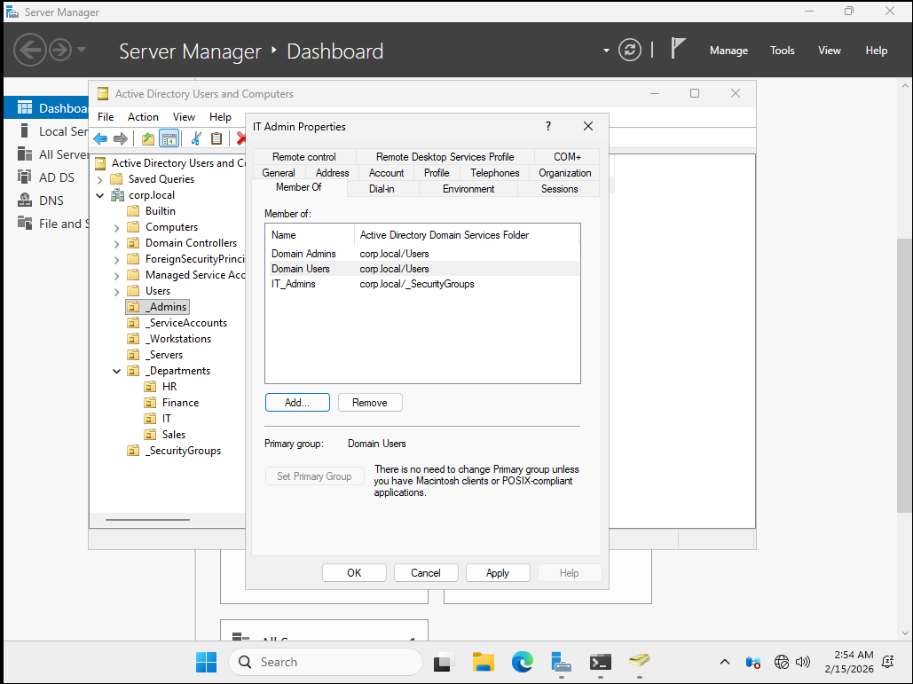

**iii.** Users were created in each department OU using enterprise naming format (first initial + last name), then added to their corresponding security groups:

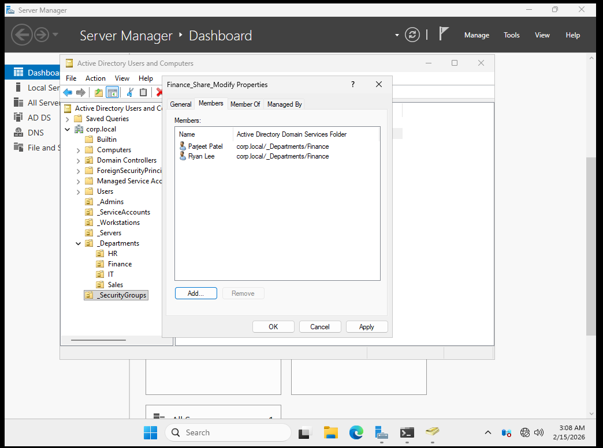

---

### 6) File Shares & NTFS Permission Hardening

Each folder was configured with **both** share-level and NTFS permissions — most beginners only configure one layer.

**i.** I created a centralized file share structure at `C:\Shares` with department-level isolation:

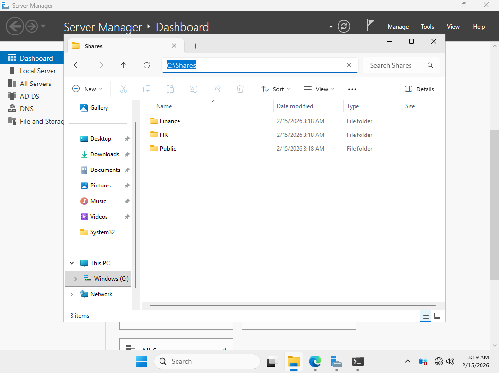

| Share | Security Group | Share Permission | NTFS Permission |
|:------|:---------------|:-----------------|:----------------|
| HR | HR_Share_Modify | Change + Read | Modify |
| Finance | Finance_Share_Modify | Change + Read | Modify |
| Public | All_Employees | Read | Read |

**ii.** I configured the HR share via Advanced Sharing, removing `Everyone` and adding only `HR_Share_Modify` with Change + Read:

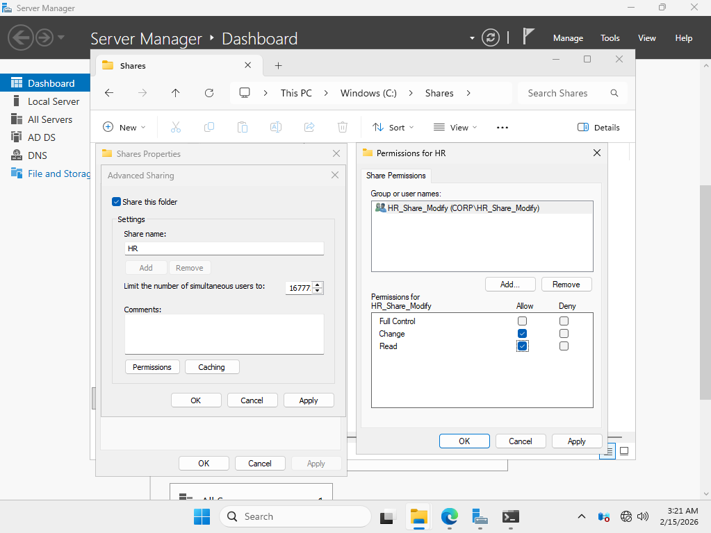

**iii.** For NTFS, I disabled inheritance (converting to explicit permissions), removed `CORP\Users`, and kept only **SYSTEM**, **Administrators**, **CREATOR OWNER**, and the department security group with Modify:

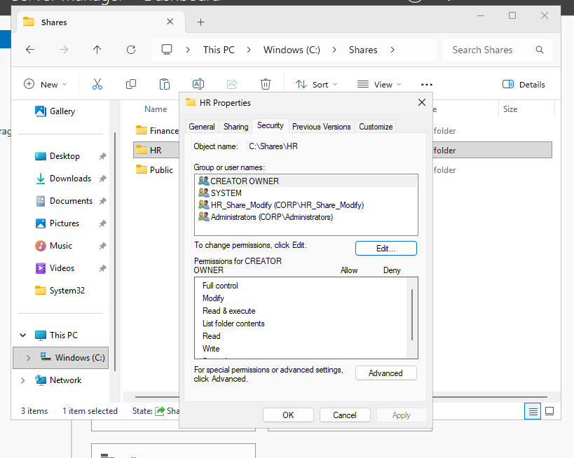

**iv.** I repeated this process for Finance and Public (Public uses Read instead of Modify).

**Key concept:** Share permissions control network-level access, NTFS permissions control file system-level access. The effective (actual) permission is the **most restrictive** combination of both. This is what Help Desk technicians troubleshoot daily.

---

### 7) Domain Join & Access Control Validation

**i.** I deployed a Windows 11 Enterprise workstation (WS01) and configured static networking pointed at DC01 for DNS. I verified connectivity with `ipconfig /all` and `ping 192.168.10.10`:


**ii.** I joined the workstation to `corp.local` via `sysdm.cpl` using `corp\itadmin` credentials and received the domain welcome confirmation:

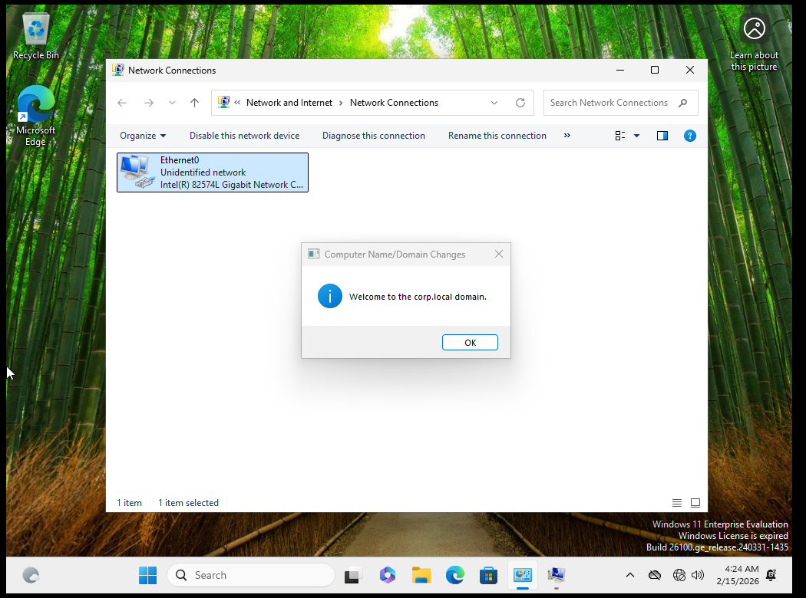

**iii.** After rebooting, I logged in as domain user `corp\jsmith` (HR department) to test Kerberos authentication:

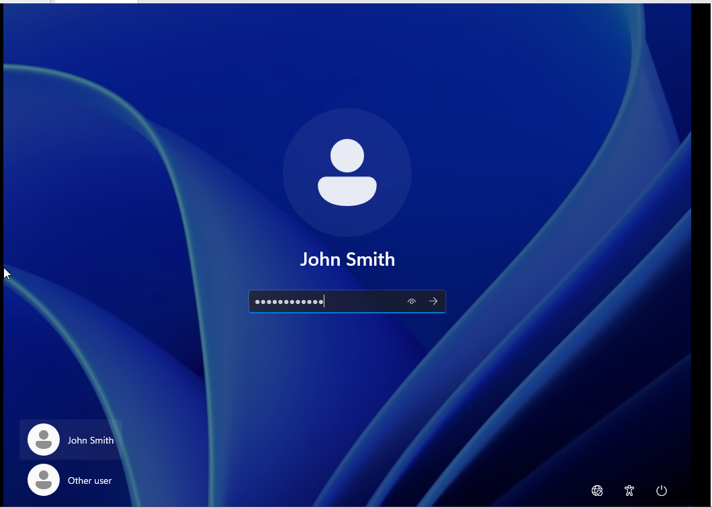

**iv.** I navigated to `\\DC01` from File Explorer and confirmed all three shares were visible:

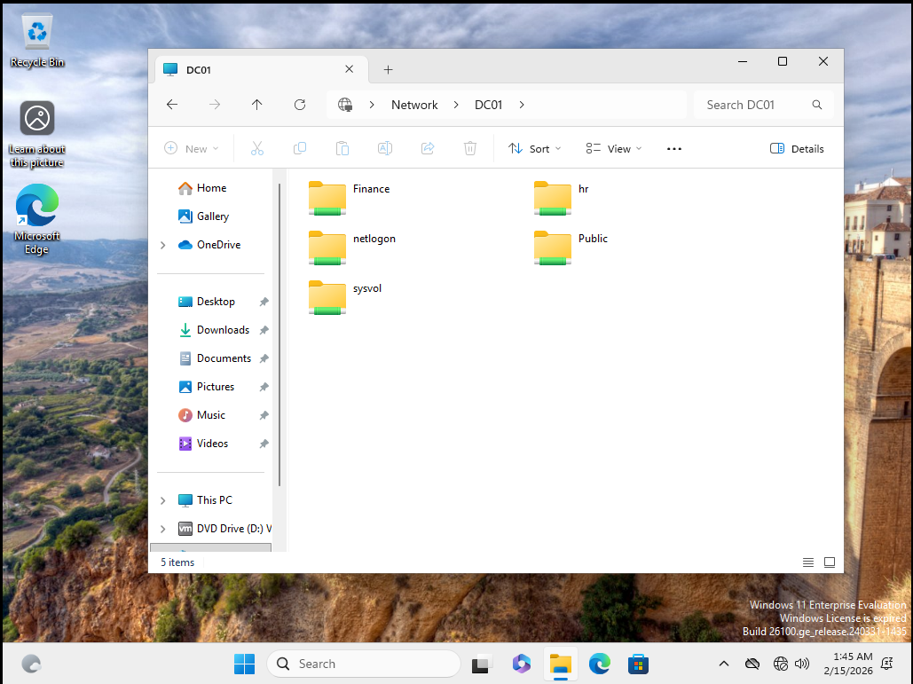

**v.** Opening the HR share — access granted as expected for an HR user:

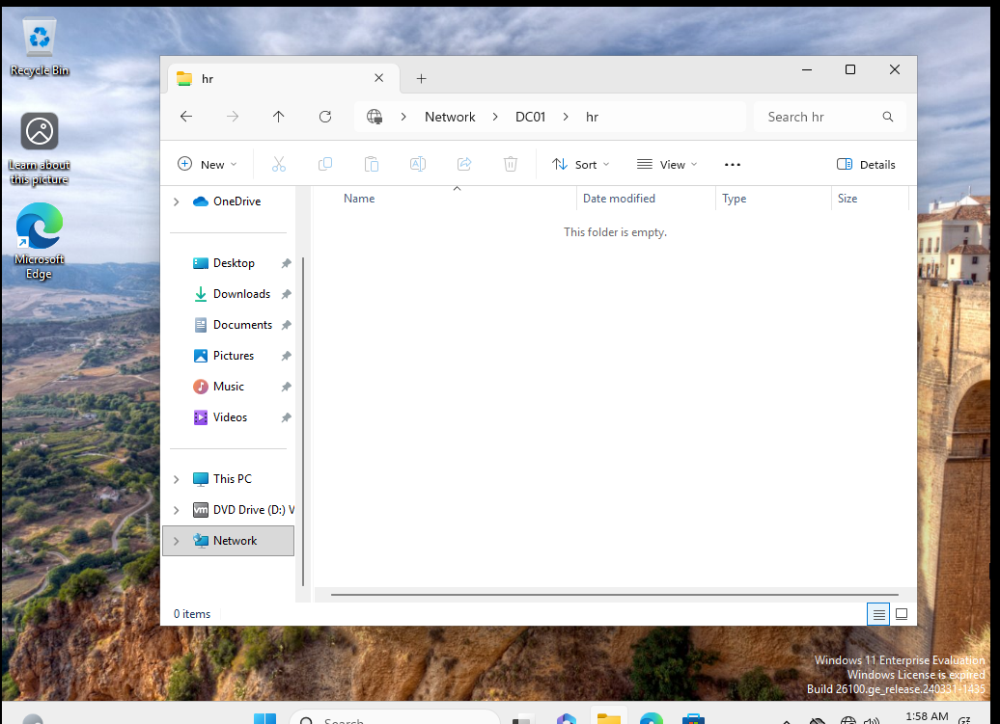

**vi.** Attempting to open the Finance share — access denied, confirming department isolation:

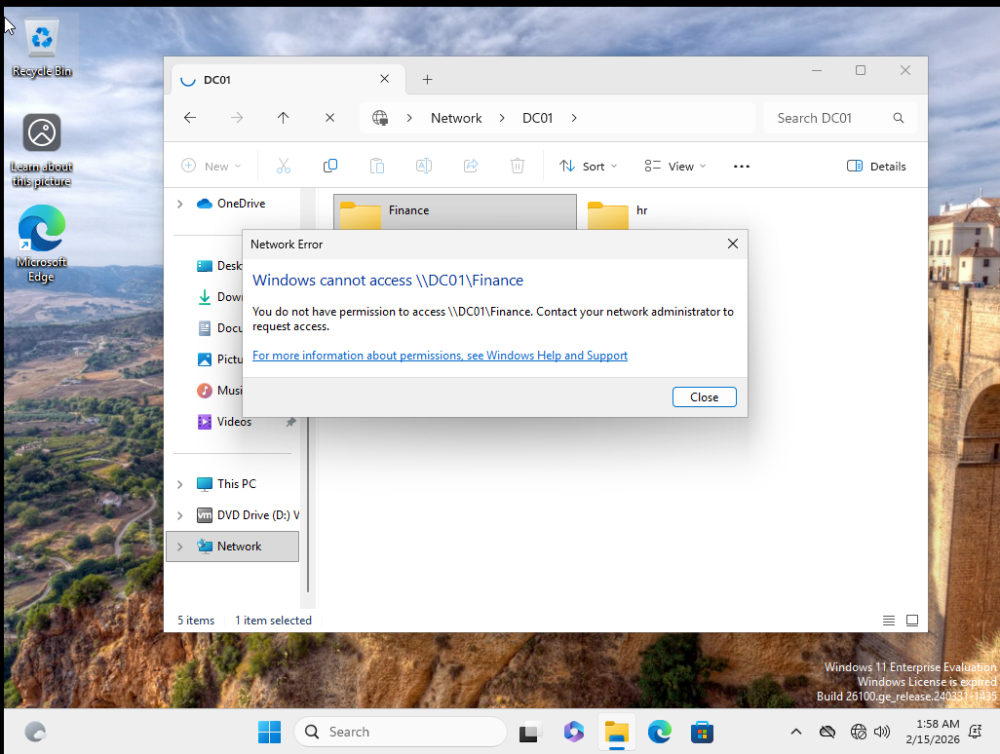

**vii.** Attempting to create a file in Public — write denied, confirming read-only enforcement:

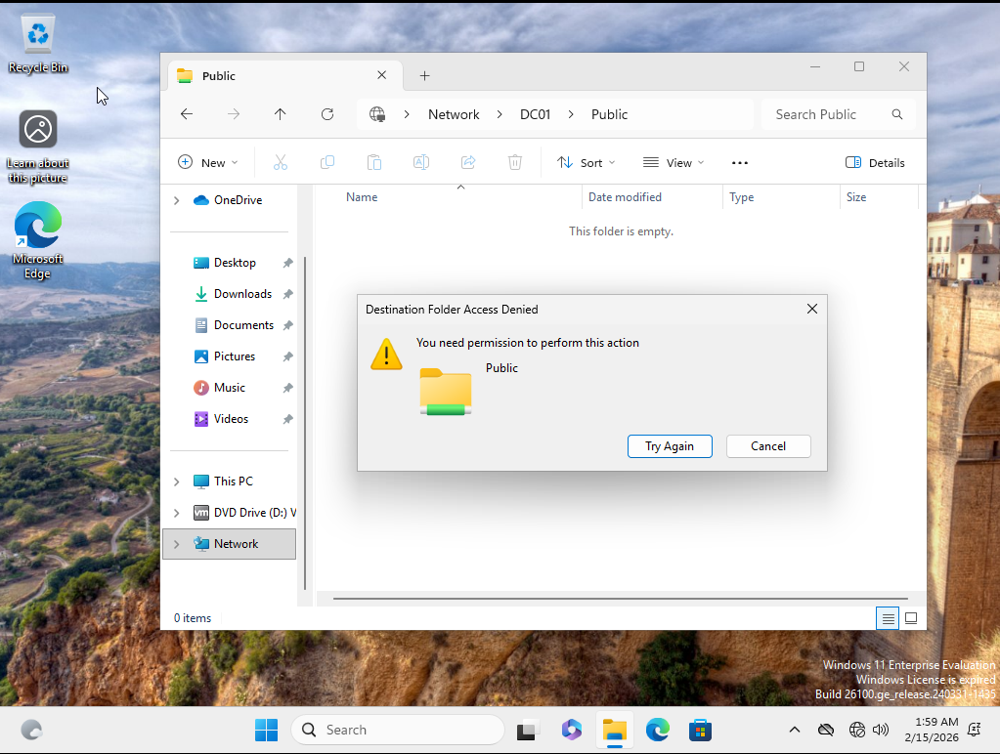

**Test results summary:**

| Share | Expected | Result |
|:------|:---------|:-------|
| `\\DC01\HR` | Access granted | ✅ Access granted |
| `\\DC01\Finance` | Access denied | ✅ Access denied |
| `\\DC01\Public` | Read-only | ✅ Write denied |

---

### 8) Troubleshooting — Misconfigured Share Path

During testing, the HR share was exposing all department folders instead of just HR contents. I diagnosed the root cause and corrected it.

**Problem:** The HR share was pointing to `C:\Shares` (parent directory) instead of `C:\Shares\HR`, so opening `\\DC01\HR` showed Finance, HR, and Public folders.

**Resolution:**

**i.** Opened Shared Folders Manager: `fsmgmt.msc`

**ii.** Identified the incorrect share path under the Shares list

**iii.** Stopped sharing the misconfigured entry

**iv.** Re-shared `C:\Shares\HR` with correct permissions

**v.** Verified from WS01 — HR share now shows correct contents

This is the exact type of issue Help Desk and Tier 2 support resolves in production environments. Misconfigured shares can expose sensitive department data to unauthorized users.

---

## Key Findings

* Deployed a fully functional Windows domain with AD DS, DNS, and centralized file shares
* Designed an enterprise OU structure with proper separation of admin, user, and service accounts
* Implemented RBAC using security groups — permissions assigned to groups, never directly to users
* Configured dual-layer permissions (Share + NTFS) with inheritance disabled and least privilege enforced
* Successfully joined a Windows 11 workstation to the domain and validated Kerberos authentication
* Tested and confirmed department-level access isolation across all file shares
* Diagnosed and corrected a share misconfiguration using `fsmgmt.msc`

---

## Skills Demonstrated

* Windows Server administration (roles, features, promotion)
* Active Directory Domain Services (forests, OUs, users, groups)
* DNS configuration and troubleshooting
* Static IP addressing and network segmentation
* NTFS and share permission management
* Inheritance control and permission hardening
* Domain join and Kerberos authentication
* Troubleshooting with `fsmgmt.msc`, `ipconfig`, `whoami`, `ping`
* VMware Workstation Pro virtual networking

---

[← Back to Lab Overview](README.md) · [← Back to Portfolio](../README.md)
