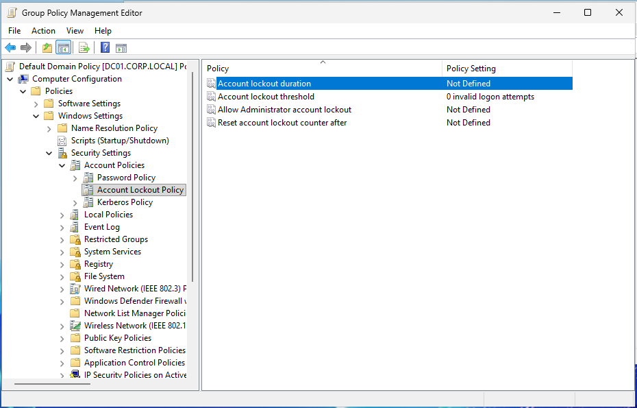
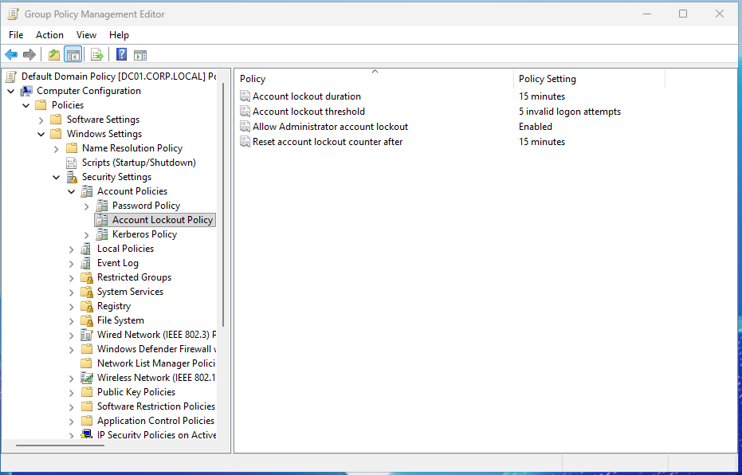
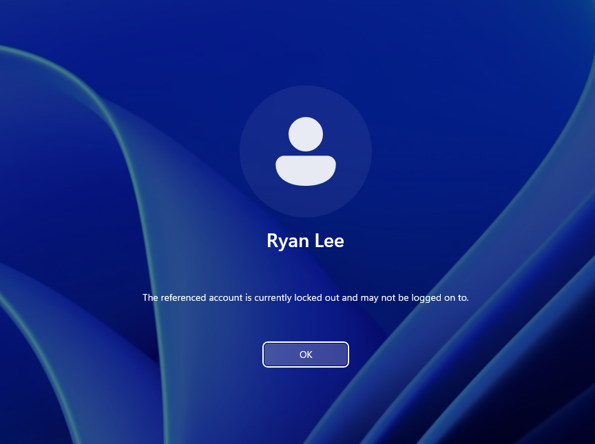
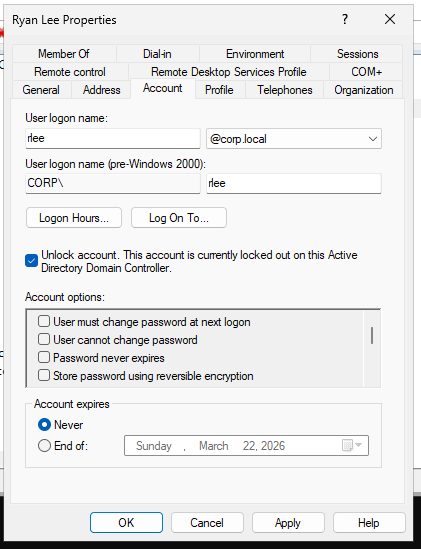
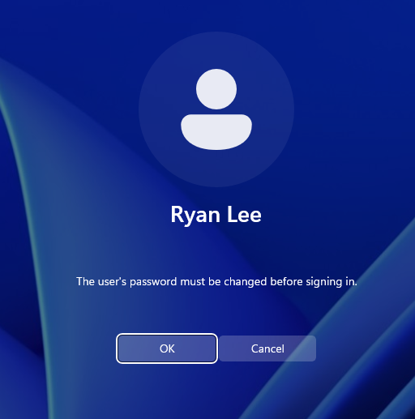
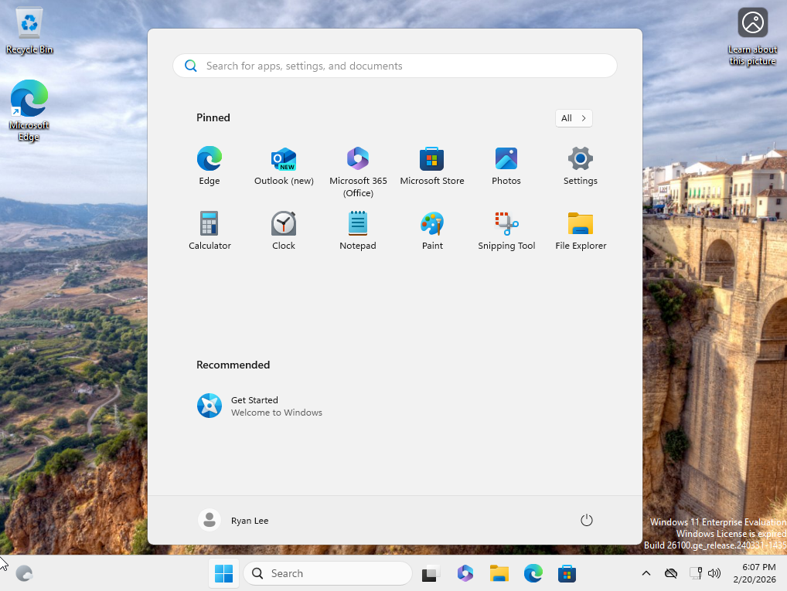

# Ticket #001 — Account Lockout & Password Reset 🔐

**Ticket:** `#001`
**User:** `corp\rlee` (Ryan Lee — Finance Department)
**Reported Issue:** "I'm locked out of my account."

---

## Pre-Ticket Configuration — Account Lockout Policy

Before simulating any lockout tickets, I checked the Default Domain Policy and found that **no account lockout policy was configured** — the threshold was set to 0 invalid logon attempts. This is actually a common finding in environments where default settings haven't been hardened.



*Default Domain Policy showing Account Lockout Policy with no threshold defined — accounts cannot be locked out.*

I configured a proper lockout policy via Group Policy Management by editing the Default Domain Policy:

| Setting | Value |
|:--------|:------|
| Account lockout threshold | 5 invalid logon attempts |
| Account lockout duration | 15 minutes |
| Reset account lockout counter after | 15 minutes |
| Allow Administrator account lockout | Enabled |



*Account Lockout Policy configured with 5-attempt threshold, 15-minute lockout duration, and 15-minute reset counter.*

After configuring the policy, I forced a policy update on both DC01 and WS01:

```
gpupdate /force
```

Then verified propagation on the workstation using:

```
gpresult /r
```

This confirmed the Default Domain Policy was applied successfully to WS01.

---

## My Process

### 1) Trigger the Lockout

On WS01, I logged out and attempted to sign in as `corp\rlee` with an incorrect password 5 times to trigger the lockout threshold.

After the fifth failed attempt, the workstation displayed the lockout message:



*WS01 login screen confirming the account is locked out after 5 failed attempts — policy enforcement validated.*

---

### 2) Confirm Lockout in Active Directory

On DC01, I opened **Active Directory Users and Computers**, navigated to `_Departments → Finance`, and opened the properties for `rlee`.

The Account tab showed the lockout flag was set:



*Ryan Lee's account properties showing "Unlock account" checkbox — confirming the account is currently locked on this Domain Controller.*

---

### 3) Unlock Account and Reset Password

I checked the **Unlock account** box and clicked Apply to clear the lockout flag.

Then I right-clicked the user and selected **Reset Password**, set a temporary password, and checked **User must change password at next logon** — standard Tier 1 procedure:


*Password reset dialog with "User must change password at next logon" enabled. Account lockout status shows Unlocked.*

---

### 4) Validate on Workstation

Back on WS01, I logged in as `corp\rlee` using the temporary password. Windows immediately prompted the user to change their password before signing in:



*WS01 enforcing mandatory password change at next logon — confirming the reset policy is working correctly.*

After setting a new password, the user successfully logged into the desktop:



*Ryan Lee successfully authenticated on WS01 after account recovery — ticket resolved.*

---

## Summary

| Step | Action | Tool |
|:-----|:-------|:-----|
| 1 | Triggered lockout (5 wrong passwords) | WS01 login screen |
| 2 | Verified locked status | ADUC → Account tab |
| 3 | Unlocked account | ADUC → Unlock account checkbox |
| 4 | Reset password with forced change | ADUC → Reset Password |
| 5 | Validated login + password change | WS01 domain login |

---

## Key Takeaways

**Account Lockout Policy** — Windows domains ship with no lockout threshold by default. Identifying and configuring this via Group Policy before it becomes an issue is a proactive security measure that demonstrates understanding beyond basic account management.

**Cached Credentials** — During this lab phase, I observed that domain users can still log in via cached credential hashes even when the DC is unreachable. This is important context for help desk techs: a successful login does not always mean domain connectivity is healthy.

---

## Skills Demonstrated

* Account lockout policy configuration via Group Policy
* GPO propagation verification with `gpupdate /force` and `gpresult /r`
* Account lockout detection, unlock, and password reset in ADUC
* Forced password rotation at next logon
* Client-side validation of account state changes
* Understanding of cached credentials vs. live domain authentication

---

[← Back to Lab Overview](README.md) · [← Back to Portfolio](../README.md)
