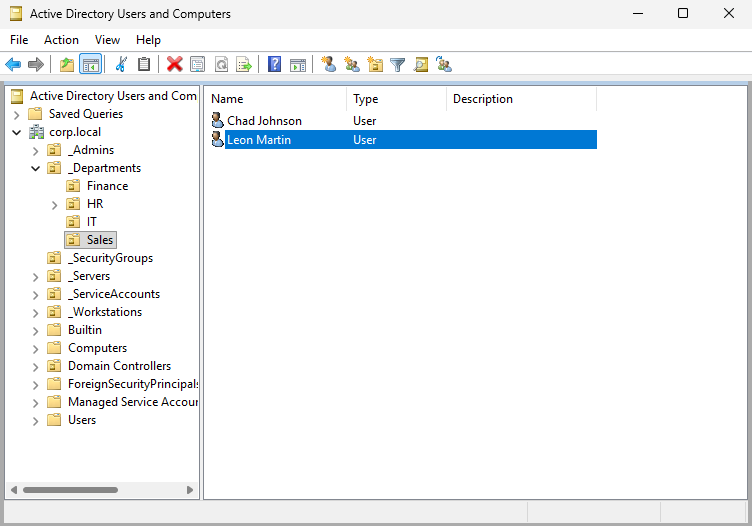
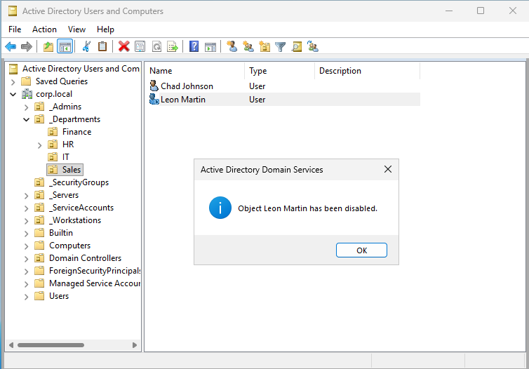
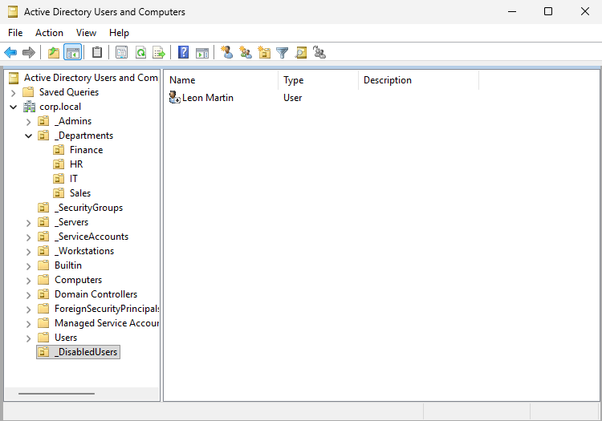
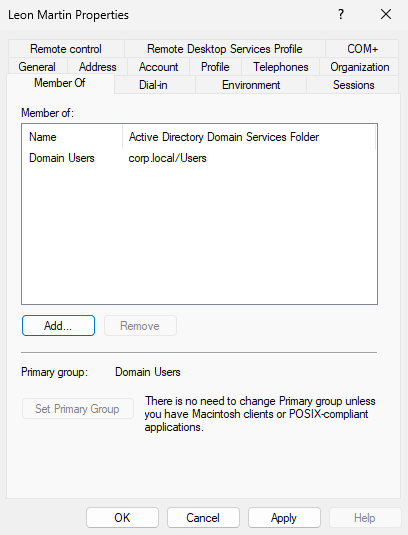
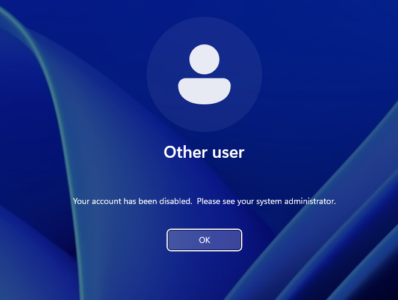

# Ticket #002 — Employee Termination (Offboarding) 🚪

**Ticket:** `#002`
**User:** `corp\lmartin` (Leon Martin — Sales Department)
**Request from HR:** "Employee terminated effective immediately. Disable all access."

---

## My Process

### 1) Confirm Pre-Termination State

On DC01, I opened ADUC and navigated to `_Departments → Sales` to confirm Leon Martin's account was active and present in the correct OU:



*Leon Martin listed as an active user in the Sales OU — pre-termination baseline documented.*

---

### 2) Disable the Account

I right-clicked Leon Martin's account and selected **Disable Account**. Active Directory confirmed the action:



*AD DS confirmation dialog: "Object Leon Martin has been disabled." — immediate access revocation.*

---

### 3) Create Disabled Users OU and Move Account

Following enterprise best practice, I created a `_DisabledUsers` OU at the **root level** of `corp.local` — not inside `_Departments`, because disabled accounts should be separated from active business structure for clean GPO scoping, auditing, and lifecycle management.

I then moved Leon Martin's account into `_DisabledUsers`:



*Leon Martin moved to `_DisabledUsers` OU at the domain root — structured lifecycle management.*

The updated OU structure now includes:

```
corp.local
 ├── _Admins
 ├── _Departments
 │    ├── Finance
 │    ├── HR
 │    ├── IT
 │    └── Sales
 ├── _DisabledUsers         ← Terminated accounts
 │    └── Leon Martin
 ├── _SecurityGroups
 ├── _Servers
 ├── _ServiceAccounts
 └── _Workstations
```

---

### 4) Remove Group Memberships

I opened Leon Martin's properties and removed all security group memberships except **Domain Users** (which cannot be removed as the primary group). This prevents accidental reactivation with permissions still intact:



*Member Of tab showing only Domain Users remaining — all department and security group access revoked.*

---

### 5) Validate Access Denied on Workstation

On WS01, I attempted to log in as `corp\lmartin`. The workstation immediately rejected the login:



*"Your account has been disabled. Please see your system administrator." — termination validated from the client side.*

---

## Summary

| Step | Action | Tool |
|:-----|:-------|:-----|
| 1 | Documented active account state | ADUC → Sales OU |
| 2 | Disabled account | ADUC → Disable Account |
| 3 | Created `_DisabledUsers` OU at root | ADUC → New OU |
| 4 | Moved account to `_DisabledUsers` | ADUC → Move |
| 5 | Removed all group memberships | ADUC → Member Of tab |
| 6 | Validated login denied on WS01 | WS01 login screen |

---

## Key Takeaways

**Offboarding Procedure** — In real environments, disabled accounts are never left in production OUs. Moving them to a dedicated `_DisabledUsers` OU at the domain root ensures clean GPO scoping, simplifies auditing, and prevents accidental reactivation with stale permissions.

**Group Cleanup** — Disabling an account alone isn't enough. If someone reactivates the account without checking group memberships, the user regains all their previous access. Stripping groups during offboarding is a critical security step.

---

## Skills Demonstrated

* Employee termination / offboarding workflow
* Account disablement in Active Directory
* OU lifecycle design (`_DisabledUsers` at domain root)
* Security group membership cleanup during offboarding
* Client-side validation of account state changes
* Understanding of GPO scoping implications for disabled accounts

---

[← Back to Lab Overview](README.md) · [← Back to Portfolio](../README.md)
