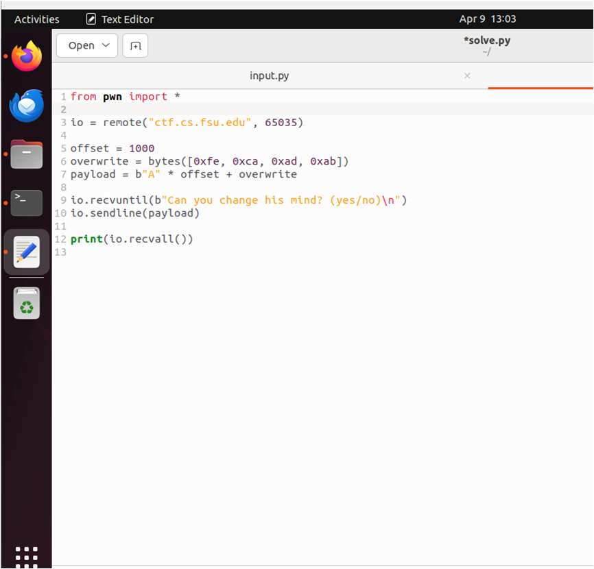
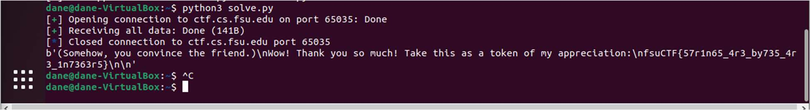
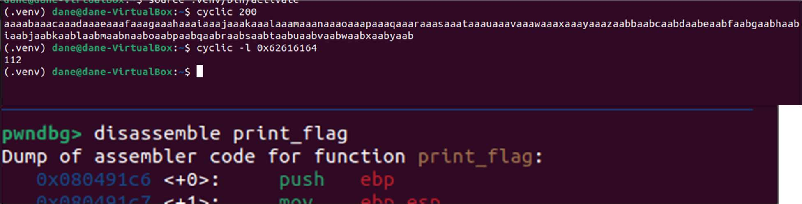
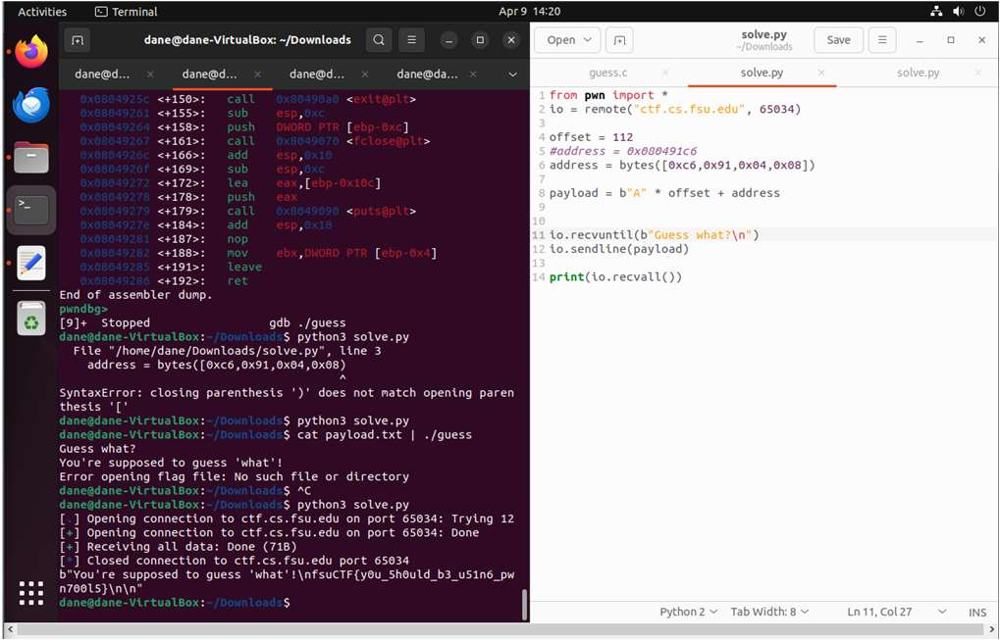
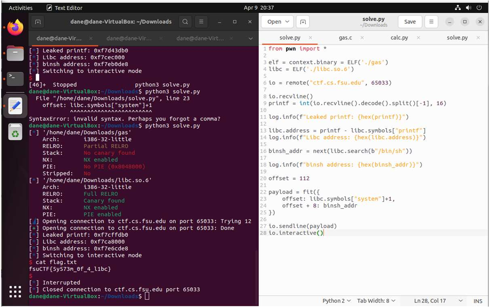

# Binary Exploitation Fundamentals

[← Back to CTF Challenges](README.md) · [← Back to Portfolio](../README.md)

---

## 🔎 Overview
This collection of binary exploitation challenges covers fundamental memory corruption vulnerabilities including buffer overflows, return address overwriting, and Return-Oriented Programming (ROP) techniques.

**Source:** FSU CTF Course - Binary Exploitation Module  
**Difficulty:** Advanced

---

## 📊 Challenge Summary

| Challenge | Flag | Vulnerability | Difficulty |
|:----------|:-----|:--------------|:----------:|
| Nums | `fsuCTF{57r1n65_4r3_by735_4r3_1n7363r5}` | Buffer Overflow (Variable Overwrite) | ⭐⭐⭐ |
| Guess | `fsuCTF{y0u_5h0uld_b3_u51n6_pwn700l5}` | Buffer Overflow (Return Address) | ⭐⭐⭐⭐ |
| Gas | `fsuCTF{5y573m_0f_4_l1bc}` | ret2libc / ROP Chain | ⭐⭐⭐⭐⭐ |

---

## 🧩 Challenge 1: Nums

**Category:** Buffer Overflow, Variable Overwrite  
**Flag:** `fsuCTF{57r1n65_4r3_by735_4r3_1n7363r5}`  
**Difficulty:** ⭐⭐⭐ Medium

### Tools Used
- **pwntools** - Python exploitation framework

### Approach & Methodology

#### Exploit Development

*pwntools script that overflows buffer and overwrites the friend variable*

**Result:** `fsuCTF{57r1n65_4r3_by735_4r3_1n7363r5}`

---

## 🧩 Challenge 2: Guess

**Category:** Buffer Overflow, Return Address Overwrite  
**Flag:** `fsuCTF{y0u_5h0uld_b3_u51n6_pwn700l5}`  
**Difficulty:** ⭐⭐⭐⭐ Hard

### Tools Used
- **pwndbg/GDB** - Finding offset and function addresses
- **pwntools** - Exploit development

### Approach & Methodology

#### Step 1: Finding the Offset

*Using cyclic pattern and pwndbg to calculate offset to return address*

#### Step 2: Crafting the Exploit

*pwntools script that redirects execution to print_flag function*

**Result:** `fsuCTF{y0u_5h0uld_b3_u51n6_pwn700l5}`

---

## 🧩 Challenge 3: Gas

**Category:** ret2libc, ROP Chain  
**Flag:** `fsuCTF{5y573m_0f_4_l1bc}`  
**Difficulty:** ⭐⭐⭐⭐⭐ Expert

### Tools Used
- **pwntools** - Exploit development and libc interaction

### Approach & Methodology

#### Step 1: Calculating libc Base

*Script calculating libc base address from leaked printf*

#### Step 2: Spawning a Shell

*Successfully spawned shell and retrieved the flag*

**Result:** `fsuCTF{5y573m_0f_4_l1bc}`

---

## 🎯 Skills Matrix

| Skill | Proficiency |
|:------|:------------|
| Buffer Overflow | ⭐⭐⭐⭐⭐ |
| Return Address Overwrite | ⭐⭐⭐⭐⭐ |
| ret2libc | ⭐⭐⭐⭐ |
| pwntools | ⭐⭐⭐⭐⭐ |
| GDB/pwndbg | ⭐⭐⭐⭐⭐ |

---

*Challenges completed as part of FSU CTF Course - Spring 2025*

---

[← Back to CTF Challenges](README.md) · [← Back to Portfolio](../README.md)
