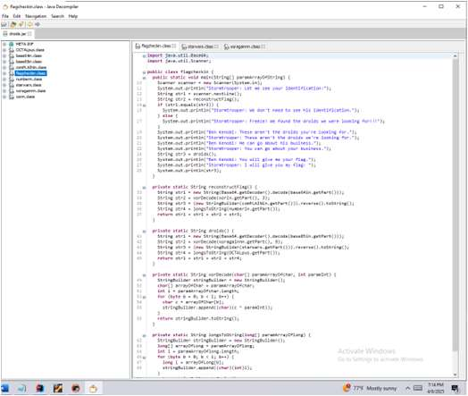
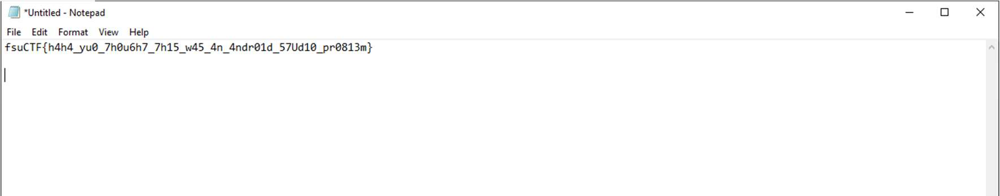
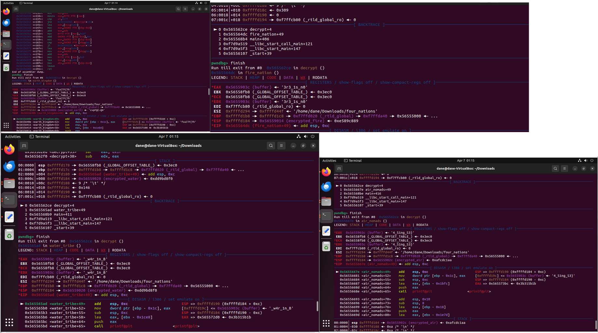
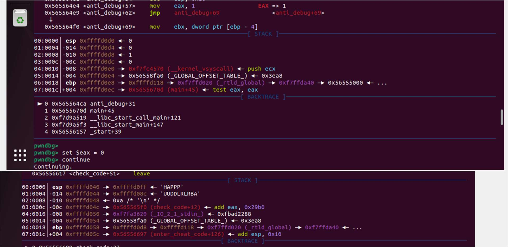
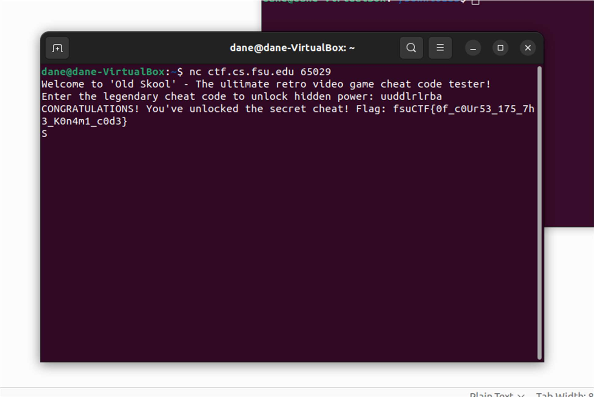

# Binary Reversing Fundamentals

[← Back to CTF Challenges](README.md) · [← Back to Portfolio](../README.md)

---

## 🔎 Overview
This collection of challenges focuses on foundational reverse engineering skills including JAR file analysis, x86/x64 binary debugging, anti-debugging techniques, and memory inspection.

**Source:** FSU CTF Course - Week 7: Reverse Engineering I  
**Difficulty:** Intermediate

---

## 📊 Challenge Summary

| Challenge | Flag | Technique | Difficulty |
|:----------|:-----|:----------|:----------:|
| Droids | `fsuCTF{h4h4_yu0_7h0u6h7_7h15_w45_4n_4ndr01d_57Ud10_pr0813m}` | JAR Decompilation | ⭐⭐⭐ |
| Four Nations | `fsuCTF{Th3r3_1s_n0_w4r_1n_B4_S1ng_S3}` | Anti-Debug Bypass | ⭐⭐⭐⭐ |
| Old Skool | `fsuCTF{0f_c0Ur53_175_7h3_K0n4m1_c0d3}` | Memory Inspection | ⭐⭐⭐ |

---

## 🧩 Challenge 1: Droids

**Category:** Java Reverse Engineering, Deobfuscation  
**Flag:** `fsuCTF{h4h4_yu0_7h0u6h7_7h15_w45_4n_4ndr01d_57Ud10_pr0813m}`  
**Difficulty:** ⭐⭐⭐ Medium

### Tools Used
- **JD-GUI** - Java Decompiler
- **CyberChef** - Data transformation

### Approach & Methodology

#### Step 1: JAR File Decompilation

*JD-GUI showing decompiled Java source with encrypted flag segments*

#### Step 2: Decryption

*CyberChef decrypting the flag segments*

**Result:** `fsuCTF{h4h4_yu0_7h0u6h7_7h15_w45_4n_4ndr01d_57Ud10_pr0813m}`

---

## 🧩 Challenge 2: Four Nations

**Category:** x86 Binary Analysis, Anti-Debugging Bypass  
**Flag:** `fsuCTF{Th3r3_1s_n0_w4r_1n_B4_S1ng_S3}`  
**Difficulty:** ⭐⭐⭐⭐ Hard

### Tools Used
- **pwndbg** - Enhanced GDB debugger

### Approach & Methodology

#### Step 1: Bypass Anti-Debugging

*Using pwndbg to bypass anti-debugging protection by modifying register*

#### Step 2: Memory Register Analysis

*Examining memory registers to extract flag segments*

**Result:** `fsuCTF{Th3r3_1s_n0_w4r_1n_B4_S1ng_S3}`

---

## 🧩 Challenge 3: Old Skool

**Category:** Memory Analysis, Input Validation Bypass  
**Flag:** `fsuCTF{0f_c0Ur53_175_7h3_K0n4m1_c0d3}`  
**Difficulty:** ⭐⭐⭐ Medium

### Tools Used
- **pwndbg** - Enhanced GDB debugger

### Approach & Methodology

#### Memory Inspection at strcmp

*Finding the cheat code in memory registers during string comparison*

**Result:** `fsuCTF{0f_c0Ur53_175_7h3_K0n4m1_c0d3}`

---

## 🎯 Skills Matrix

| Skill | Proficiency |
|-------|-------------|
| Java Decompilation | ⭐⭐⭐⭐ |
| Binary Debugging (GDB) | ⭐⭐⭐⭐⭐ |
| Anti-Debugging Bypass | ⭐⭐⭐⭐ |
| Memory Analysis | ⭐⭐⭐⭐⭐ |

---

*Challenges completed as part of FSU CTF Course - Spring 2025*

---

[← Back to CTF Challenges](README.md) · [← Back to Portfolio](../README.md)
