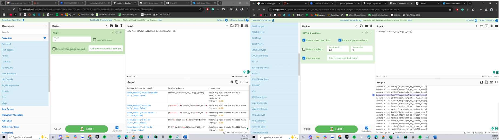
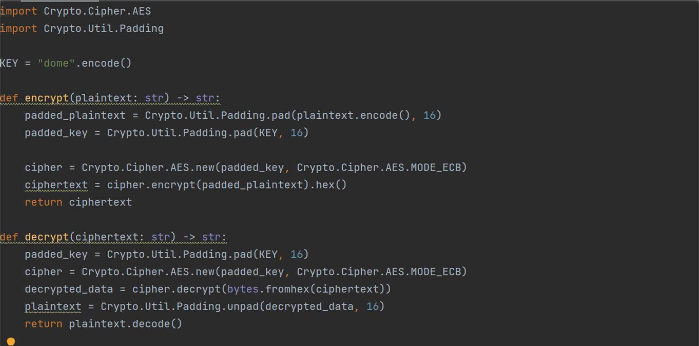
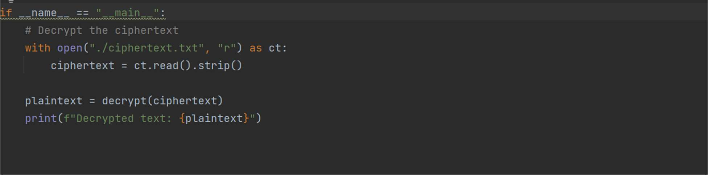
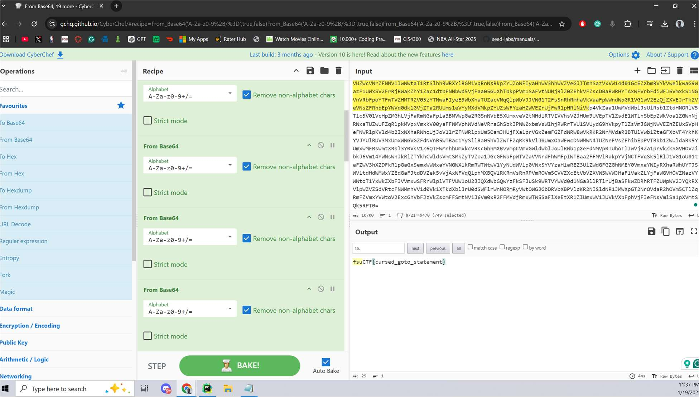

# Cryptography Challenges

## 🔎 Overview
This collection of cryptography challenges focuses on fundamental encoding, cipher analysis, and decryption techniques. These exercises demonstrate practical skills used in security analysis, CTF competitions, and real-world incident response scenarios where encrypted or obfuscated data must be analyzed.

**Source:** FSU CTF Course - Cryptography Module  
**Difficulty:** Beginner to Intermediate

---

## 📊 Challenge Summary

| Challenge | Flag | Technique | Difficulty |
|:----------|:-----|:----------|:----------:|
| Baby Crypto | `fsuCTF{cyberchef_is_pretty_cool}` | CyberChef Magic + ROT13 | ⭐⭐ |
| Dome | `fsuCTF{python_dash_m_venv_dotvenv}` | Python Decryption Script | ⭐⭐⭐ |
| Infinity | `fsuCTF{cursed_goto_statement}` | Recursive Base64 Decoding | ⭐⭐ |

---

## 🧩 Challenge 1: Baby Crypto

**Category:** Encoding Analysis, Classical Ciphers  
**Flag:** `fsuCTF{cyberchef_is_pretty_cool}`  
**Difficulty:** ⭐⭐ Easy

### Challenge Description
A ciphertext file containing encoded data that must be decoded using multiple techniques. This challenge introduces the power of CyberChef for rapid data transformation.

### Tools Used
- **CyberChef** - Data transformation and analysis
- **Magic Function** - Automatic encoding detection
- **ROT13 Brute Force** - Classical cipher analysis

### Approach & Methodology

#### Step 1: Initial Analysis with CyberChef Magic
1. Downloaded the provided ciphertext file
2. Opened the content in CyberChef
3. Used the **Magic** feature to automatically detect encoding
4. Applied **ROT13 Brute Force** to find the correct rotation

*Using CyberChef's Magic function and ROT13 brute force to decode the ciphertext*

**Result:** ROT13 revealed the flag: `fsuCTF{cyberchef_is_pretty_cool}`

### Key Takeaways
- CyberChef's Magic function is invaluable for quick encoding identification
- Multi-layer encoding is common in CTF challenges
- ROT13 is frequently used due to its self-inverse property

### Skills Demonstrated
- Encoding identification and analysis
- Use of automated decryption tools
- Classical cipher recognition

---

## 🧩 Challenge 2: Dome

**Category:** Python Cryptography, Script Analysis  
**Flag:** `fsuCTF{python_dash_m_venv_dotvenv}`  
**Difficulty:** ⭐⭐⭐ Medium

### Challenge Description
A Python encryption program with an incomplete decrypt function. The challenge requires implementing the decryption logic and running it against the provided ciphertext.

### Tools Used
- **Python 3** - Script execution and modification
- **Code Analysis** - Understanding encryption logic

### Approach & Methodology

#### Step 1: Analyze the Encryption Script
Examined the provided encryption code using AES in ECB mode:

*The original encryption script showing AES-ECB encryption with the key "dome"*

#### Step 2: Implement Decryption
Implemented the `decrypt()` function by reversing the encryption logic:

*Modified script with working decrypt function*

#### Step 3: Flag Recovery
Ran the modified Python script with the ciphertext file.

**Result:** `fsuCTF{python_dash_m_venv_dotvenv}`

### Key Takeaways
- Many CTF crypto challenges require implementing the inverse of a given function
- Code analysis skills are essential for understanding encryption schemes
- AES in ECB mode can be reversed with the correct key

### Skills Demonstrated
- Python programming and debugging
- Cryptographic function analysis
- Reverse engineering encryption algorithms

---

## 🧩 Challenge 3: Infinity

**Category:** Encoding, Iterative Decoding  
**Flag:** `fsuCTF{cursed_goto_statement}`  
**Difficulty:** ⭐⭐ Easy

### Challenge Description
A ciphertext encoded with multiple layers of Base64. The challenge name "Infinity" hints at the repetitive nature of the solution.

### Tools Used
- **CyberChef** - Iterative Base64 decoding
- **Pattern Recognition** - Identifying encoding signatures

### Approach & Methodology

#### Iterative Base64 Decoding
1. Recognized the Base64 encoding pattern
2. Applied multiple "From Base64" operations in CyberChef
3. Continued until readable ASCII text appeared

*CyberChef recipe with multiple Base64 decode operations revealing the flag*

**Result:** After several iterations: `fsuCTF{cursed_goto_statement}`

### Key Takeaways
- Challenge names often contain hints about the solution approach
- Multi-layer encoding is a common obfuscation technique
- CyberChef can chain multiple operations efficiently

### Skills Demonstrated
- Base64 encoding recognition
- Iterative problem-solving
- Pattern recognition in encoded data

---

## 🛠 Cryptography Toolkit

| Tool | Purpose | Use Case |
|:-----|:--------|:---------|
| **CyberChef** | Multi-purpose data transformation | Encoding, decoding, encryption |
| **Python** | Custom script development | Implementing decryption algorithms |
| **hashcat/John** | Password/hash cracking | Breaking weak hashes |
| **OpenSSL** | Cryptographic operations | Certificate and key analysis |

---

## 🎯 Skills Matrix

| Skill | Proficiency |
|:------|:------------|
| CyberChef Operations | ⭐⭐⭐⭐⭐ |
| Base64/Encoding Analysis | ⭐⭐⭐⭐⭐ |
| Python Cryptography | ⭐⭐⭐⭐ |
| Classical Cipher Analysis | ⭐⭐⭐⭐ |

---

*Challenges completed as part of FSU CTF Course - Spring 2025*
