# Final CTF Competition Writeups

[← Back to CTF Challenges](README.md) · [← Back to Portfolio](../README.md)

---

## 🔎 Overview
This collection documents challenges from FSU's Final CTF Competition, showcasing diverse cybersecurity skills across multiple domains.

**Source:** FSU CTF Course - Final Competition  
**Challenges Solved:** 12/12  
**Difficulty:** Mixed (Easy to Expert)

---

## 📊 Challenge Summary

| Challenge | Category | Flag | Difficulty |
|:----------|:---------|:-----|:----------:|
| Holy Grail | Reverse Engineering | `fsuCTF{kn19h75_wh0_s4y_n1}` | ⭐⭐⭐⭐ |
| The GOAT Part 2 | Cryptography | `fsuCTF{7h3_573p5_4r3_4n_4c7u41_r3c1p3...}` | ⭐⭐⭐ |
| Chamber of Secrets | Reverse Engineering | `fsuCTF{sssssSSSsssSss...}` | ⭐⭐⭐⭐ |
| Dragons | Binary Analysis | `fsuCTF{t1m3_t0_p1ck_y0ur_dr4g0n}` | ⭐⭐⭐⭐ |
| 1337 C0nv3r73r | Web (SSTI) | `fsuC7F{1s_n0d3_b3773r_7h4n_php}` | ⭐⭐⭐ |
| Pokemon | Web (Command Injection) | `fsuCTF{pr0f3550r_04k_1_d0n7_f33l_50_600d}` | ⭐⭐ |
| Seminole Lounge | Web (XXE) | `fsuCTF{600d_v1b35}` | ⭐⭐⭐ |
| Rabbit Hole | Multi-Layer Forensics | `fsuCTF{f4lling_d0wn_ju$t_lik3_Al!ce}` | ⭐⭐⭐⭐⭐ |
| Master Key | Binary Exploitation | `fsuCTF{why_15_17_c4ll3d_4_5k3l370n_k3y}` | ⭐⭐⭐⭐ |
| Rails on Ruby | Cryptography | `fsuCTF{5ubw4y_5urf3r5_4773n710n_5p4n}` | ⭐⭐ |
| A Rat | RSA Cryptography | `fsuCTF{w34k357_l1nk_50m37h1n6}` | ⭐⭐⭐ |
| PILlow | Steganography | `fsuCTF{st3g_s0lv3_only_g3ts_y0u_s0_f4r}` | ⭐⭐⭐⭐ |

---

## 🔧 Reverse Engineering

### Challenge: Holy Grail
**Flag:** `fsuCTF{kn19h75_wh0_s4y_n1}`

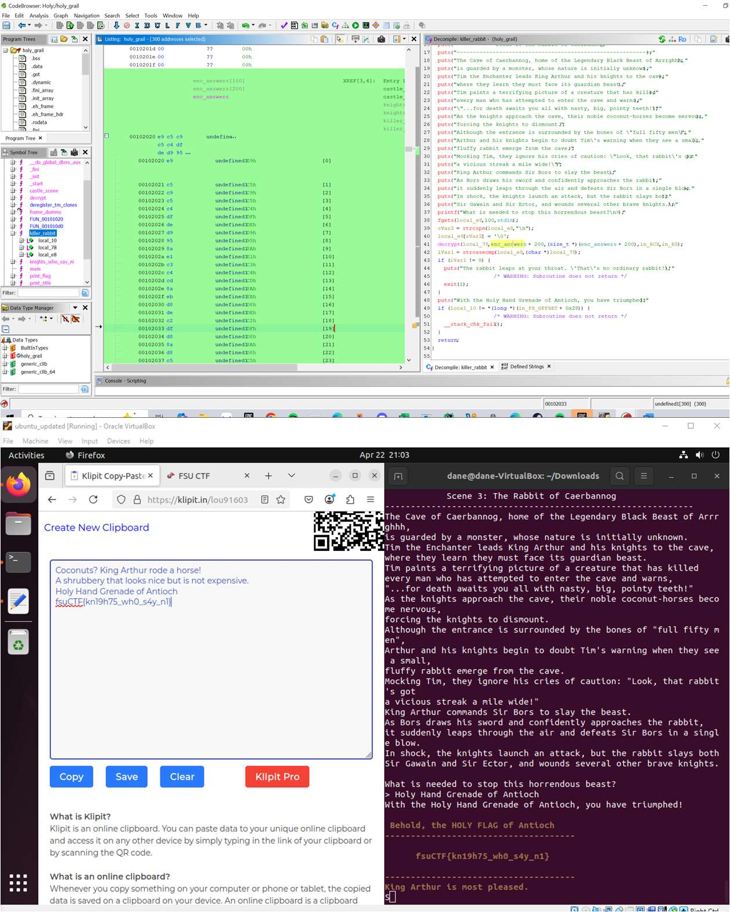

*Ghidra analysis revealing encrypted answers and decryption logic*

---

### Challenge: The GOAT Part 2
**Flag:** `fsuCTF{7h3_573p5_4r3_4n_4c7u41_r3c1p3_50_y0ur3_w31c0m3}`

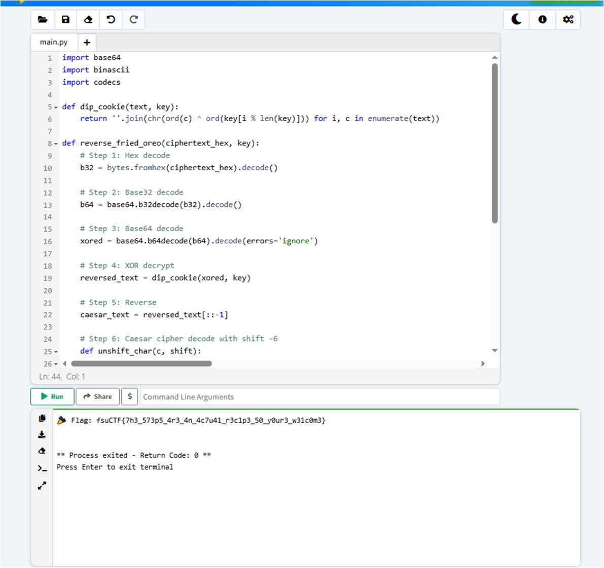

*Decryption script reversing the encryption algorithm*

---

### Challenge: Chamber of Secrets
**Flag:** `fsuCTF{sssssSSSsssSssssSSsssSSSsSSSSSsssSSsSsSsSsSSsSSsSSSSSS}`

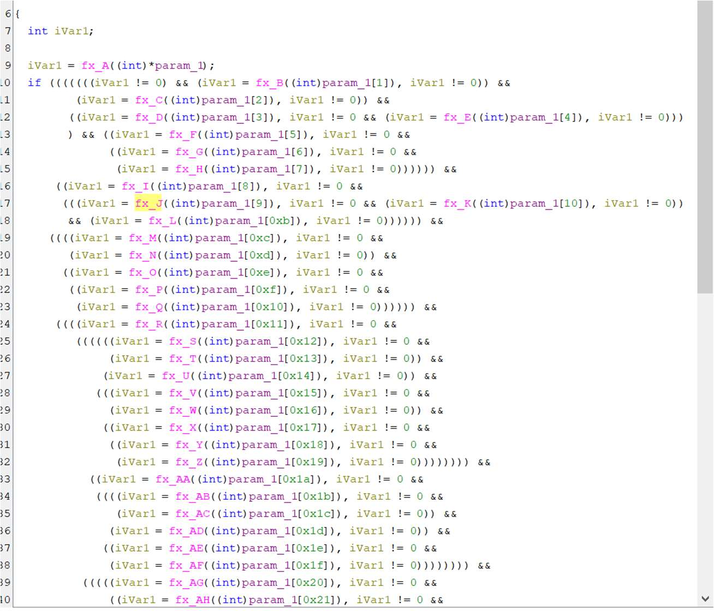

*Function analysis revealing the uppercase/lowercase S pattern*

---

### Challenge: Dragons
**Flag:** `fsuCTF{t1m3_t0_p1ck_y0ur_dr4g0n}`

*pwndbg showing code segments extracted from memory*

---

## 🌐 Web Exploitation

### Challenge: 1337 C0nv3r73r (SSTI)
**Flag:** `fsuC7F{1s_n0d3_b3773r_7h4n_php}`

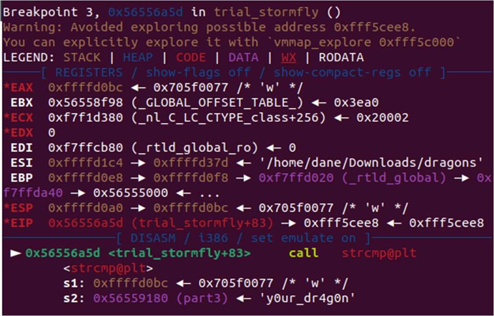

*SSTI payload reading flag.txt*

---

### Challenge: Pokemon (Command Injection)
**Flag:** `fsuCTF{pr0f3550r_04k_1_d0n7_f33l_50_600d}`

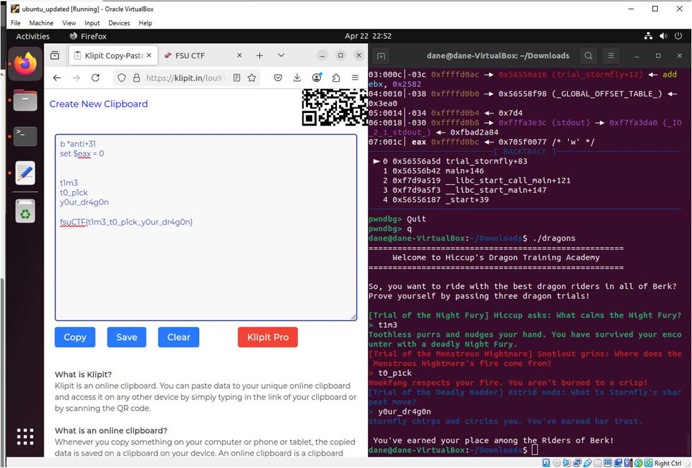

*Command injection payload revealing the flag*

---

### Challenge: Seminole Lounge (XXE)
**Flag:** `fsuCTF{600d_v1b35}`

*XXE payload reading flag.txt through external entity*

---

## 🔍 Digital Forensics

### Challenge: Rabbit Hole (Multi-Layer)
**Flag:** `fsuCTF{f4lling_d0wn_ju$t_lik3_Al!ce}`

#### Part 1: Metadata Analysis

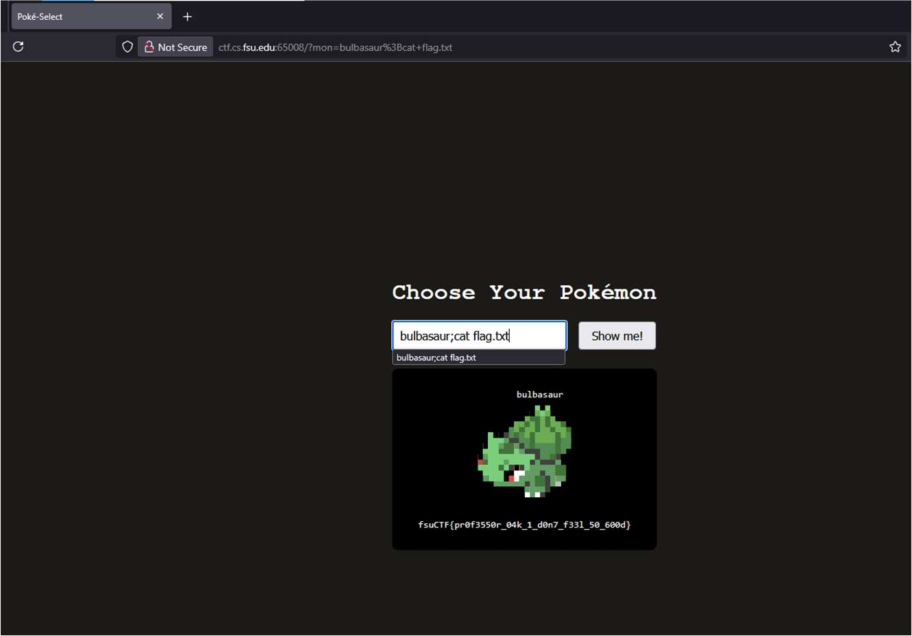

*ExifTool revealing flag segment in Artist field*

#### Part 2: Binwalk Extraction

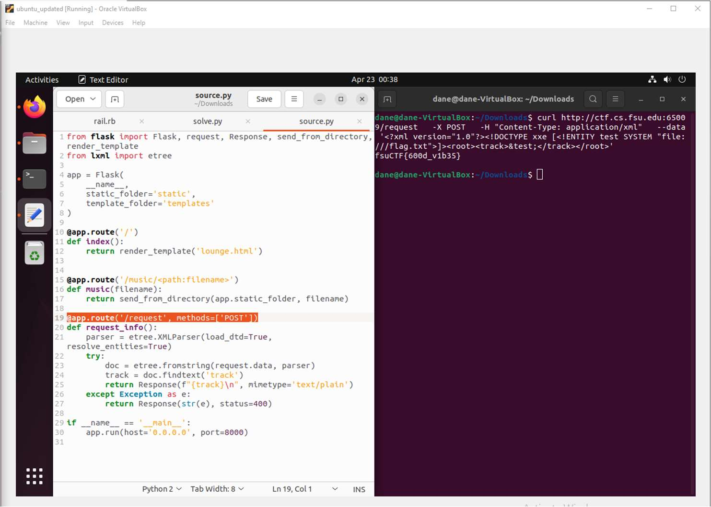

*Binwalk extracting embedded files from the image*

#### Part 3: Steghide

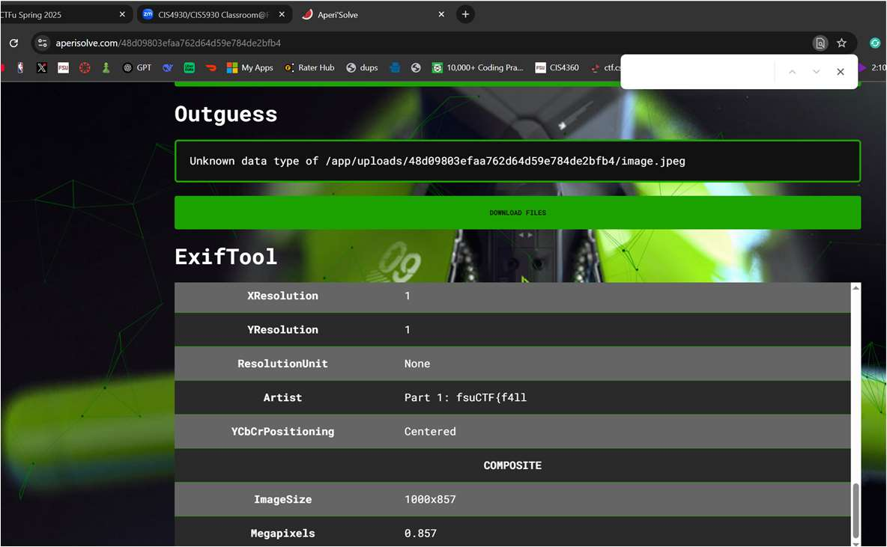

*Steghide extracting PDF containing final flag segment*

---

### Challenge: PILlow (LSB Steganography)
**Flag:** `fsuCTF{st3g_s0lv3_only_g3ts_y0u_s0_f4r}`

#### StegSolve Analysis

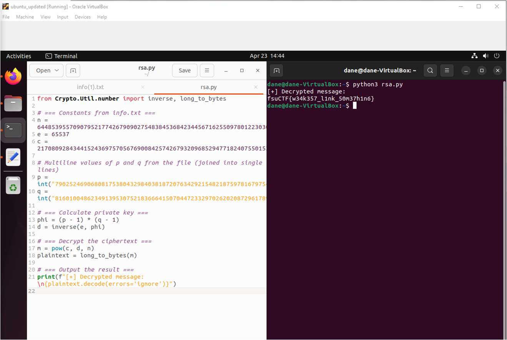

*StegSolve showing LSB data in green channel*

#### Python Extraction Script

*Python script extracting binary data from green channel LSB*

---

## 🔐 Cryptography

### Challenge: Rails on Ruby (Rail Fence)
**Flag:** `fsuCTF{5ubw4y_5urf3r5_4773n710n_5p4n}`

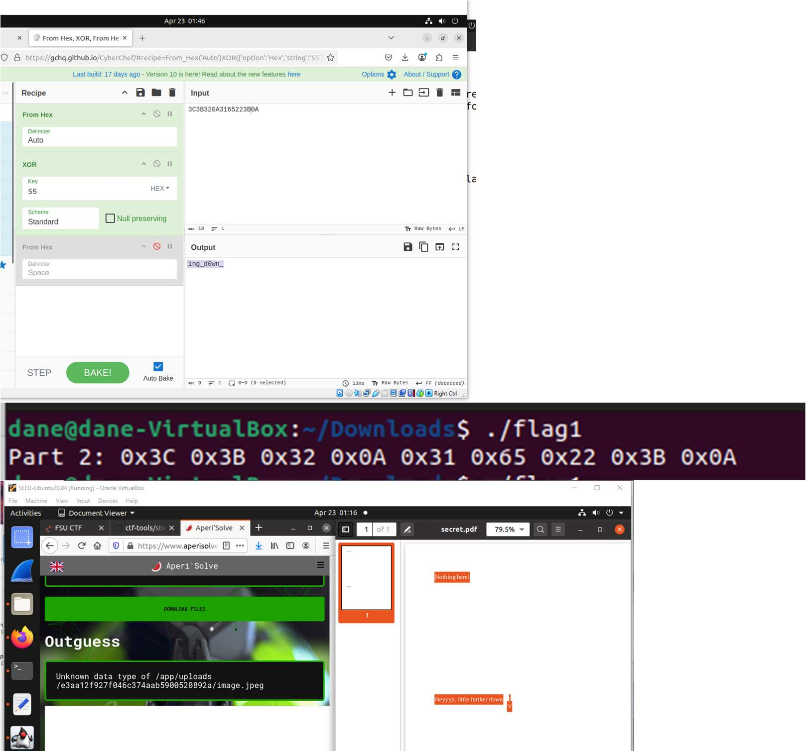

*Online tool decoding the Rail Fence cipher*

---

### Challenge: A Rat (RSA)
**Flag:** `fsuCTF{w34k357_l1nk_50m37h1n6}`

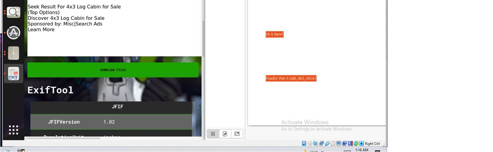

*FactorDB successfully factoring the weak RSA modulus*

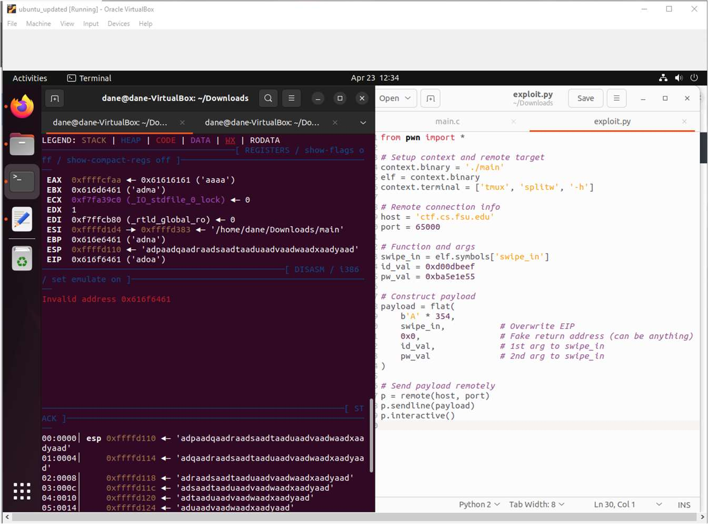

*Python script computing private key and decrypting flag*

---

## 💥 Binary Exploitation

### Challenge: Master Key
**Flag:** `fsuCTF{why_15_17_c4ll3d_4_5k3l370n_k3y}`

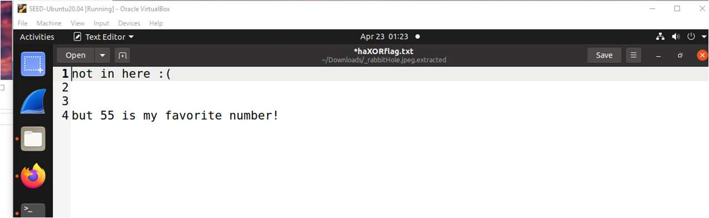

*Finding offset with cyclic pattern and constructing exploit*

---

## 📊 Competition Results

| Category | Challenges | Score |
|:---------|:----------:|:-----:|
| Reverse Engineering | 4 | ✅ |
| Web Exploitation | 3 | ✅ |
| Cryptography | 3 | ✅ |
| Digital Forensics | 2 | ✅ |
| Binary Exploitation | 1 | ✅ |
| **Total** | **12/12** | **100%** |

---

*Final CTF Competition - FSU CTF Course - Spring 2025*

---

[← Back to CTF Challenges](README.md) · [← Back to Portfolio](../README.md)
