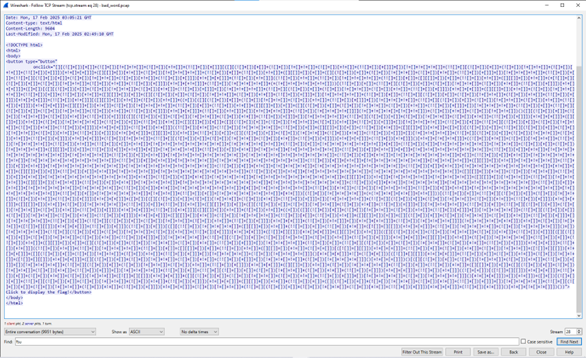
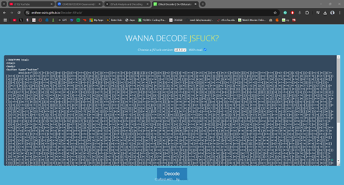
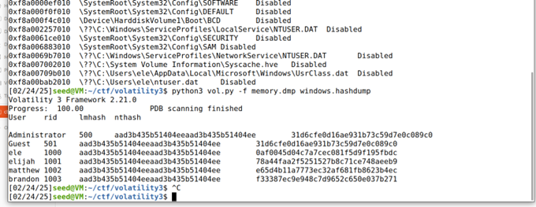
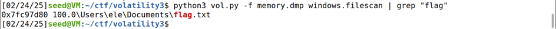
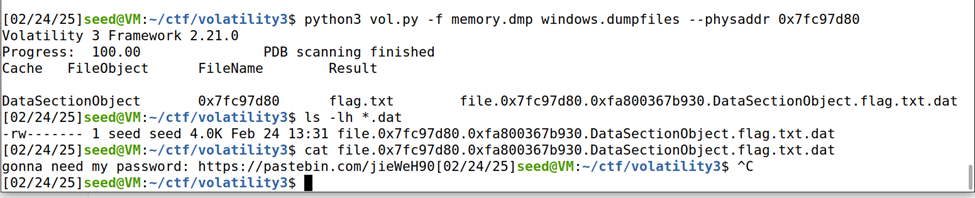
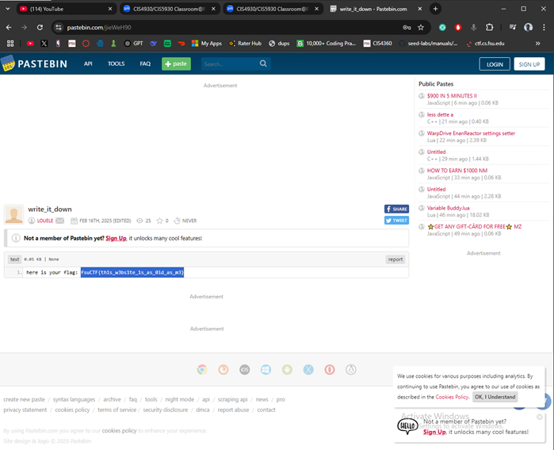

# Network Forensics

## 🔎 Overview
This set of Capture the Flag (CTF) challenges focused on analyzing network captures and memory artifacts to detect hidden or exfiltrated data. Each challenge required investigating different forms of encoded or hidden information, simulating the kind of forensic and incident response tasks performed by SOC analysts.

**Source:** FSU CTF Course - Network Forensics Module  
**Difficulty:** Intermediate to Advanced

---

## 📊 Challenge Summary

| Challenge | Flag | Technique | Difficulty |
|:----------|:-----|:----------|:----------:|
| bad_word | `fsuCTF{...}` | PCAP Analysis + JSFuck Decoding | ⭐⭐⭐ |
| stolen_artifact | `fsuCTF{...}` | Traffic Analysis + Base64 Decoding | ⭐⭐⭐⭐ |
| notetaker | `fsuCTF{...}` | Memory Forensics + Hash Cracking | ⭐⭐⭐⭐ |

---

## 🧩 Challenge 1: bad_word

**Category:** Network Packet Analysis, Data Decoding  
**Difficulty:** ⭐⭐⭐ Medium

### Tools Used
- **Wireshark** - Packet capture analysis
- **JSFuck Decoder** - Deobfuscation

### Approach & Methodology

#### Step 1: TCP Stream Analysis
Loaded the provided PCAP file into Wireshark and inspected TCP streams:

*Wireshark showing suspicious encoded content in TCP stream*

#### Step 2: JSFuck Decoding
Discovered unusual encoded text and processed it with a JSFuck decoder:

*Using JSFuck decoder to deobfuscate the payload*

#### Step 3: Flag Recovery

*Reconstructed decoded text revealing the flag*

**Skills:** Packet capture analysis, protocol inspection, data decoding

---

## 🧩 Challenge 2: stolen_artifact

**Category:** Network Traffic Analysis, Data Exfiltration Detection  
**Difficulty:** ⭐⭐⭐⭐ Hard

### Tools Used
- **tshark** - Command-line packet analysis
- **CyberChef** - Data transformation

### Approach & Methodology

#### Step 1: Traffic Filtering
Analyzed the network capture using tshark, filtering for suspicious traffic:

*tshark filtering for suspicious traffic tied to unknown domain*

#### Step 2: Base64 Decoding & Image Reconstruction
Observed large base64-encoded payloads indicating data exfiltration. Extracted and processed them in CyberChef:

*Reconstructed image containing the hidden flag*

**Skills:** Traffic filtering, base64 decoding, network exfiltration analysis

---

## 🧩 Challenge 3: notetaker

**Category:** Memory Forensics, Credential Recovery  
**Difficulty:** ⭐⭐⭐⭐ Hard

### Tools Used
- **Volatility** - Memory forensics framework
- **Hash Cracking Tools** - Password recovery

### Approach & Methodology

#### Step 1: Hash Extraction
Investigated memory dump and located credential hashes using hashdump plugin:

*Volatility hashdump revealing user credential hashes*

#### Step 2: Hash Cracking
Cracked the recovered hashes with an online tool:

*CrackStation recovering plaintext credentials*

#### Step 3: Flag Location
Searched the memory dump for flag references:

*Using grep to locate flag.txt in memory*

*Extracting flag content*

#### Step 4: Flag Recovery

*Using cracked credentials to access and confirm the flag*

**Skills:** Memory forensics, hash cracking, file carving, credential analysis

---

## 🛠 Network Forensics Toolkit

| Tool | Purpose | Use Case |
|:-----|:--------|:---------|
| **Wireshark** | GUI packet analysis | Deep packet inspection |
| **tshark** | CLI packet analysis | Scripted filtering |
| **Volatility** | Memory forensics | RAM dump analysis |
| **CyberChef** | Data transformation | Decoding, reconstruction |

---

## 🎯 Skills Matrix

| Skill | Proficiency |
|:------|:------------|
| Packet Capture Analysis | ⭐⭐⭐⭐⭐ |
| Memory Forensics | ⭐⭐⭐⭐ |
| Hash Cracking | ⭐⭐⭐⭐ |
| Data Exfiltration Detection | ⭐⭐⭐⭐ |
| Traffic Filtering | ⭐⭐⭐⭐⭐ |

---

## 📌 Key Takeaways
- Developed the ability to detect and analyze **data exfiltration** from packet captures
- Strengthened hands-on skills in **memory forensics**, including hash analysis and file recovery
- Learned to correlate **network evidence and system artifacts** to build a complete incident picture

---

*Challenges completed as part of FSU CTF Course - Spring 2025*
