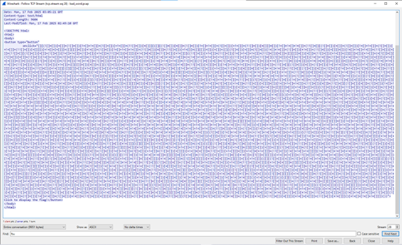
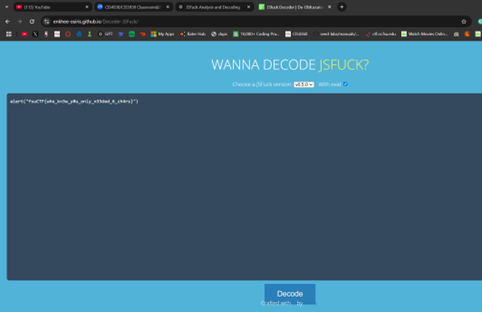
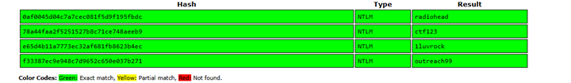
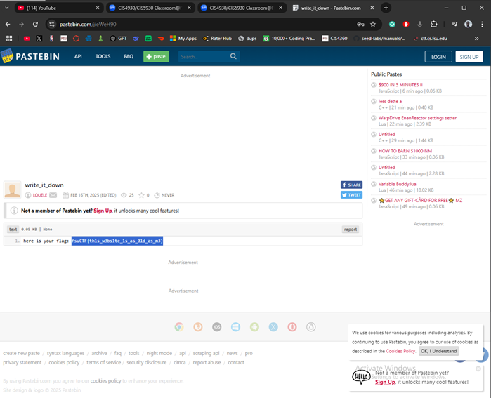

# Network Forensics

## 🔎 Overview
This set of Capture the Flag (CTF) challenges focused on analyzing network captures and memory artifacts to detect hidden or exfiltrated data.  
I worked on three challenges: **bad_word**, **stolen_artifact**, and **notetaker**. Each one required investigating different forms of encoded or hidden information, simulating the kind of forensic and incident response tasks performed by SOC analysts.

---

### 🧩 Challenge: bad_word

**Approach Walkthrough**
1. Loaded the provided PCAP file into Wireshark and inspected TCP streams.  

2. Discovered unusual encoded text hidden inside the streams.  
3. Exported the suspicious payload and processed it with a **JSFuck decoder**.  

4. Reconstructed the decoded text, which revealed the flag. 

**Key Skills:** Packet capture analysis, protocol inspection, data decoding  

---

### 🧩 Challenge: stolen_artifact

**Approach Walkthrough**
1. Analyzed the network capture using **tshark**, filtering for suspicious traffic tied to an unknown domain.  

2. Observed large base64-encoded payloads indicating potential data exfiltration.  
3. Extracted the payloads and processed them in **CyberChef** using find & replace, base64 decode, and render image functions.
4. Reconstructed the decoded data into an image, which contained the hidden flag.  

**Key Skills:** Traffic filtering, base64 decoding, network exfiltration analysis  

---

### 🧩 Challenge: notetaker

**Approach Walkthrough**
1. Investigated a provided memory dump file with forensic tools.  
2. Located user credential hashes using the **hashdump** plugin.  

3. Cracked the recovered hashes with an online tool to obtain plaintext credentials.  

4. Searched the memory dump for “flag†references, located flag.txt, and extracted it.   
 
 
5. Used the cracked credentials to access the file and confirm the flag.  

**Key Skills:** Memory forensics, hash cracking, file carving, credential analysis  

---

## 🛠 Skills & Tools Used
- **Linux Command Line** – grep, cat, strings, base64, volatility3
- **Wireshark / tshark** – network packet analysis and filtering  
- **CyberChef** – base64 decoding, text/image reconstruction  
- **JSFuck decoder** – deobfuscation of encoded text  
- **Hash cracking utilities** – recovered plaintext credentials from hashdump  
- **Memory forensics** – file search, extraction, and analysis  

---

## 📌 Key Takeaways
- Developed the ability to detect and analyze **data exfiltration** from packet captures.  
- Strengthened hands-on skills in **memory forensics**, including hash analysis and file recovery.  
- Learned to correlate **network evidence and system artifacts** to build a complete incident picture.