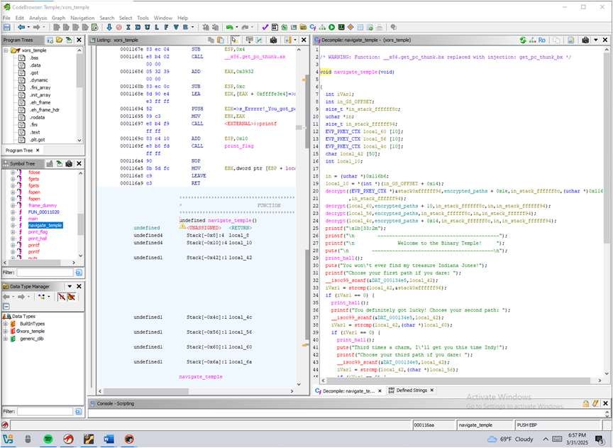
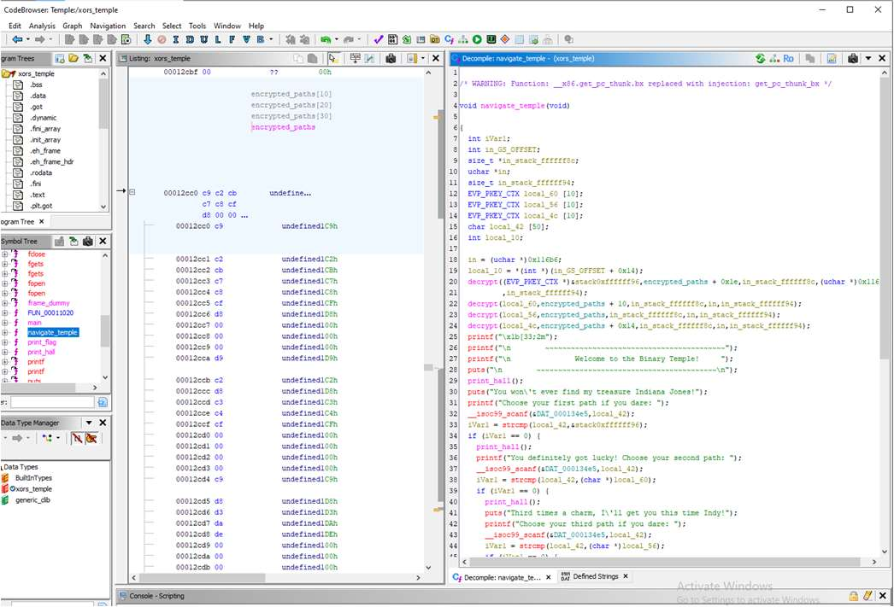
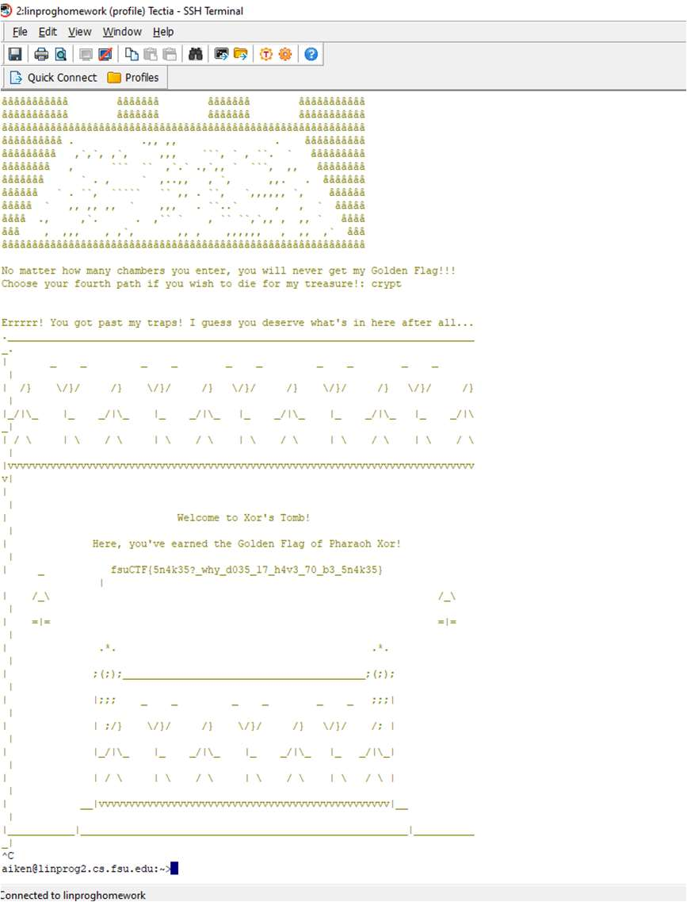
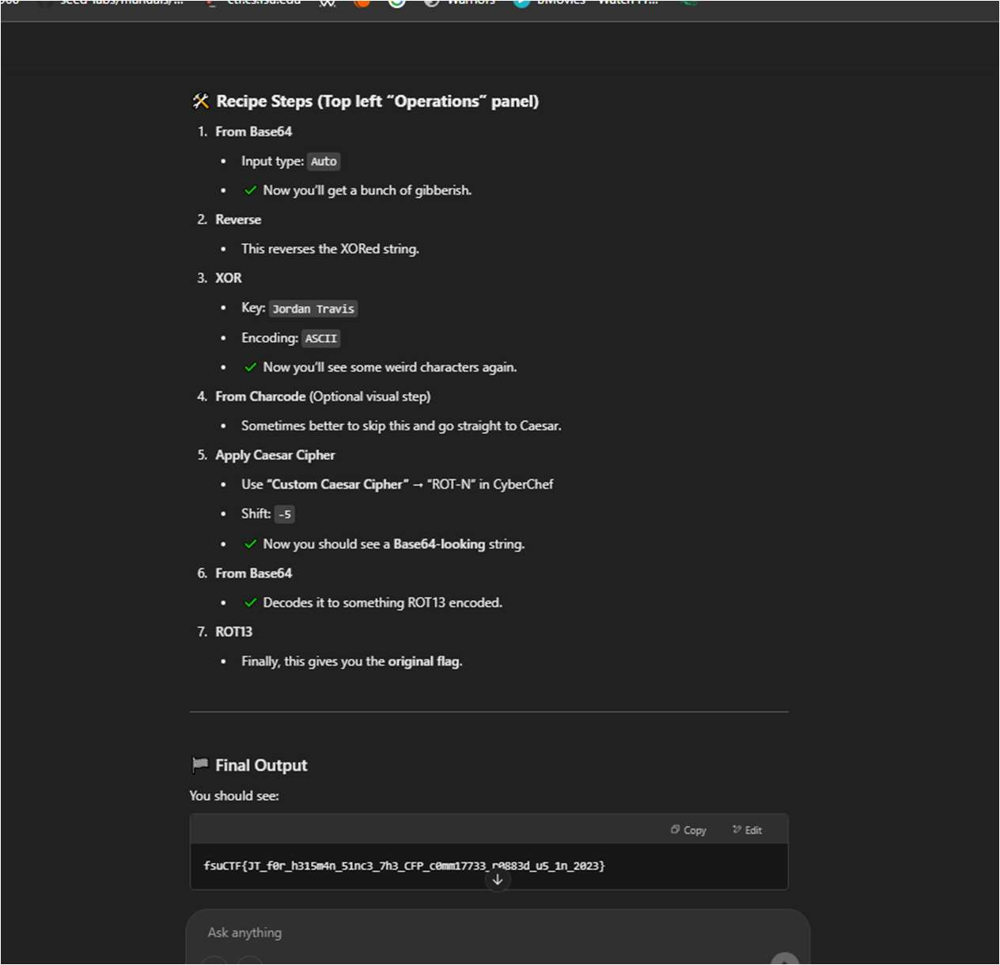
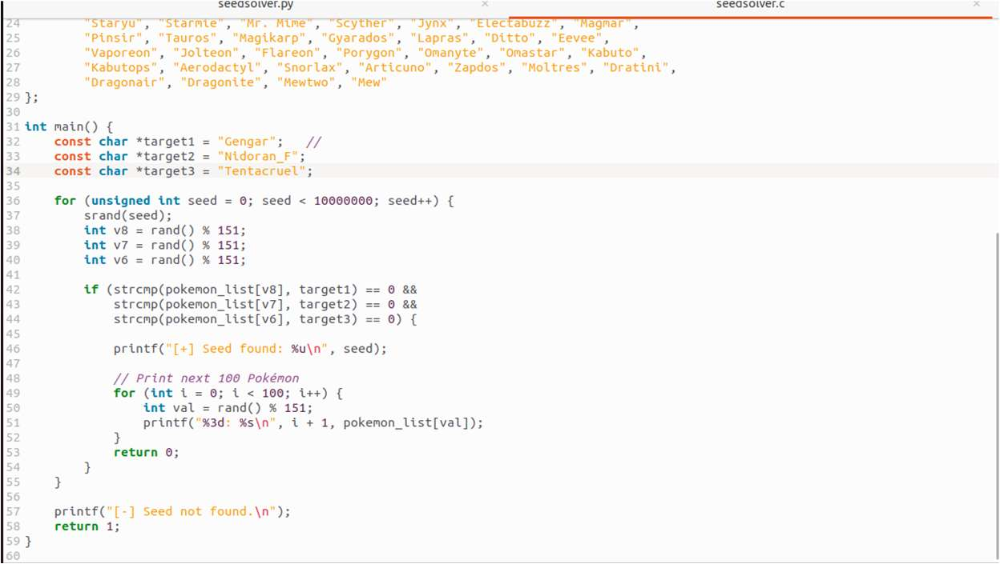
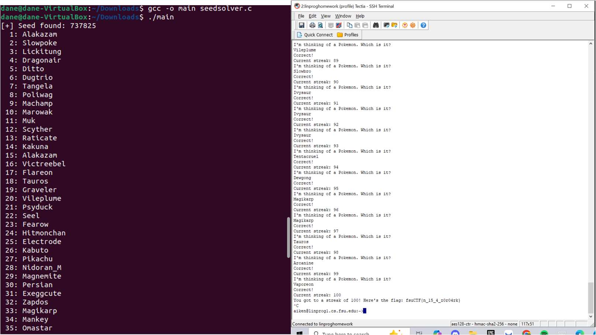

# Advanced Reverse Engineering

## 🔎 Overview
This collection of reverse engineering challenges covers advanced static analysis using Ghidra, encryption algorithm reversal, and custom scripting for cryptographic challenges.

**Source:** FSU CTF Course - Reverse Engineering Module II  
**Difficulty:** Intermediate to Advanced

---

## 📊 Challenge Summary

| Challenge | Flag | Technique | Difficulty |
|:----------|:-----|:----------|:----------:|
| Indiana Jones & The Binary Temple | `fsuCTF{5n4k35?_why_d035_17_h4v3_70_b3_5n4k35}` | Ghidra + XOR Decryption | ⭐⭐⭐⭐ |
| Robbery | `fsuCTF{JT_f0r_h315m4n_51nc3_7h3_CFP_c0mm17733_r0883d_u5_1n_2023}` | Encryption Reversal | ⭐⭐⭐ |
| Secret Seed | `fsuCTF{n_15_4_z0r04rk}` | PRNG Seed Bruteforce | ⭐⭐⭐⭐ |

---

## 🧩 Challenge 1: Indiana Jones & The Binary Temple

**Category:** Static Analysis, XOR Encryption  
**Flag:** `fsuCTF{5n4k35?_why_d035_17_h4v3_70_b3_5n4k35}`  
**Difficulty:** ⭐⭐⭐⭐ Hard

### Tools Used
- **Ghidra** - Static binary analysis
- **Python** - XOR decryption script

### Approach & Methodology

#### Step 1: Static Analysis with Ghidra

*Ghidra showing encrypted path strings and decrypt function using XOR 0xAA*

#### Step 2: Decrypting Path Keys

*Python script decrypting the temple path choices*

#### Step 3: Flag Retrieval

*Successfully navigating the temple to reveal the flag*

**Result:** `fsuCTF{5n4k35?_why_d035_17_h4v3_70_b3_5n4k35}`

---

## 🧩 Challenge 2: Robbery

**Category:** Encryption Reversal  
**Flag:** `fsuCTF{JT_f0r_h315m4n_51nc3_7h3_CFP_c0mm17733_r0883d_u5_1n_2023}`  
**Difficulty:** ⭐⭐⭐ Medium

### Approach & Methodology

#### Decryption Script

*Decryption script that reverses the encryption algorithm*

**Result:** `fsuCTF{JT_f0r_h315m4n_51nc3_7h3_CFP_c0mm17733_r0883d_u5_1n_2023}`

---

## 🧩 Challenge 3: Secret Seed

**Category:** PRNG Analysis, Bruteforce  
**Flag:** `fsuCTF{n_15_4_z0r04rk}`  
**Difficulty:** ⭐⭐⭐⭐ Hard

### Approach & Methodology

#### Bruteforce Script

*Python script bruteforcing seeds from 1 to 1,000,000*

#### Result

*Successfully found seed and generated the flag*

**Result:** `fsuCTF{n_15_4_z0r04rk}`

---

## 🎯 Skills Matrix

| Skill | Proficiency |
|:------|:------------|
| Ghidra Analysis | ⭐⭐⭐⭐⭐ |
| XOR Cryptanalysis | ⭐⭐⭐⭐⭐ |
| Algorithm Reversal | ⭐⭐⭐⭐ |
| PRNG Analysis | ⭐⭐⭐⭐ |
| Python Scripting | ⭐⭐⭐⭐⭐ |

---

*Challenges completed as part of FSU CTF Course - Spring 2025*
