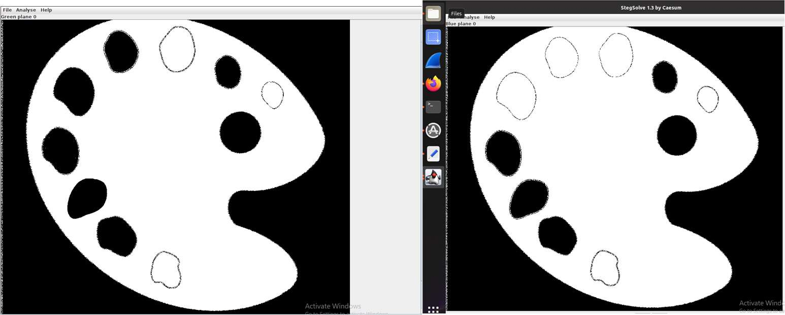
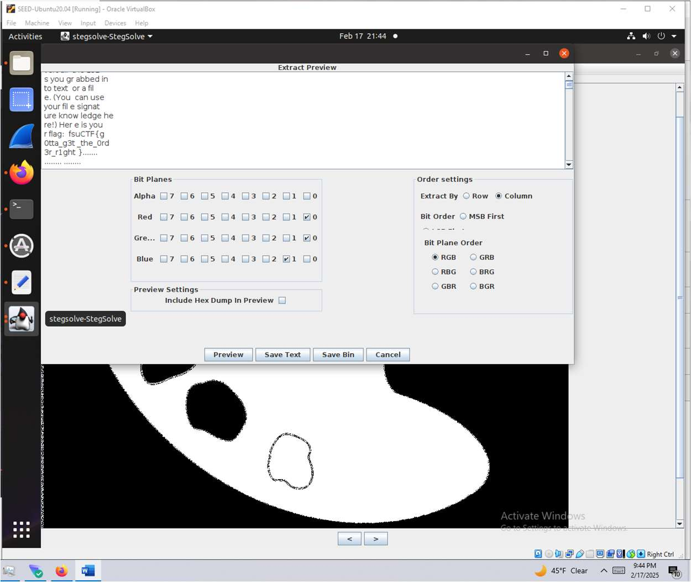
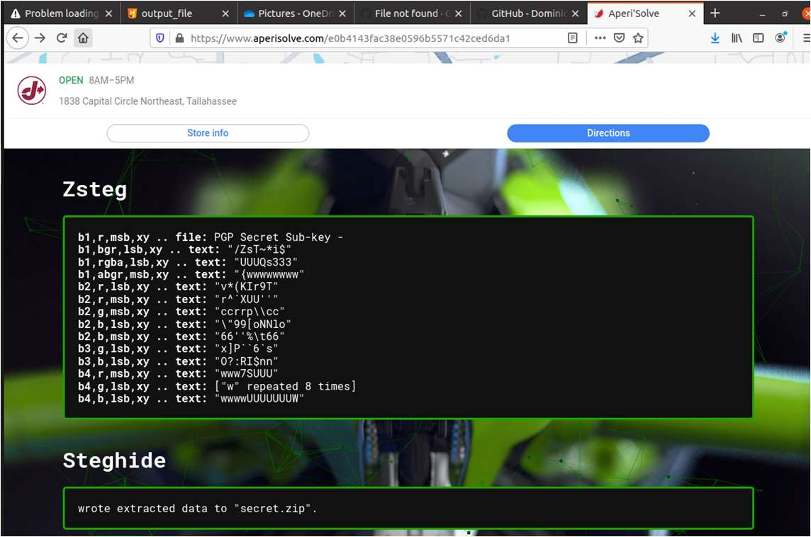
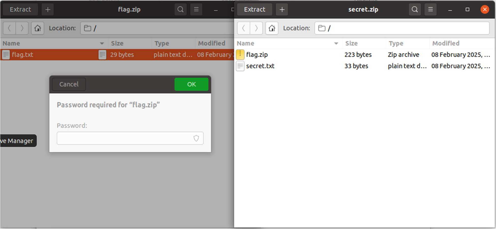
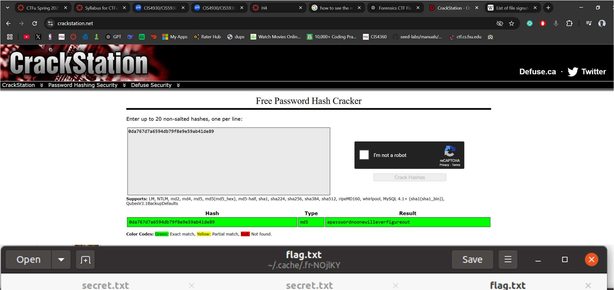
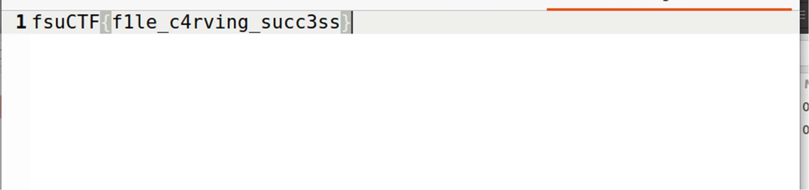
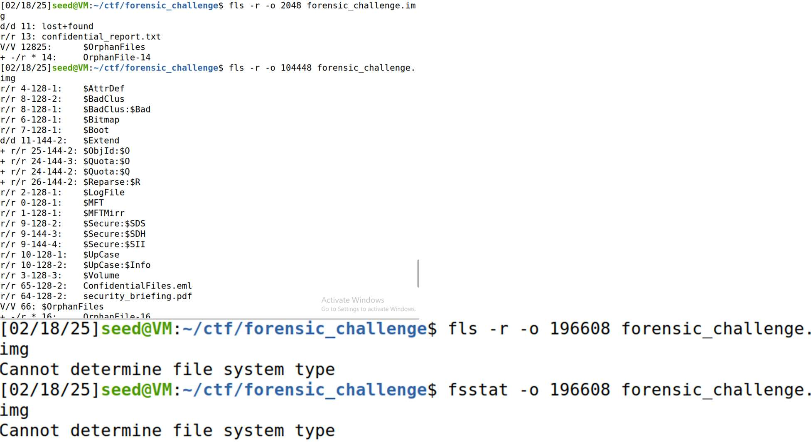
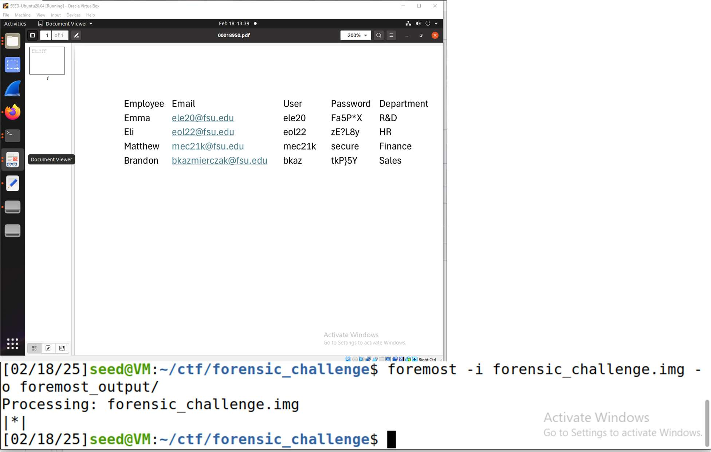

# Steganography & Disk Forensics

[← Back to CTF Challenges](README.md) · [← Back to Portfolio](../README.md)

---

## 🔎 Overview
This collection of forensics challenges covers steganography (hidden data in images), disk image analysis, and file carving techniques.

**Source:** FSU CTF Course - Digital Forensics Module  
**Difficulty:** Intermediate

---

## 📊 Challenge Summary

| Challenge | Flag | Technique | Difficulty |
|:----------|:-----|:----------|:----------:|
| Palette | `fsuCTF{g0tta_g3t_the_0rd3r_r1ght}` | Bit Plane Analysis (StegSolve) | ⭐⭐⭐ |
| Turkey | `fsuCTF{f1le_c4rving_succ3ss}` | Steghide + Hash Cracking | ⭐⭐⭐⭐ |
| Security Breach | `fsuCTF{brandon_emma_finance_secure}` | Disk Forensics (foremost) | ⭐⭐⭐⭐ |

---

## 🧩 Challenge 1: Palette

**Category:** Image Steganography, Bit Plane Analysis  
**Flag:** `fsuCTF{g0tta_g3t_the_0rd3r_r1ght}`  
**Difficulty:** ⭐⭐⭐ Medium

### Tools Used
- **StegSolve** - Bit plane analysis and manipulation

### Approach & Methodology

#### Step 1: Initial Analysis with StegSolve

*StegSolve showing artifacts visible on specific bit planes*

#### Step 2: Data Extraction

*Configuring bit plane extraction order based on challenge hint*

**Result:** `fsuCTF{g0tta_g3t_the_0rd3r_r1ght}`

---

## 🧩 Challenge 2: Turkey

**Category:** Multi-Layer Steganography, Password Cracking  
**Flag:** `fsuCTF{f1le_c4rving_succ3ss}`  
**Difficulty:** ⭐⭐⭐⭐ Hard

### Tools Used
- **Aperi'Solve** - Online steganography analysis
- **CrackStation** - Online hash cracking

### Approach & Methodology

#### Step 1: Automated Analysis

*Aperi'Solve running steghide and extracting hidden ZIP file*

#### Step 2: Hash Cracking

*CrackStation successfully cracking the password hash*

**Result:** `fsuCTF{f1le_c4rving_succ3ss}`

---

## 🧩 Challenge 3: Security Breach

**Category:** Disk Forensics, File Recovery  
**Flag:** `fsuCTF{brandon_emma_finance_secure}`  
**Difficulty:** ⭐⭐⭐⭐ Hard

### Tools Used
- **fls** - File system listing (Sleuth Kit)
- **foremost** - File carving tool

### Approach & Methodology

#### Step 1: Partition Analysis

*Using fls to examine partition contents*

#### Step 2: File Carving

*Foremost recovering deleted files from the disk image*

#### Step 3: Evidence Analysis

*Recovered documents revealing incident details*

*Additional evidence implicating specific users*

**Result:** `fsuCTF{brandon_emma_finance_secure}`

---

## 🎯 Skills Matrix

| Skill | Proficiency |
|:------|:------------|
| Steganography Analysis | ⭐⭐⭐⭐ |
| Bit Plane Extraction | ⭐⭐⭐⭐ |
| File Carving | ⭐⭐⭐⭐⭐ |
| Disk Forensics | ⭐⭐⭐⭐ |
| Hash Cracking | ⭐⭐⭐⭐ |

---

*Challenges completed as part of FSU CTF Course - Spring 2025*

---

[← Back to CTF Challenges](README.md) · [← Back to Portfolio](../README.md)
