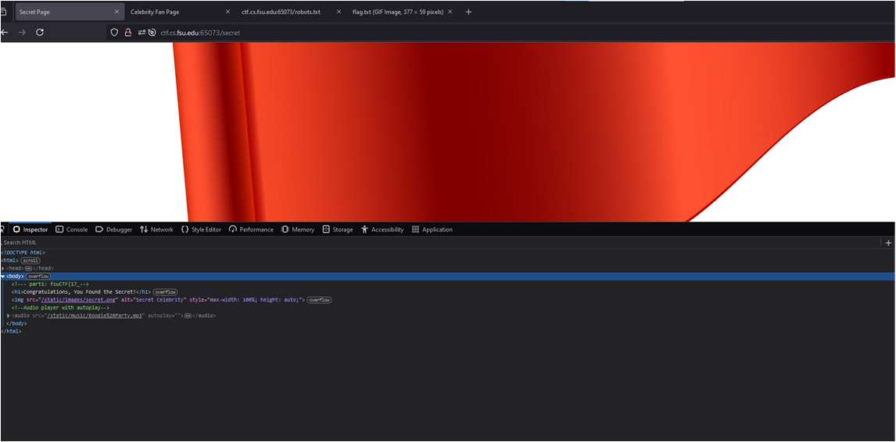
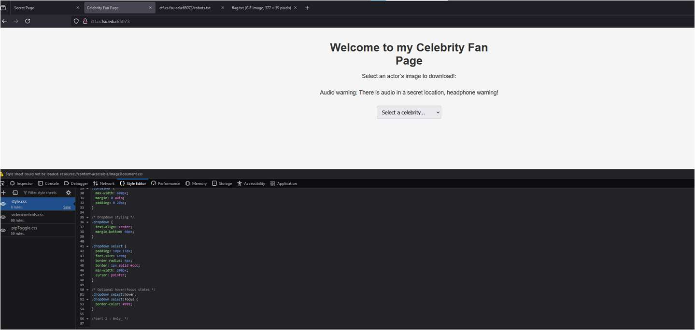
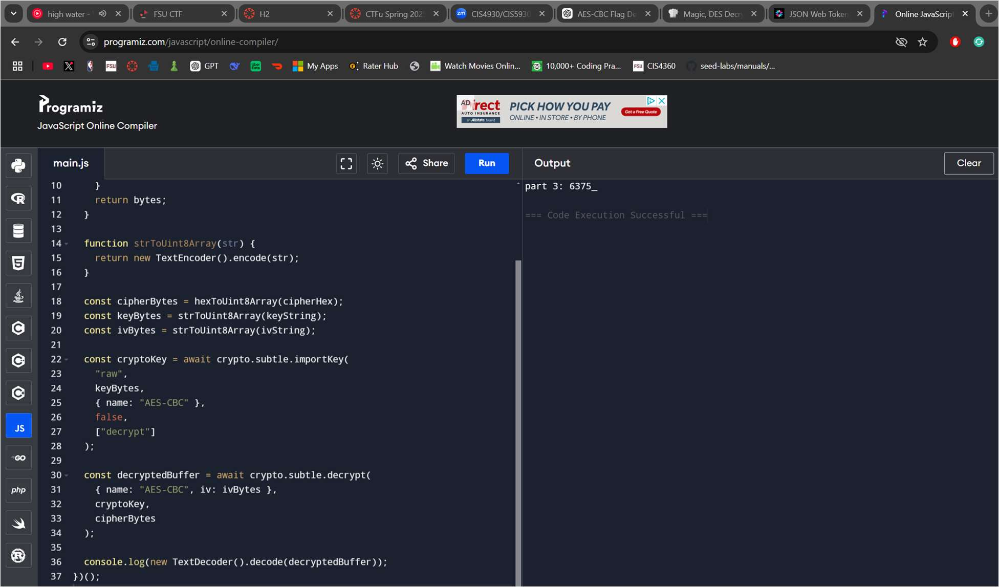
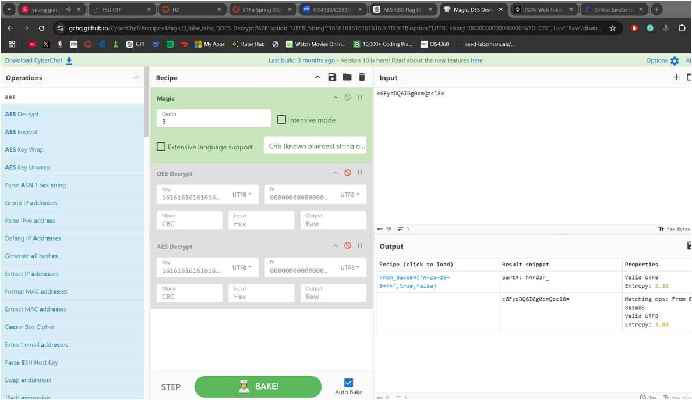
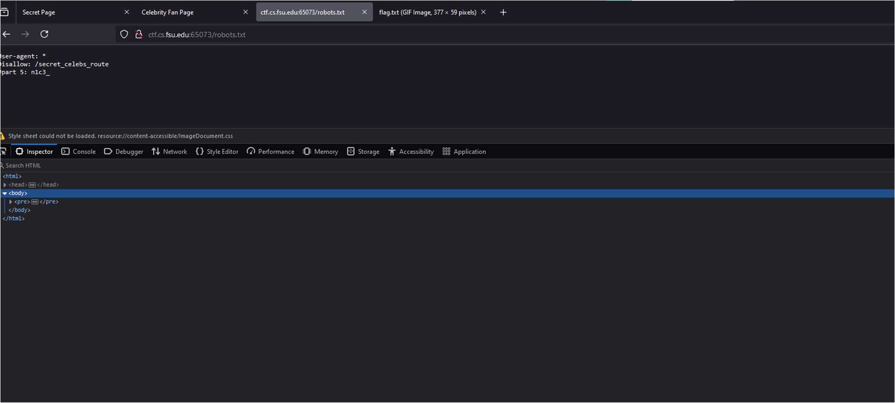
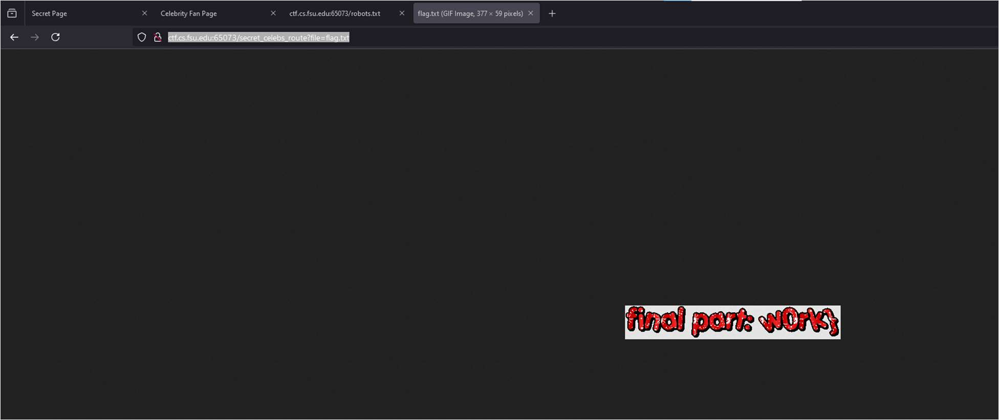
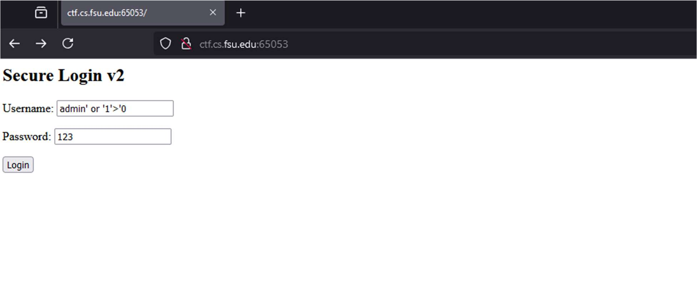

# Web Security Fundamentals

[← Back to CTF Challenges](README.md) · [← Back to Portfolio](../README.md)

---

## 🔎 Overview
This collection of web security challenges covers fundamental vulnerabilities found in web applications including client-side security issues, SQL injection, authentication bypass, and path traversal.

**Source:** FSU CTF Course - Web Exploitation Module  
**Difficulty:** Beginner to Intermediate

---

## 📊 Challenge Summary

| Challenge | Flag | Vulnerability | Difficulty |
|:----------|:-----|:--------------|:----------:|
| Celebrity Fan Page | `fsuCTF{17_0nly_6375_h4rd3r_n1c3_w0rk}` | Multi-vector (6 parts) | ⭐⭐⭐⭐ |
| Secure Login 2 | `fsuCTF{f1l73r5_4r3_4_h4ck3r5_w0r57_fr13nd}` | SQL Injection | ⭐⭐⭐ |
| Adlib Quest | `fsuCTF{cursed_goto_statement}` | Source Code Analysis | ⭐⭐ |

---

## 🧩 Challenge 1: Celebrity Fan Page

**Category:** Multi-Vector Web Exploitation  
**Flag:** `fsuCTF{17_0nly_6375_h4rd3r_n1c3_w0rk}`  
**Difficulty:** ⭐⭐⭐⭐ Hard

### Challenge Description
A web application with the flag split across 6 different locations, requiring multiple web exploitation techniques to find all parts.

### Tools Used
- **Browser Developer Tools** - Inspect Element, Network tab, Debugger
- **JWT.io** - JSON Web Token decoding
- **CyberChef** - Data transformation

### Approach & Methodology

#### Part 1: Hidden HTML Elements
**Technique:** DOM Inspection

*Browser DevTools showing hidden HTML content with first flag segment*

---

#### Part 2: CSS Analysis
**Technique:** Style Sheet Inspection

*Style Editor revealing flag segment hidden in CSS*

---

#### Part 3: JavaScript Analysis
**Technique:** Debugger/Source Inspection

*Debugger tab showing JavaScript with encoded flag segment*

---

#### Part 4: JWT Token Analysis
**Technique:** Session Token Decoding

*JWT token decoded revealing flag segment in payload*

---

#### Part 5: robots.txt Enumeration
**Technique:** Web Reconnaissance

*robots.txt revealing disallowed paths and flag segment*

---

#### Part 6: Path Traversal
**Technique:** Directory Traversal

*Successful path traversal revealing final flag segment*

---

### Complete Flag Assembly
Combined all 6 parts: `fsuCTF{17_0nly_6375_h4rd3r_n1c3_w0rk}`

### Skills Demonstrated
- Client-side security analysis (HTML, CSS, JavaScript)
- Browser Developer Tools proficiency
- JWT token analysis and decoding
- Web reconnaissance and path traversal

---

## 🧩 Challenge 2: Secure Login 2

**Category:** SQL Injection, Authentication Bypass  
**Flag:** `fsuCTF{f1l73r5_4r3_4_h4ck3r5_w0r57_fr13nd}`  
**Difficulty:** ⭐⭐⭐ Medium

### Challenge Description
A login form protected by input filters that must be bypassed using SQL injection techniques.

### Exploitation Process

#### SQL Injection Bypass
Analyzed filter logic and crafted payload to bypass authentication:

*Successful SQL injection bypassing authentication*

**Result:** `fsuCTF{f1l73r5_4r3_4_h4ck3r5_w0r57_fr13nd}`

### Key Takeaways
- Input filtering is not a substitute for parameterized queries
- Case sensitivity and encoding often bypass simple filters

---

## 🧩 Challenge 3: Adlib Quest

**Category:** Source Code Analysis  
**Flag:** `fsuCTF{cursed_goto_statement}`  
**Difficulty:** ⭐⭐ Easy

### Approach
1. Viewed page source (Ctrl+U)
2. Located the flag through careful source code analysis

**Result:** `fsuCTF{cursed_goto_statement}`

---

## 🎯 Skills Matrix

| Skill | Proficiency |
|:------|:------------|
| SQL Injection | ⭐⭐⭐⭐ |
| Client-Side Analysis | ⭐⭐⭐⭐⭐ |
| JWT Token Analysis | ⭐⭐⭐⭐ |
| Path Traversal | ⭐⭐⭐⭐ |
| Browser DevTools | ⭐⭐⭐⭐⭐ |

---

*Challenges completed as part of FSU CTF Course - Spring 2025*

---

[← Back to CTF Challenges](README.md) · [← Back to Portfolio](../README.md)
