# Tenant Setup & Identity Architecture ☁️

## Overview

**Project:** Provision and configure a Microsoft 365 Business Premium tenant simulating a 10-user SMB environment
**Type:** Cloud Administration Lab
**Focus:** Entra ID, user provisioning, security groups, RBAC delegation, MFA enforcement

---

## Table of Contents

| # | Section | What's Covered |
|:--|:--------|:---------------|
| 1 | [Tenant Provisioning](#1-tenant-provisioning) | M365 Business Premium setup, admin center access |
| 2 | [Security Group Architecture](#2-security-group-architecture) | Department-based RBAC groups in Entra ID |
| 3 | [User Provisioning](#3-user-provisioning) | Onboarding 10 users with licenses and group assignments |
| 4 | [Role-Based Access Control](#4-role-based-access-control) | User Administrator and Helpdesk Administrator delegation |
| 5 | [MFA & Security Baseline](#5-mfa--security-baseline) | Security Defaults, Conditional Access policies |

---

## Tenant Architecture

```
┌─────────────────────────────────────────────────────────────┐
│          Microsoft 365 Business Premium Tenant              │
│          aikenitservices.onmicrosoft.com                     │
│                                                             │
│   ┌──────────────────┐    ┌──────────────────────────┐      │
│   │  Entra ID        │    │  Microsoft 365 Services  │      │
│   │  ───────────     │    │  ─────────────────────   │      │
│   │  Users (10)      │    │  Exchange Online          │      │
│   │  Security Groups │    │  Teams                    │      │
│   │  Admin Roles     │    │  SharePoint               │      │
│   │  Conditional     │    │  Intune                   │      │
│   │  Access          │    │  OneDrive                 │      │
│   └──────────────────┘    └──────────────────────────┘      │
│                                                             │
│   ┌──────────────────────────────────────────────────┐      │
│   │  Security Layer                                  │      │
│   │  ─────────────                                   │      │
│   │  MFA via Security Defaults                       │      │
│   │  Block Legacy Authentication                     │      │
│   │  Conditional Access (Microsoft-managed)          │      │
│   └──────────────────────────────────────────────────┘      │
└─────────────────────────────────────────────────────────────┘
```

| Component | Details |
|:----------|:--------|
| Tenant | Microsoft 365 Business Premium (Trial — 10 licenses) |
| Domain | `aikenitservices.onmicrosoft.com` |
| Identity Provider | Microsoft Entra ID |
| Admin | Dane Aiken (Global Administrator) |

---

## 1) Tenant Provisioning

I provisioned a Microsoft 365 Business Premium trial tenant configured as a simulated SMB environment. The Developer Program sandbox was unavailable, so I used the Business Premium trial instead — which actually provides a more realistic Help Desk simulation with Intune, Conditional Access, and full Exchange Online capabilities.

The tenant was set up as **Aiken IT Services**, a 10-person company, with a professional domain structure and dedicated Global Administrator account.

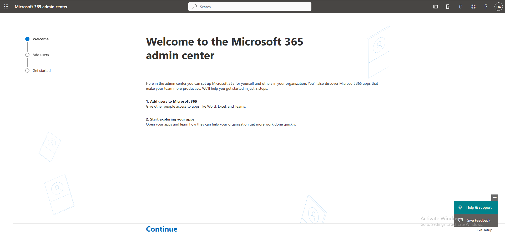

*Microsoft 365 Admin Center welcome screen — tenant provisioned with Aiken IT Services branding.*

After completing the setup wizard and switching from Simplified View to Standard View (full admin mode), the complete Admin Center dashboard became available with all administrative navigation options:

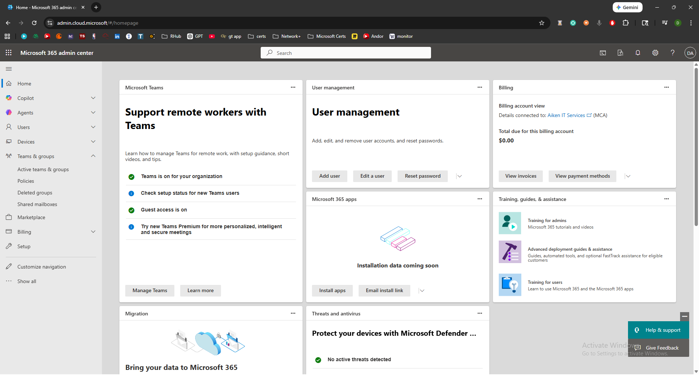

*M365 Admin Center dashboard in Standard View — full administrative controls visible in left navigation.*

---

## 2) Security Group Architecture

Before creating any users, I built the permission model first. In real environments, access is never assigned directly to users — it's assigned to security groups following RBAC principles.

I navigated to **Teams & groups → Active teams & groups → Security** and documented the baseline (empty) state before any configuration:

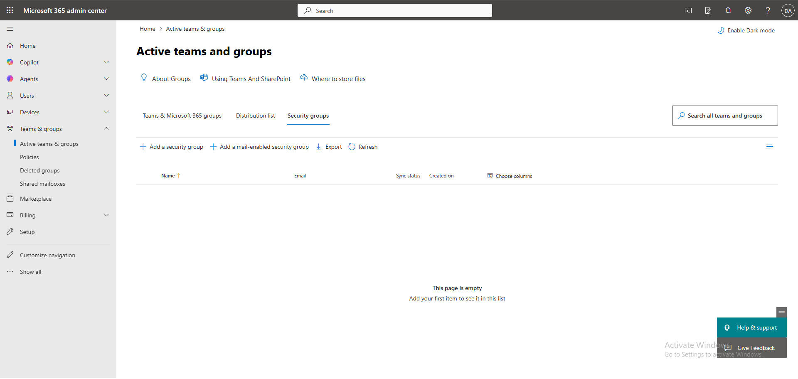

*Security groups page showing empty baseline — pre-configuration state documented.*

I then created four department-based security groups:

| Group Name | Type | Description |
|:-----------|:-----|:------------|
| HR-Access | Security (Assigned) | Access group for Human Resources department |
| Finance-Access | Security (Assigned) | Access group for Finance department |
| Sales-Access | Security (Assigned) | Access group for Sales department |
| IT-Access | Security (Assigned) | Access group for IT department |

All groups were configured with **Assigned** membership type and without Azure AD role assignment capability — these are access groups, not administrative role groups, following least privilege principles.

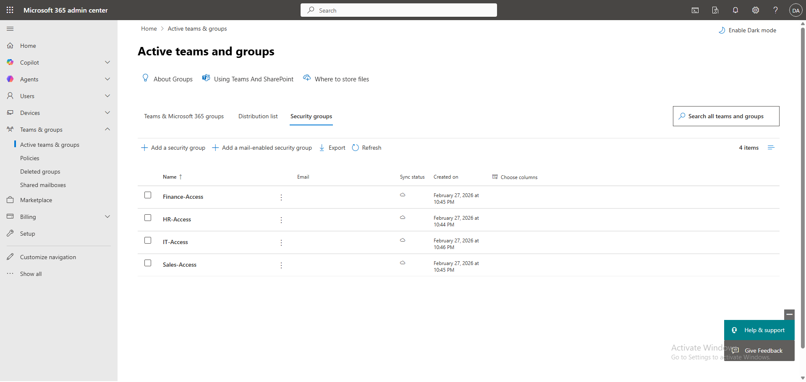

*All four department security groups created — HR-Access, Finance-Access, Sales-Access, IT-Access.*

---

## 3) User Provisioning

With the group structure in place, I onboarded 9 additional users (10 total including the Global Admin account) across four departments. Each user was created with:

* Microsoft 365 Business Premium license assigned
* Department field populated
* Auto-generated password with forced change at first sign-in
* Immediate assignment to their department security group

### First User — Rachel Lee (HR)

I created Rachel Lee as the first standard user to establish the provisioning workflow, then assigned her to the HR-Access security group:

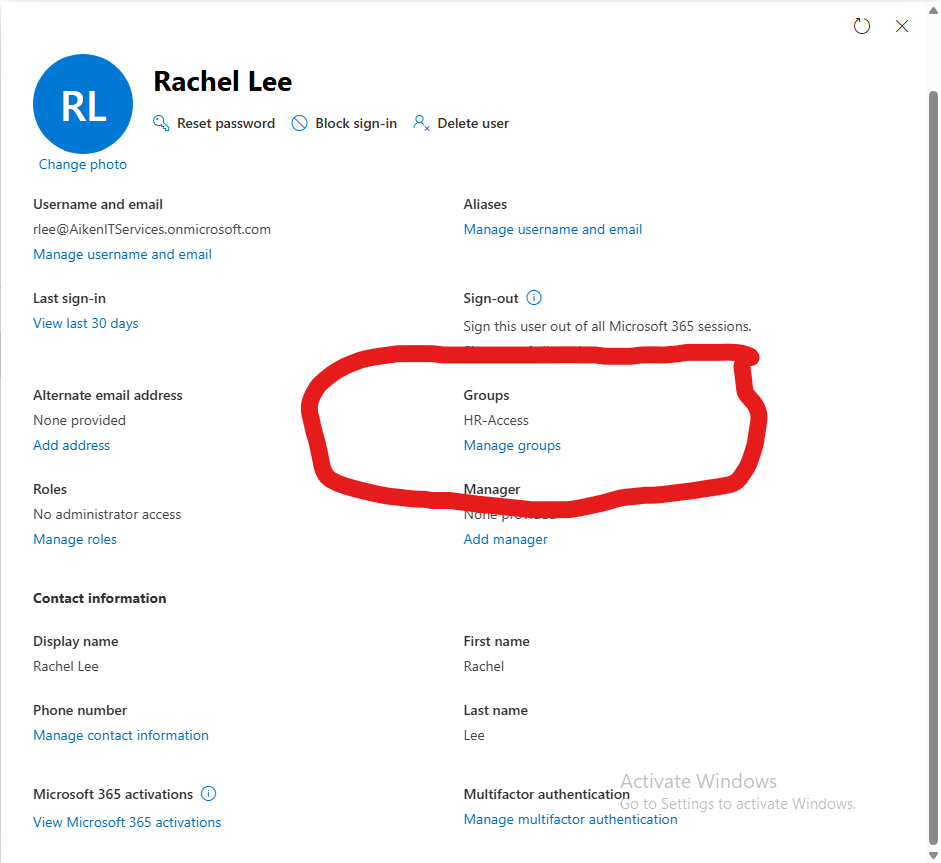

*Rachel Lee assigned to HR-Access security group — department-based access control established.*

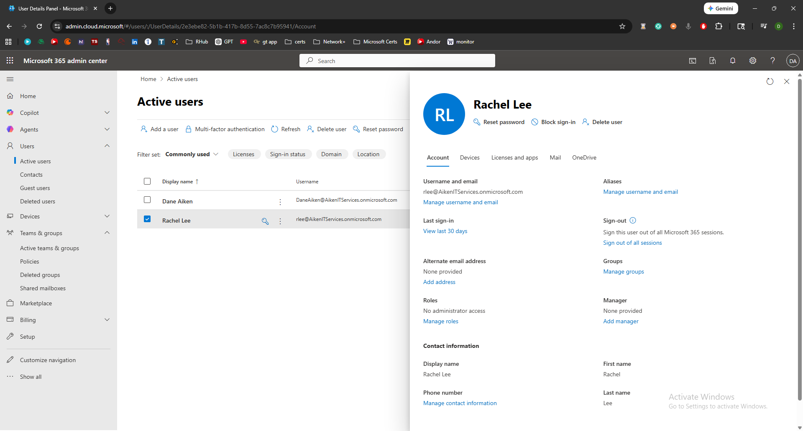

*Rachel Lee provisioned with Business Premium license and HR department tag — onboarding workflow documented.*

### Full Company Provisioning

After establishing the workflow with Rachel Lee, I created the remaining 8 users and assigned each to their corresponding department group:

| Department | User | Username | Security Group |
|:-----------|:-----|:---------|:---------------|
| HR | Rachel Lee | `rlee` | HR-Access |
| HR | Jimmy Butler | `jbutler` | HR-Access |
| Finance | Jayson Tatum | `jtatum` | Finance-Access |
| Finance | Nikola Jokic | `njokic` | Finance-Access |
| Sales | Luka Doncic | `ldoncic` | Sales-Access |
| Sales | Devin Booker | `dbooker` | Sales-Access |
| Sales | Anthony Edwards | `aedwards` | Sales-Access |
| IT | LeBron James | `ljames` | IT-Access |
| IT | IT Support | `support` | IT-Access |

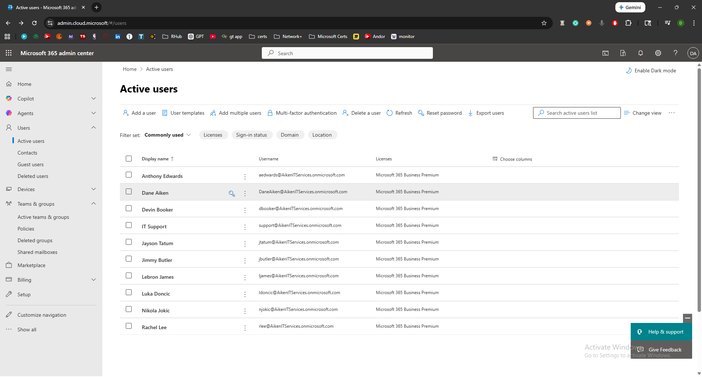

*Active Users list showing all 10 accounts provisioned with Business Premium licenses — full company onboarding complete.*

---

## 4) Role-Based Access Control

With all users provisioned, I implemented admin role delegation to simulate real-world privilege separation. Not everyone should be a Global Admin — IT staff need appropriate scoped roles.

### User Administrator — LeBron James (`ljames`)

I assigned the **User Administrator** role to the IT department lead. This role can reset passwords, manage users, and manage group membership — mirroring a Tier 2 IT Admin scope without full Global Admin access.

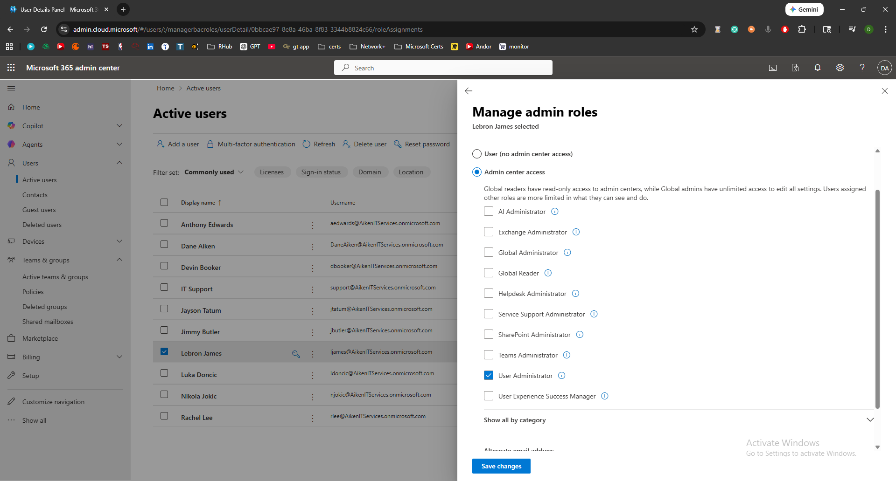

*LeBron James assigned User Administrator role — scoped privilege delegation for IT operations.*

### Helpdesk Administrator — IT Support (`support`)

I assigned the **Helpdesk Administrator** role to the support account. This role can reset passwords and force sign-outs — exactly what Tier 1 Help Desk needs, and nothing more.

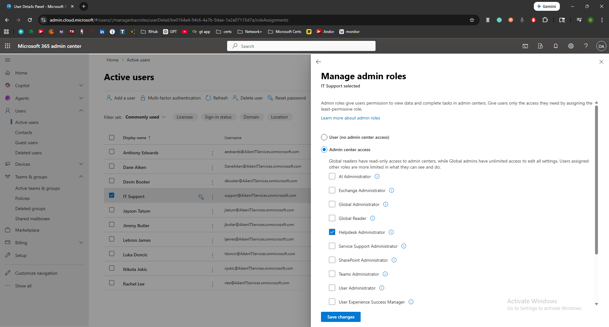

*Support account assigned Helpdesk Administrator role — least privilege enforcement for Tier 1 operations.*

This RBAC structure ensures:

| Role | User | Can Do | Cannot Do |
|:-----|:-----|:-------|:----------|
| Global Admin | Dane Aiken | Everything | — |
| User Administrator | `ljames` | Manage users, reset passwords, manage groups | Modify admin roles, tenant settings |
| Helpdesk Administrator | `support` | Reset passwords, force sign-out | Create users, modify groups, change licenses |

---

## 5) MFA & Security Baseline

I navigated to Microsoft Entra ID to configure the security baseline for the tenant:

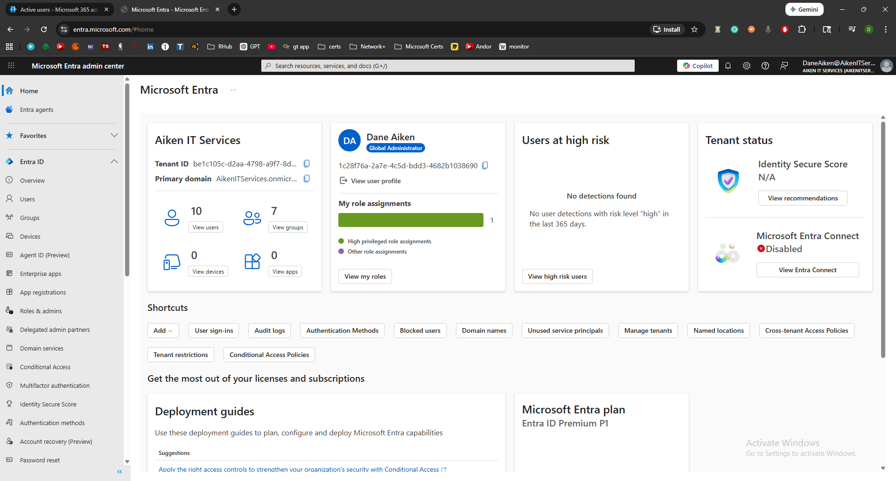

*Microsoft Entra ID Admin Center — identity management dashboard with tenant overview.*

I enabled **Security Defaults**, which automatically deployed Microsoft-managed Conditional Access policies:

| Policy | Effect |
|:-------|:-------|
| Block legacy authentication | Prevents insecure auth protocols |
| Require MFA for admins | Admin accounts require multi-factor authentication |
| Require MFA for all users | All users prompted for MFA registration |
| Require MFA for Azure management | Protects Azure portal access |

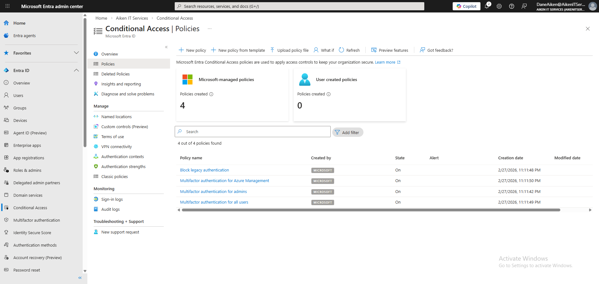

*Microsoft-managed Conditional Access policies active — MFA enforced for all users, legacy auth blocked.*

For a 10-user SMB simulation, Security Defaults is the realistic choice — most small businesses use this baseline rather than custom Conditional Access policies. This provides strong protection without the complexity of manual policy creation.

---

## Summary

| Phase | Action | Tool |
|:------|:-------|:-----|
| 1 | Provisioned M365 Business Premium tenant | Microsoft 365 Admin Center |
| 2 | Created 4 department security groups | Admin Center → Teams & Groups |
| 3 | Onboarded 10 users with licenses and group assignments | Admin Center → Users |
| 4 | Delegated User Admin and Helpdesk Admin roles | Admin Center → Roles |
| 5 | Enabled MFA via Security Defaults | Entra ID → Conditional Access |

---

## Key Takeaways

**Groups Before Users** — Building the security group architecture before creating users ensures every account is assigned to proper RBAC groups from the start. This prevents the common mistake of users existing without group-based access controls.

**Least Privilege Delegation** — The Helpdesk Administrator role provides exactly what Tier 1 support needs (password resets and sign-out forcing) without exposing user creation, license management, or tenant configuration. This separation is critical in production environments.

**Security Defaults for SMBs** — For small business environments, Microsoft-managed Conditional Access policies via Security Defaults provide MFA enforcement and legacy auth blocking without requiring P1/P2 licensing or manual policy configuration.

---

## Skills Demonstrated

* Microsoft 365 Business Premium tenant provisioning and configuration
* Microsoft Entra ID (Azure AD) identity architecture design
* Department-based security group creation for RBAC
* Structured user provisioning with license assignment and department tagging
* Admin role delegation (User Administrator, Helpdesk Administrator)
* MFA enforcement via Security Defaults and Conditional Access policies
* Principle of least privilege implementation across admin roles

---

[← Back to Lab Overview](README.md) · [← Back to Portfolio](../README.md)
