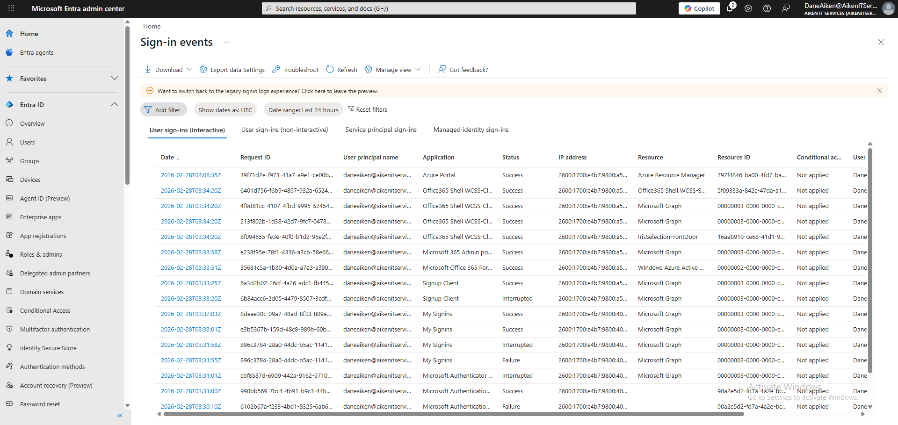
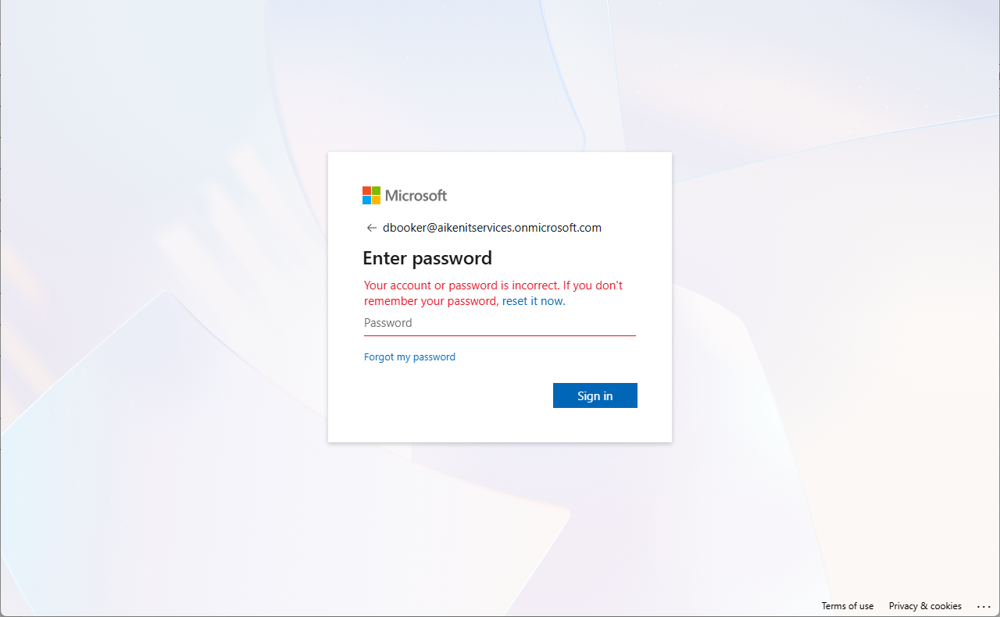
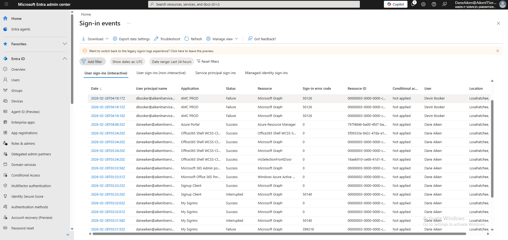
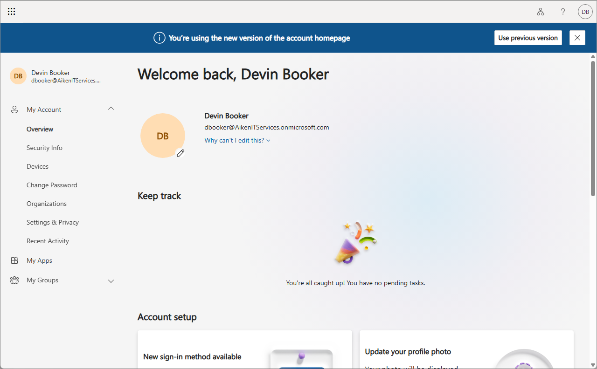
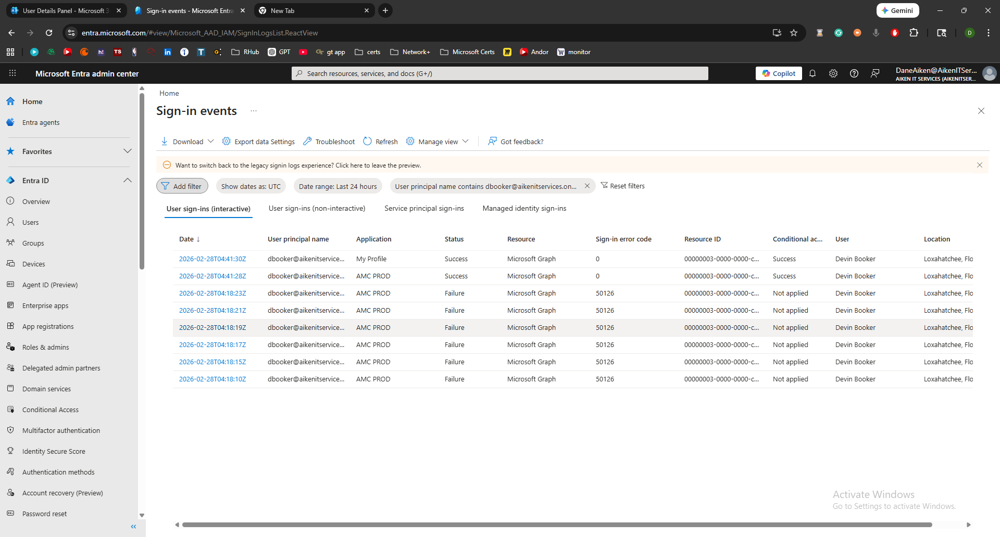
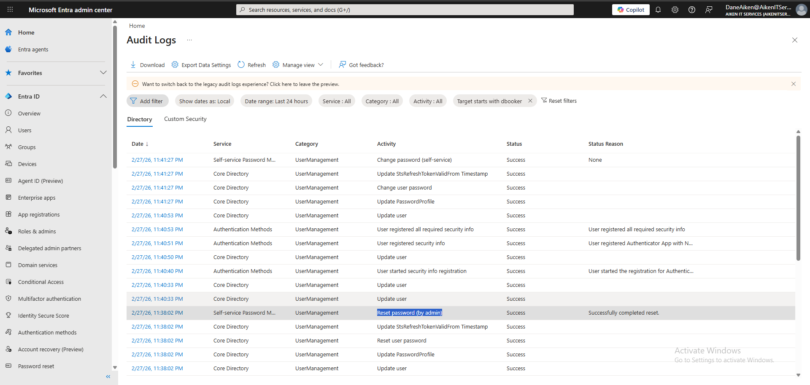

# Ticket #001 — Password Reset (Failed Sign-In Investigation) 🔐

**Ticket:** `#001`
**User:** `dbooker` (Devin Booker — Sales Department)
**Reported Issue:** "I can't log in — it says my password is wrong."

---

## My Process

### 1) Document Baseline Sign-In Logs

Before simulating the incident, I navigated to **Entra ID → Monitoring → Sign-in logs** and documented the baseline state. This establishes what "normal" looks like before any authentication failures appear:

*Entra ID sign-in logs — baseline state documented before incident simulation.*

---

### 2) Trigger Failed Authentication Attempts

To simulate the reported issue, I opened an incognito browser window and navigated to `portal.office.com`. I attempted to sign in as `dbooker@aikenitservices.onmicrosoft.com` with an incorrect password multiple times to generate failed authentication events:

*Failed sign-in attempt at portal.office.com — incorrect password entered for Devin Booker's account.*

---

### 3) Investigate Sign-In Logs

Returning to the Global Admin session, I checked the Entra ID sign-in logs filtered by user (`dbooker`) and time range (last 1 hour). The failed authentication attempts were now visible:

*Entra ID sign-in logs showing failed authentication attempts for Devin Booker — Status: Failure with error details visible.*

---

### 4) Perform Delegated Password Reset

To simulate the proper Help Desk workflow, I signed in as the **Helpdesk Administrator** (`support@aikenitservices.onmicrosoft.com`) rather than using the Global Admin account. This demonstrates delegated role usage — the support account has only Helpdesk Administrator permissions.

I navigated to **Users → Active users → dbooker → Reset password**, generated a new temporary password, and enabled the **force password change at next sign-in** option:

*Password reset performed via Helpdesk Administrator account — temporary password generated with forced change enabled.*

---

### 5) Validate User Can Sign In

After the reset, I switched back to the incognito window and signed in as `dbooker` using the temporary password. The system prompted for a mandatory password change and MFA registration (enforced by Security Defaults):

*Successful sign-in with temporary password — user prompted to set new password and complete MFA registration.*

---

### 6) Verify Authentication Timeline

Returning to the admin session, I reviewed the sign-in logs again to confirm the full authentication timeline — from initial failures through successful remediation:

*Sign-in activity timeline showing authentication failure followed by successful sign-in after password reset — full incident lifecycle visible.*

---

### 7) Verify Audit Trail

Finally, I navigated to **Entra ID → Monitoring → Audit logs** and filtered by target user (`dbooker`). The audit log confirmed the password reset event, including who performed it and when:

*Audit log showing password reset activity — initiated by the support account (Helpdesk Administrator) with timestamp.*

---

## Summary

| Step | Action | Tool |
|:-----|:-------|:-----|
| 1 | Documented baseline sign-in logs | Entra ID → Sign-in logs |
| 2 | Generated failed authentication attempts | Incognito browser → portal.office.com |
| 3 | Investigated failures in sign-in logs | Entra ID → Sign-in logs (filtered) |
| 4 | Reset password via Helpdesk Administrator | M365 Admin Center (as `support`) |
| 5 | Validated successful sign-in after reset | Incognito browser → portal.office.com |
| 6 | Confirmed authentication timeline | Entra ID → Sign-in logs |
| 7 | Verified audit trail for compliance | Entra ID → Audit logs |

---

## Key Takeaways

**Delegated Role Usage** — The password reset was performed using the Helpdesk Administrator role (`support`), not the Global Admin account. In production environments, Tier 1 technicians should never use Global Admin credentials for routine operations. This demonstrates proper privilege separation.

**Log-Driven Troubleshooting** — Instead of blindly resetting the password, the proper workflow is to first investigate the sign-in logs to understand what happened (wrong password vs. account lockout vs. MFA failure vs. Conditional Access block). The logs tell the full story.

**Audit Accountability** — Every administrative action is logged with the identity of who performed it. The audit trail showing "Reset password — initiated by: support" provides traceability that is critical for compliance and incident documentation.

---

## Skills Demonstrated

* Authentication failure investigation using Entra ID sign-in logs
* Delegated password reset via Helpdesk Administrator role
* Forced password change and MFA registration enforcement
* Sign-in log filtering and timeline analysis
* Audit log verification for compliance and traceability
* Proper Tier 1 workflow: investigate → remediate → validate → document

---

[← Back to Lab Overview](README.md) · [← Back to Portfolio](../README.md)
