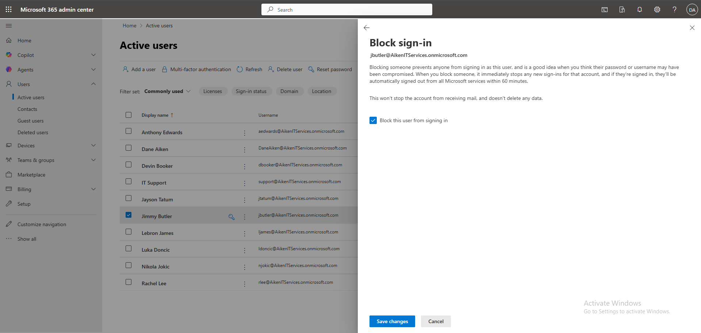
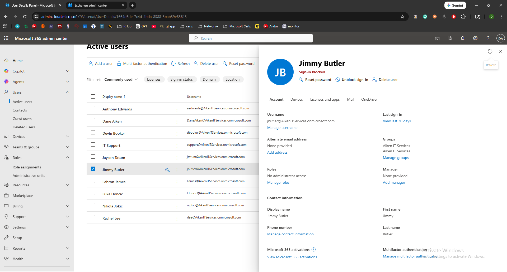
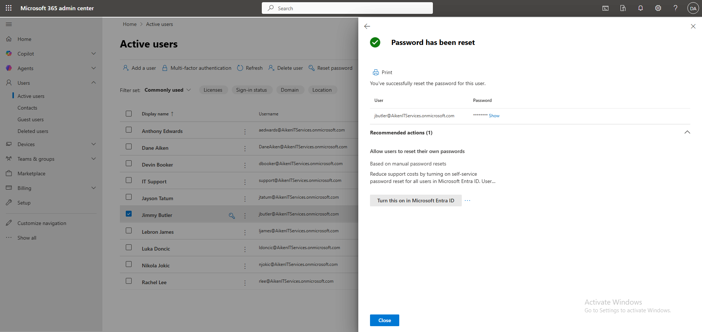
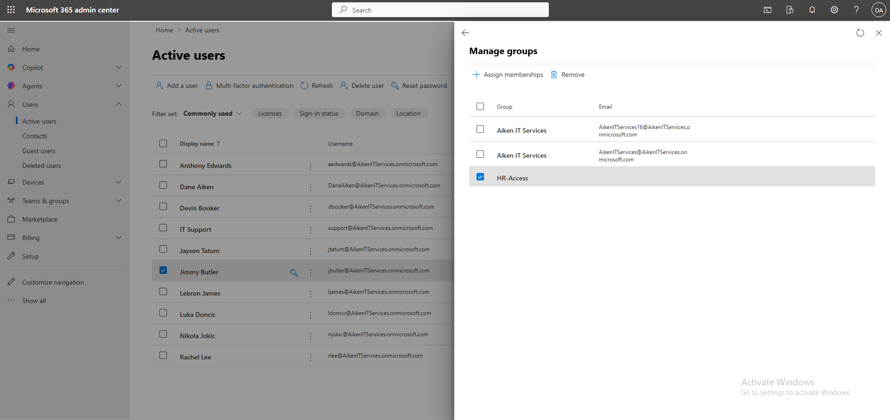
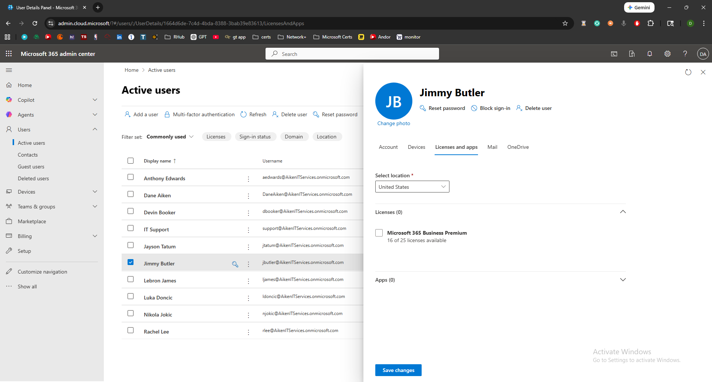
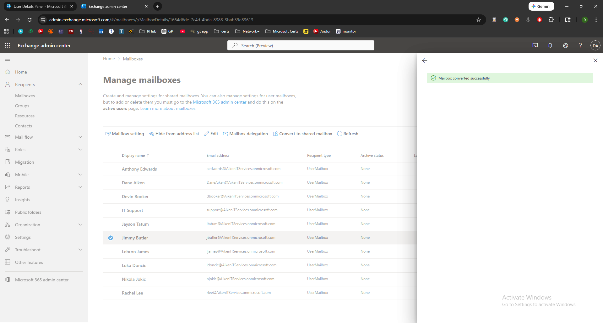
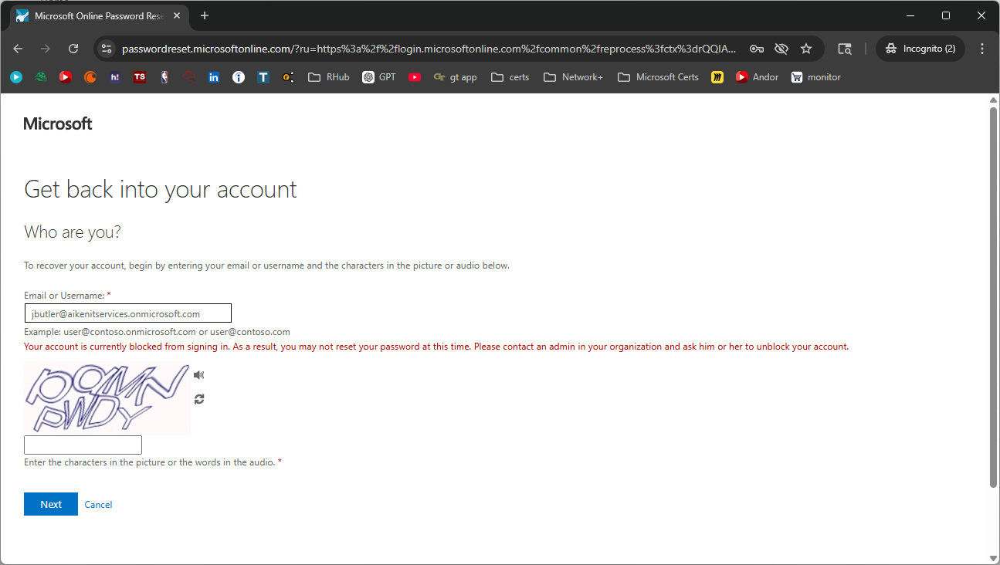

# Ticket #002 — Employee Offboarding (Jimmy Butler) 🚪

**Ticket:** `#002`
**User:** `jbutler` (Jimmy Butler — HR Department)
**Request from HR:** "Employee terminated effective immediately. Disable all access."

---

## My Process

### 1) Block Sign-In Immediately

The first priority in any termination is preventing further access. I navigated to **M365 Admin Center → Users → Active users → jbutler** and toggled **Block sign-in** to prevent any authentication:

*Sign-in blocked for Jimmy Butler — immediate access containment.*

*Confirmed sign-in block saved correctly after verification.*

---

### 2) Reset Password

With sign-in blocked, I reset the password to invalidate any cached credentials or active sessions. This is a defense-in-depth step — even though sign-in is blocked, resetting the password ensures the old credentials cannot be reused if the block is accidentally lifted:

*Password reset during offboarding — credential invalidation as a secondary containment measure.*

---

### 3) Remove Department Group Membership

I opened Jimmy Butler's user profile and removed him from the **HR-Access** security group. This revokes all department-based access that was inherited through group membership:

*HR-Access group membership removed — department-level access privileges revoked.*

---

### 4) Remove License

I unassigned the Microsoft 365 Business Premium license, which disables access to all M365 services:

*Business Premium license removed — Exchange, Teams, SharePoint, OneDrive services deactivated.*

**Important lesson learned:** During this simulation, I initially removed the license before converting the mailbox to shared. This caused the Exchange mailbox to become soft-deleted and disappear from the mailbox list. I had to temporarily reassign the license to restore the mailbox before converting it. The correct offboarding order is:

1. Block sign-in
2. Reset password
3. **Convert mailbox to shared**
4. **Then** remove license
5. Remove from groups

This sequencing issue is a very common mistake made by junior admins, and understanding the correct order is a strong interview talking point.

---

### 5) Convert Mailbox to Shared

After correcting the sequence, I navigated to the **Exchange Admin Center → Recipients → Mailboxes**, selected Jimmy Butler's mailbox, and converted it from a User Mailbox to a **Shared Mailbox**:

*Mailbox converted to Shared — allows HR to access former employee email without requiring a license.*

A shared mailbox:
* Does not require a license
* Allows designated users (like HR) to access the former employee's email
* Preserves email history for compliance and knowledge transfer
* Remains functional even after the user license is removed

---

### 6) Validate Containment — Blocked Sign-In Attempt

To confirm the offboarding was effective, I opened an incognito window and attempted to sign in as `jbutler@aikenitservices.onmicrosoft.com`:

*"Your account has been locked" — sign-in attempt rejected, confirming access has been fully revoked.*

---

## Summary

| Step | Action | Tool |
|:-----|:-------|:-----|
| 1 | Blocked sign-in | M365 Admin Center → Users |
| 2 | Reset password | M365 Admin Center → Users |
| 3 | Removed from HR-Access group | M365 Admin Center → Users → Groups |
| 4 | Removed Business Premium license | M365 Admin Center → Users → Licenses |
| 5 | Converted mailbox to Shared | Exchange Admin Center → Mailboxes |
| 6 | Validated blocked sign-in from user side | Incognito browser → portal.office.com |

---

## Key Takeaways

**Offboarding Sequence Matters** — Removing the license before converting the mailbox causes the Exchange mailbox to be soft-deleted. The correct order is: block sign-in → reset password → convert mailbox to shared → remove license → remove groups. Understanding this sequence is critical for any IT admin handling terminations.

**Defense in Depth** — Blocking sign-in alone isn't sufficient. Resetting the password invalidates cached credentials, removing group memberships revokes inherited permissions, and removing the license disables all service access. Each layer addresses a different attack vector.

**Mailbox Preservation** — Converting to a shared mailbox before license removal preserves email history for compliance, legal hold, and knowledge transfer — while also reclaiming the license for reallocation to new employees.

---

## Skills Demonstrated

* Employee termination / offboarding workflow in Microsoft 365
* Immediate access containment via sign-in blocking
* Credential revocation during offboarding
* Security group membership cleanup
* License removal and service deprovisioning
* Mailbox conversion (User → Shared) in Exchange Admin Center
* Correct offboarding sequence awareness (mailbox before license)
* Client-side validation of access revocation
* Understanding of defense-in-depth principles in identity management

---

[← Back to Lab Overview](README.md) · [← Back to Portfolio](../README.md)
