# Cybersecurity Portfolio – Dane Aiken 🛡️

**Aspiring SOC Analyst | Threat Detection Specialist | CTF Enthusiast**

*Florida State University – Computer Science Graduate*

---

## 🔗 Quick Navigation

| 🔍 [Splunk Labs](#-1-splunk-home-labs) | 🎖️ [TryHackMe](#️-2-tryhackme-soc-analyst-labs) | 🚩 [CTF Challenges](#-3-capture-the-flag-challenges) | 📜 [Certifications](#-certifications) | 🛠️ [Skills](#️-technical-skills) |
|:---:|:---:|:---:|:---:|:---:|

---

## 👋 About Me

I am a **Computer Science graduate from Florida State University** with a specialized focus on **cybersecurity and defensive operations**. My hands-on experience spans **SIEM analysis, digital forensics, threat intelligence, incident response, and CTF problem-solving**.

I'm passionate about protecting organizations from cyber threats and continuously expanding my technical capabilities through hands-on labs, certifications, and competitive challenges.

---

## 📜 Certifications

| Certification | Issuer | Focus Area |
|:-------------:|:------:|:----------:|
|  | CompTIA | Security Fundamentals |
|  | CompTIA | Security Analytics |
|  | Google | Professional Certificate |
|  | TryHackMe | SOC Operations |

📄 View Certificate Files

- [CompTIA Security+ Certificate](_Certifications/CompTIA%20Security+%20ce%20certificate.pdf)
- [CompTIA CySA+ Certificate](_Certifications/CompTIA%20CySA+%20ce%20certificate.pdf)
- [Google Cybersecurity Certificate](_Certifications/Google%20Cybersecurity%20Certificate.pdf)
- [TryHackMe SAL1 Certificate](_Certifications/TryHackMe%20SAL1%20certificate.pdf)

---

## 🎯 Career Focus

| Role | Core Skills |
|:-----|:------------|
| **SOC Analyst (Tier 1/2)** | Threat detection, incident response, SIEM monitoring |
| **Junior Cybersecurity Analyst** | Vulnerability assessment, security operations |
| **Threat Intelligence Analyst** | IOC analysis, threat hunting, intelligence reporting |
| **Digital Forensics Analyst** | Incident investigation, evidence collection |

---

## 🛠️ Technical Skills

### Security Tools & Platforms

| Category | Tools |
|:---------|:------|
| **SIEM & Logging** |  SPL Query Language |
| **Network Analysis** |  tshark, tcpdump |
| **Forensics** |  Memory Analysis, File Carving |
| **Reverse Engineering** |  pwndbg, Ghidra, JD-GUI |
| **Web Security** |  Browser DevTools, JWT Analysis |
| **Threat Intel** | OpenCTI, MISP, STIX/TAXII, IOC Analysis |
| **Penetration Testing** | Metasploit, Nmap, John the Ripper |
| **Data Analysis** |  Python, Regex |

### Programming & Scripting

| Language | Use Case |
|:---------|:---------|
|  | Automation, exploit development, data processing |
|  | Linux administration, log analysis, scripting |
|  | Database queries, injection testing |
| **SPL** | Splunk search and correlation queries |

### Operating Systems

---

## 📂 Portfolio Projects

### 🔍 [1. Splunk Home Labs](Splunk_HomeLabs/)

**Hands-on SIEM analysis and threat detection using Splunk Enterprise**

Practical labs demonstrating SOC analyst workflows including log ingestion, SPL query writing, dashboard creation, and security event correlation.

| Project | Description | Skills |
|:--------|:------------|:-------|
| [🔐 SSH Brute Force Detection](Splunk_HomeLabs/SSH_Brute_Force_Detection.md) | Identifying authentication attacks through log analysis | SPL, Log Analysis, Alert Engineering |
| [🌐 OWASP Juice Shop Analysis](Splunk_HomeLabs/Detecting_Web_Application_Attacks_in_OWASP_Juice_Shop_Logs.md) | Web application security monitoring and attack detection | Web Logs, Attack Patterns, Dashboard Development |

💡 Skills Demonstrated

- Log ingestion from multiple sources (JSON, Apache, SSH)
- SPL query writing for attack detection (brute force, web exploits)
- Dashboard creation and alert configuration
- Security event correlation and analysis

---

### 🎖️ [2. TryHackMe SOC Analyst Labs](TryHackMe_SOCAnalyst1/)

**Real-world threat intelligence and incident response case studies**

Completion of the **TryHackMe SOC Analyst Level 1 Path** with hands-on APT analysis, OSINT investigations, and threat intelligence documentation.

| Project | Description | Skills |
|:--------|:------------|:-------|
| [🦠 APT Analysis: Tropic Trooper](TryHackMe_SOCAnalyst1/OSINT_Tropic_Trooper.md) | Nation-state threat actor investigation | APT Analysis, IOC Documentation |
| [🔗 OSINT: Friday Overtime](TryHackMe_SOCAnalyst1/OSINT_Friday_Overtime.md) | Social engineering investigation | OSINT, Intelligence Gathering |
| [📋 SOC Workflow: Summit](TryHackMe_SOCAnalyst1/SOC_Analyst_Workflow_Summit.md) | End-to-end incident response workflow | Incident Response, Threat Hunting |

💡 Skills Demonstrated

- APT Campaign Analysis (Tropic Trooper, USBFerry)
- OSINT investigations and intelligence gathering
- IOC (Indicators of Compromise) documentation
- OpenCTI threat intelligence platform usage
- STIX/TAXII framework understanding

---

### 🚩 [3. Capture The Flag Challenges](Capture_The_Flag/)

**Offensive security skills and hands-on exploitation techniques**

Comprehensive collection of **25+ documented CTF challenges** from FSU's CTF course across multiple security domains.

#### Challenge Categories

| Category | Challenges | Key Techniques |
|:---------|:----------:|:---------------|
| [🔐 **Cryptography**](Capture_The_Flag/Cryptography/) | 3 | CyberChef, Base64, ROT13, XOR decryption |
| [🌐 **Web Exploitation**](Capture_The_Flag/Web_Exploitation/) | 6 | SQL Injection, JWT manipulation, SSTI, Command Injection |
| [🔧 **Reverse Engineering**](Capture_The_Flag/Reverse_Engineering/) | 9 | GDB/pwndbg, Ghidra, Anti-debug bypass, JAR decompilation |
| [🔍 **Digital Forensics**](Capture_The_Flag/Forensics/) | 6 | Wireshark, Volatility, Steganography, File carving |
| [💥 **Binary Exploitation**](Capture_The_Flag/Binary_Exploitation/) | 3 | Buffer overflow, ROP chains, pwntools |
| [🏆 **Final CTF Competition**](Capture_The_Flag/Final_CTF/) | 12 | Multi-domain challenges |

📊 Challenge Completion Summary

| Assignment | Category Focus | Challenges Solved |
|:-----------|:---------------|:-----------------:|
| HW1 | Cryptography | 3/3 ✅ |
| HW2 | Web Exploitation | 3/3 ✅ |
| HW4 | Forensics & Steganography | 3/3 ✅ |
| HW5 | Network Forensics | 3/3 ✅ |
| HW6 | Reverse Engineering | 3/3 ✅ |
| HW7 | Binary Reversing | 3/3 ✅ |
| HW8 | Binary Exploitation | 3/3 ✅ |
| Final CTF | All Categories | 12/12 ✅ |

---

## 📊 Portfolio Summary

| 📁 Category | 🎯 Projects | 🛠️ Primary Tools | ⭐ Difficulty |
|:------------|:-----------:|:-----------------|:------------:|
| **SIEM Analysis** | 2 Labs | Splunk, SPL | ⭐⭐⭐⭐ |
| **Threat Intelligence** | 3 Cases | OpenCTI, OSINT | ⭐⭐⭐⭐ |
| **Web Security** | 6 Challenges | Burp Suite, DevTools | ⭐⭐⭐ |
| **Reverse Engineering** | 9 Challenges | GDB, Ghidra | ⭐⭐⭐⭐ |
| **Digital Forensics** | 6 Challenges | Wireshark, Volatility | ⭐⭐⭐⭐ |
| **Binary Exploitation** | 3 Challenges | pwntools, GDB | ⭐⭐⭐⭐⭐ |
| **Cryptography** | 3 Challenges | CyberChef, Python | ⭐⭐⭐ |

---

## 🚀 Why This Portfolio Stands Out

| Strength | Description |
|:---------|:------------|
| ✅ **Hands-On Technical Skills** | Real tools, real scenarios, documented results |
| ✅ **Blue Team Focus** | SOC operations, detection engineering, threat hunting |
| ✅ **Offensive Understanding** | Red team tactics knowledge to better defend |
| ✅ **Comprehensive Documentation** | Professional writeups with methodology & screenshots |
| ✅ **Industry-Relevant Certifications** | Security+, CySA+, Google Cybersecurity, SAL1 |
| ✅ **Continuous Learning** | Active CTF participation and threat research |

---

## 🎯 Career Readiness

### Why I'm Ready for a SOC Analyst Role

<strong>1. Detection & Monitoring</strong>

- Created custom Splunk dashboards and alerts for real-time threat detection
- Analyzed network traffic patterns to identify brute force and web attacks
- Correlated security events across multiple log sources

<strong>2. Incident Response</strong>

- Investigated APT campaigns with structured analysis methodology
- Collected and documented IOCs for threat intelligence sharing
- Performed memory forensics and artifact recovery

<strong>3. Threat Intelligence</strong>

- Analyzed nation-state threat actors using OSINT techniques
- Used OpenCTI for threat intelligence management
- Documented findings in industry-standard formats (STIX/TAXII)

<strong>4. Technical Proficiency</strong>

- Comfortable with Linux command line and security tools
- Experienced in log analysis, pattern recognition, and data correlation
- Strong problem-solving skills demonstrated through 25+ CTF challenges

---

## 📈 Learning Journey

```mermaid
graph LR
    A[🎓 Fundamentals] --> B[📊 SIEM & Logging]
    B --> C[🔍 Threat Intelligence]
    C --> D[🚨 Incident Response]
    D --> E[🔬 Advanced Analysis]
    E --> F[🎯 Threat Hunting]
```

### Current Focus Areas
- 🔄 Advanced threat detection with Splunk
- 🔄 Malware analysis and reverse engineering
- 🔄 MITRE ATT&CK framework mapping
- 🔄 Security orchestration and automation (SOAR)

### Next Certifications
- 📋 Blue Team Level 1 (BTL1)
- 📋 GIAC Security Essentials (GSEC)
- 📋 Splunk Core Certified Power User

---

## 📞 Get In Touch

I'm actively seeking opportunities in cybersecurity, particularly in **SOC operations, threat detection, and incident response**.

| Platform | Link |
|:--------:|:----:|
|  | [linkedin.com/in/dane-aiken](https://linkedin.com/in/dane-aiken) |
|  | [@DaneOAiken](https://github.com/DaneOAiken) |
|  | [daneoaiken@gmail.com](mailto:daneoaiken@gmail.com) |

---

### ⭐ If you find this portfolio valuable, please consider starring this repository! ⭐

**"Always learning, always improving, always defending."**

---

## 📜 License

This portfolio is for educational and professional demonstration purposes. All challenge solutions are from completed authorized exercises and labs at Florida State University.

**Last Updated:** February 2025
