# Splunk Home Lab — Walkthrough 2 🛡️

**Scenario:** Detecting Web Application Attacks in OWASP Juice Shop Logs

---

## Overview

In this walkthrough, I used OWASP Juice Shop as the intentionally vulnerable web application to simulate real-world attack traffic. By generating different types of malicious requests (SQL injection, password spraying, directory traversal, command injection), I ingested and analyzed the logs in Splunk to demonstrate detection, visualization, and alerting workflows.

* **Target Application:** OWASP Juice Shop
* **Traffic Source:** Manually generated malicious traffic (SQLi, password spraying, XSS, traversal, command injection, recon attempts)
* **Goal:** Ingest application traffic into Splunk, analyze for attack patterns, build dashboards, and configure alerts.

---

## Setup ⚙️

The environment was built in a Kali Linux VM running Docker and Splunk. Juice Shop was deployed in a container, and OWASP ZAP was configured as a proxy to capture and generate attack traffic.

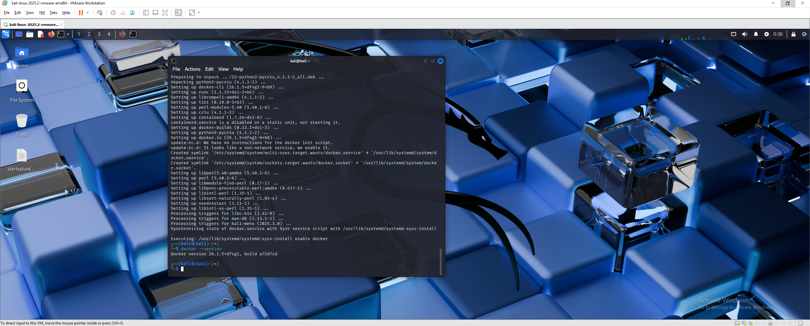
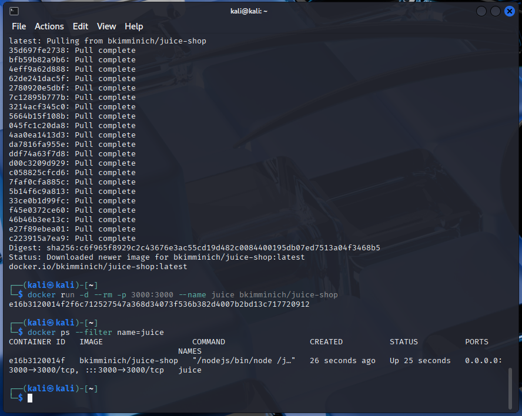
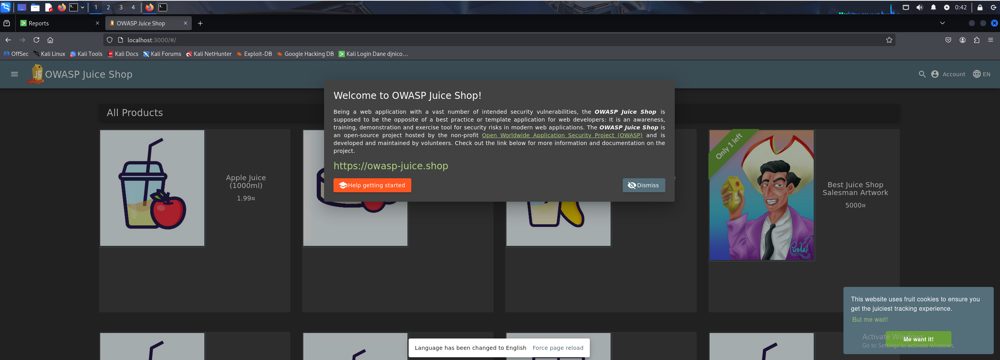

---

## Data Ingestion 📂

After generating traffic, I exported logs from OWASP ZAP into CSV format. These logs were ingested into Splunk by creating a custom index called `juice` and uploading the file through the Splunk Web UI.

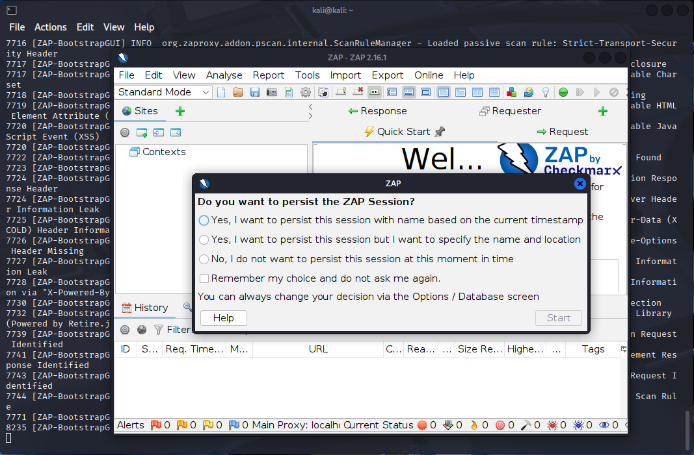
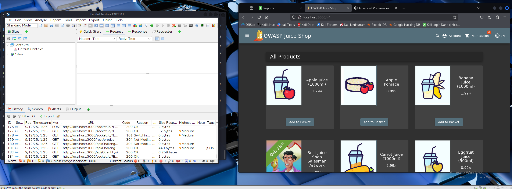

---

## Field Verification 🔍

Once the data was in Splunk, I verified that key fields were parsed correctly. I renamed them into standard SOC analyst naming conventions and applied double `urldecode()` so encoded attack payloads would be detected.

* `Method` → `http_method`
* `URL` → `uri`
* `Code` → `status`

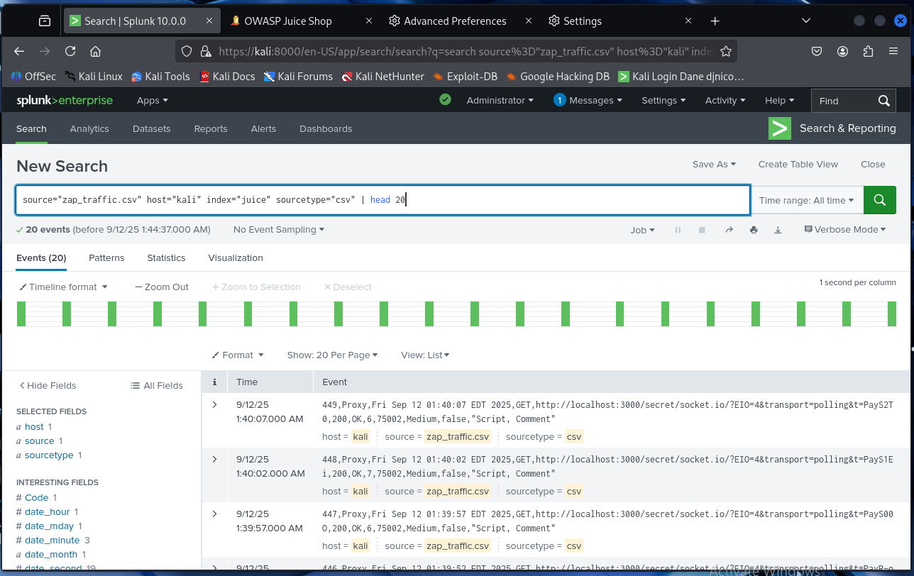

---

## Attack Detections 🚨

### SQL Injection

SQL injection attempts were identified by searching for payloads containing patterns like `UNION SELECT` and `' OR 1=1--`.

```spl
index=juice
| rename Method as http_method, URL as uri, Code as status
| eval decoded=lower(urldecode(uri))
| where like(decoded,"%union%select%") OR like(decoded,"% or 1=1%")
| table _time http_method status uri
```

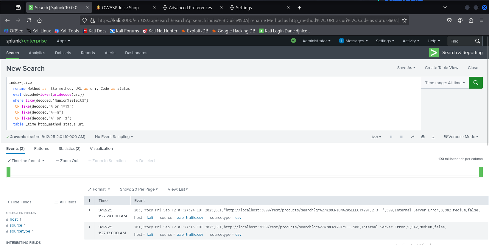

---

### Password Spraying

For password spraying, I detected repeated failed login attempts (HTTP 401/403) to `/rest/user/login`. Grouping over 5-minute intervals highlighted bursts of activity.

```spl
index=juice
| rename Method as http_method, URL as uri, Code as status
| where like(uri,"%/rest/user/login%") AND status IN (401,403)
| bin _time span=5m
| stats count AS failed_logins by _time
| where failed_logins>0
```

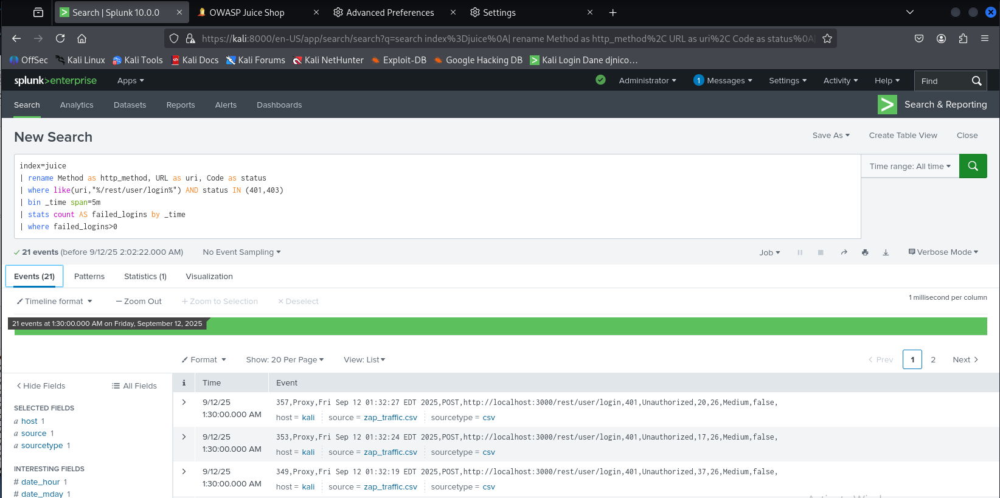

---

## Time-Based Analysis ⏱️

Time-based analysis highlighted when attacks spiked. Using timecharts, I plotted SQLi and failed logins over time. These visualizations are crucial for identifying attack campaigns versus isolated attempts.

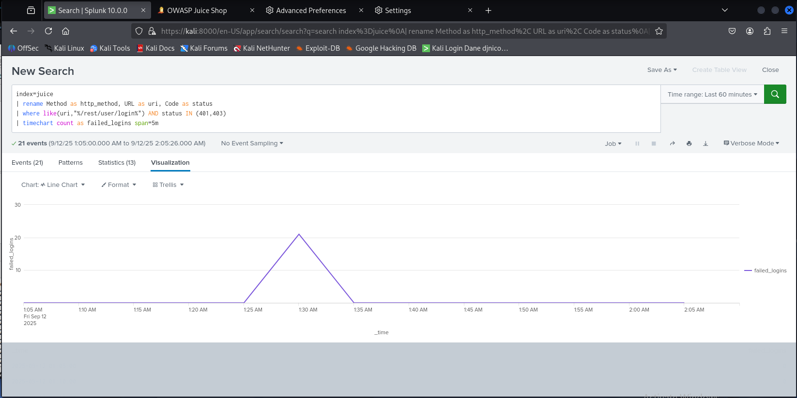
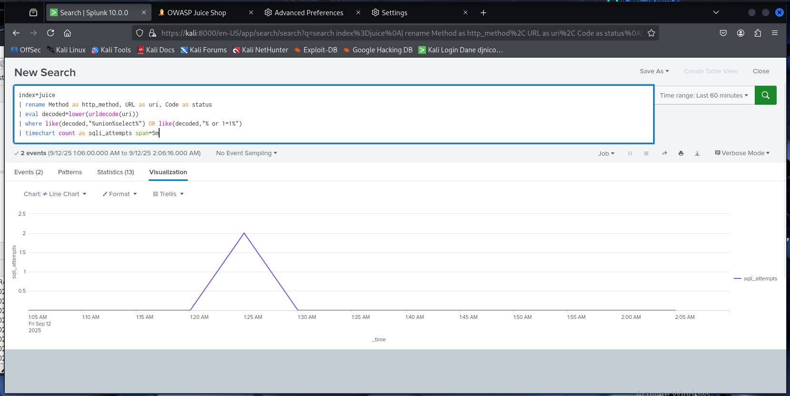

---

## Reports 📊

To summarize activity, I created reports showing:

* **Attack type distribution (pie chart):** to see which categories of attacks were most frequent.
* **Top Payloads:** to list the most common malicious strings attempted by attackers.
* **Top Targeted Endpoints:** to identify which parts of the application were probed most often.
* **Top Source Hosts:** to show which client hosts generated the most malicious requests.

These reports help analysts quickly understand the scope and focus of an attack campaign even without drilling into raw logs.

---

## Dashboard 📈

The dashboard consolidated all findings into a single view for an analyst. It included:

* Pie chart of attack types
* SQLi timechart
* Password spraying timechart
* Top payloads
* Top hosts

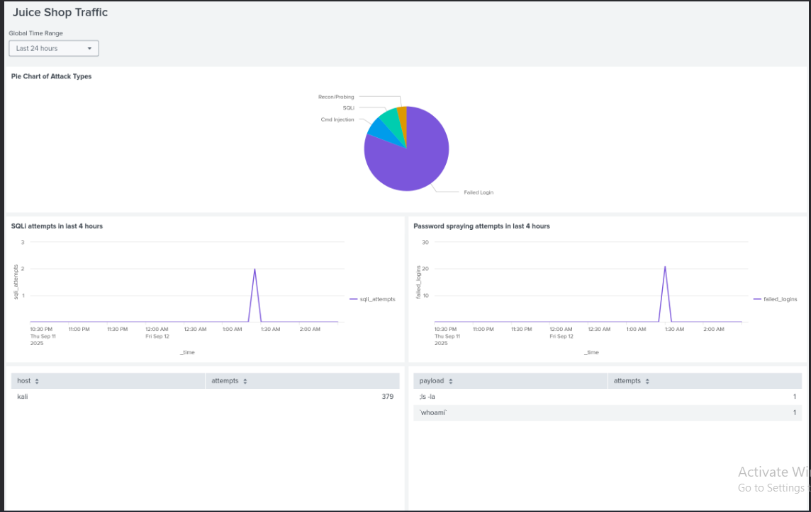

---

## Scheduled Alert 🔔

Finally, I configured a scheduled alert to detect password spraying. The SPL checks for more than 20 failed logins from a single source in a 10-minute window. This alert ensures that brute-force activity is automatically flagged.

```spl
index=juice
| eval decoded=lower(urldecode(urldecode(URL)))
| where like(decoded,"%/rest/user/login%") AND Code IN (401,403)
| eval src=coalesce(clientip, host)
| bin _time span=10m
| stats count AS failed_logins by src, _time
| where failed_logins >= 20
```

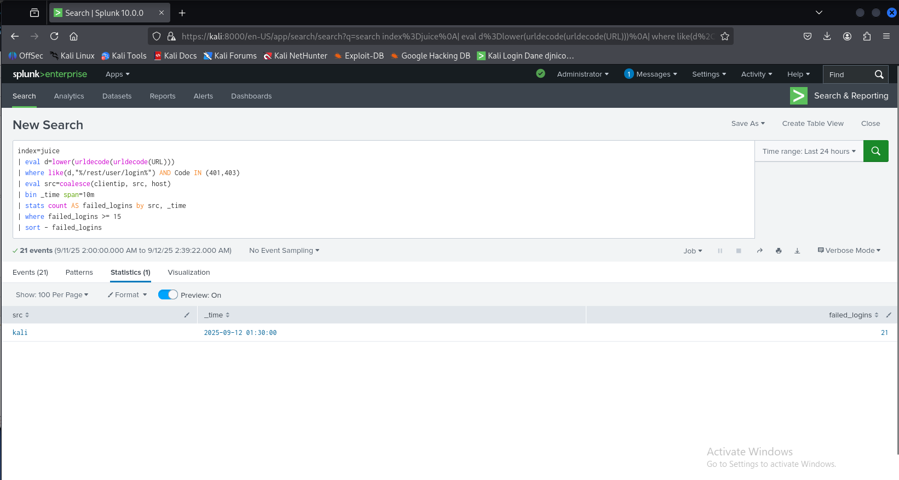
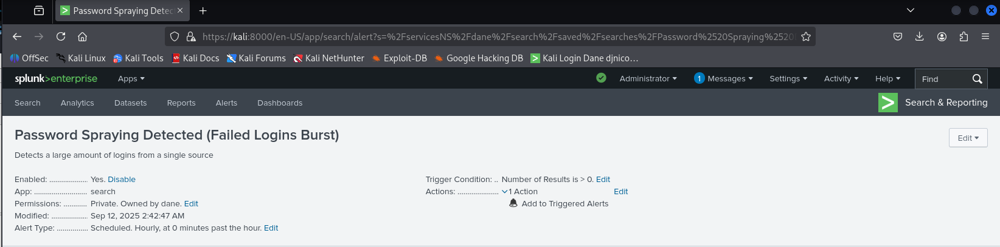

---

## Conclusion ✅

This walkthrough demonstrated a complete analyst workflow:

* Ingest web application traffic into Splunk
* Detect common web attacks (SQLi, traversal, spraying, command injection)
* Visualize trends over time with timecharts
* Summarize activity using reports
* Consolidate detections into a dashboard
* Configure a scheduled alert for password spraying

**Outcome:** A repeatable SOC analyst workflow for analyzing and responding to web application attack traffic.
