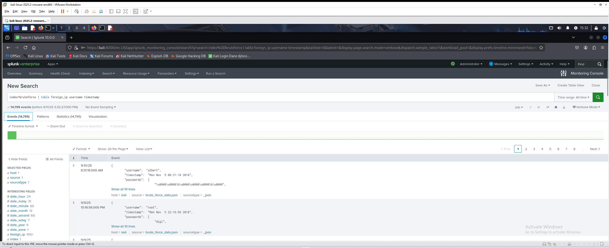
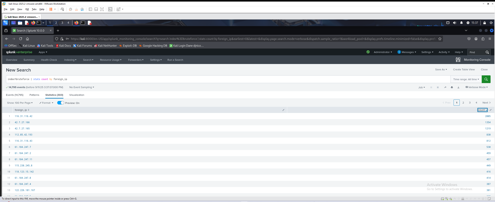
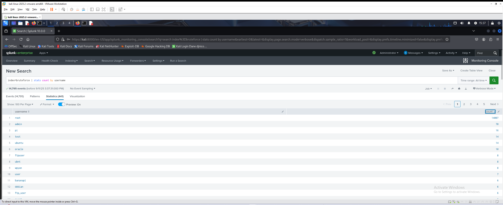
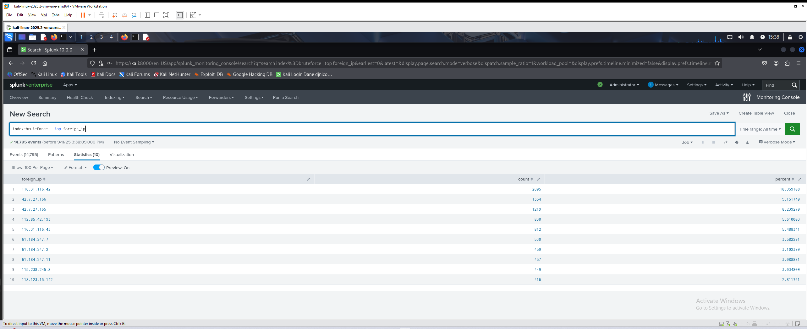
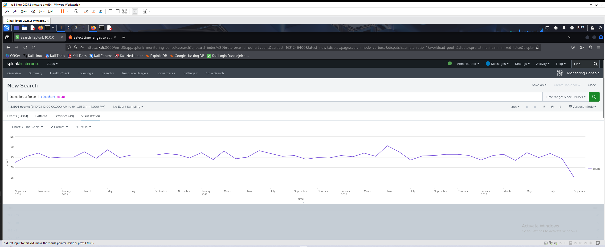
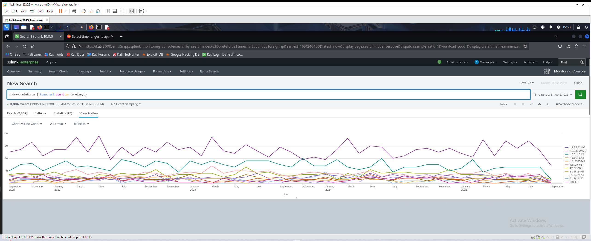
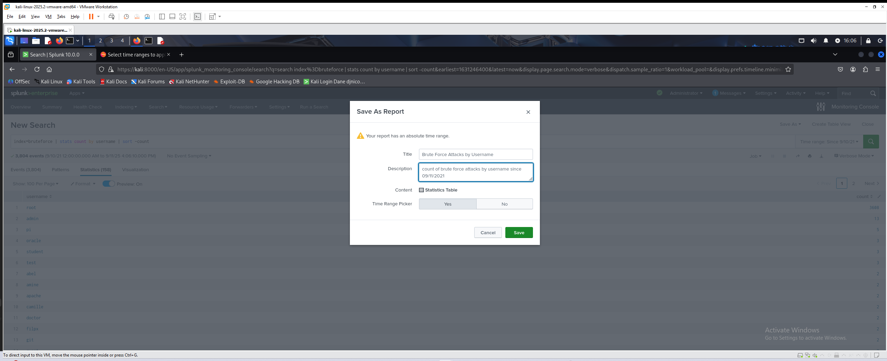
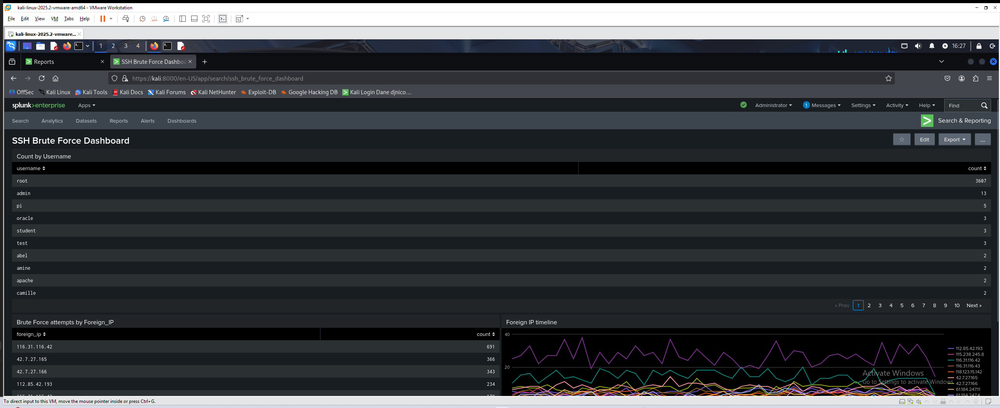
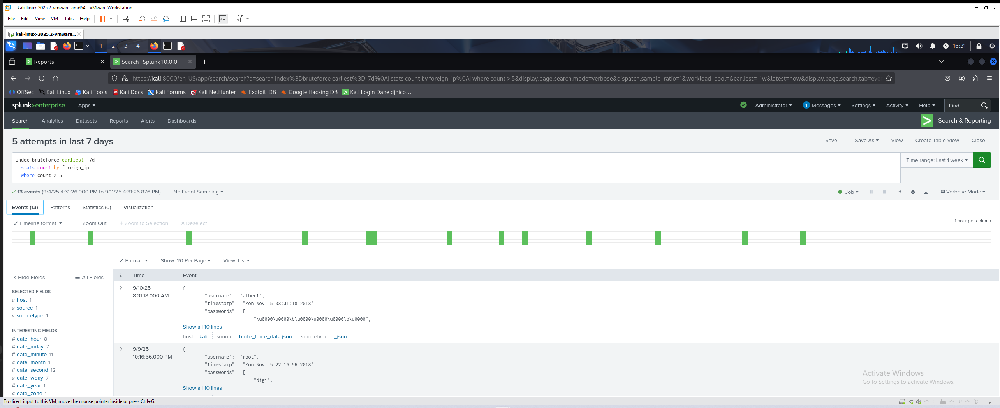
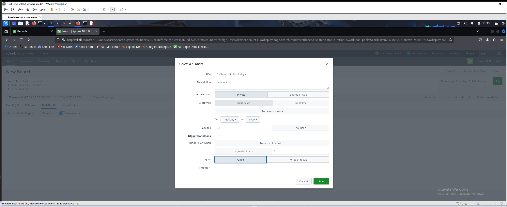

# Splunk Walkthrough 1 — SSH Brute Force Detection 🛡️

[← Back to Splunk Labs](README.md) · [← Back to Portfolio](../README.md)

---

## Overview

**Scenario:** Detect and analyze SSH brute force attempts using Splunk
**Type:** SIEM / Detection Engineering
**Focus:** Field extraction, SPL queries, dashboards, alerting

---

## My Process

### 1) Data Ingestion

I uploaded the **`brute_force_data.json`** dataset (from Kaggle) into Splunk.

* Set the **sourcetype** to `_json`
* Created a new index named **`bruteforce`**
* Verified the dataset was ingested successfully



---

### 2) Field Verification

I confirmed Splunk parsed the key fields:

* `foreign_ip` → attacker IP
* `username` → targeted account
* `timestamp` → time of event

I used the following search to view the fields:

```spl
index=bruteforce | table foreign_ip username timestamp
```


---

### 3) Basic Counts

I generated **summary statistics** to identify the most common attacker IPs and targeted usernames.

#### Count by IP

```spl
index=bruteforce | stats count by foreign_ip | sort - count
```


#### Count by Username

```spl
index=bruteforce | stats count by username | sort - count
```



#### Top IPs (quick command)

```spl
index=bruteforce | top foreign_ip
```



---

### 4) Time-Based Analysis

I analyzed brute force activity trends over time.

#### Total Attempts Over Time

```spl
index=bruteforce earliest=09/11/2021:00:00:00 | timechart count
```



#### Attempts Grouped by IP

```spl
index=bruteforce earliest=09/11/2021:00:00:00 | timechart count by foreign_ip
```



---

### 5) Reports

I converted SPL queries into **saved reports** for easier reuse and scheduling. Example:
**Brute Force Attacks by Username** report.



---

### 6) Dashboard Creation

I created an **SSH Brute Force Dashboard** with the following panels:

* **Panel 1:** Count by Username
* **Panel 2:** Count by IP
* **Panel 3:** Foreign IP Timeline



---

### 7) Scheduled Alert

To automate detection, I built a **scheduled alert** to fire if an IP exceeds a weekly threshold.

#### SPL Query

```spl
index=bruteforce earliest=-7d
| stats count by foreign_ip
| where count > 50
```

* Runs daily (last 7 days)
* Triggers if any IP exceeds **50 attempts**




---

## Key Findings

* Successfully ingested and indexed JSON dataset in Splunk
* Verified parsing of attacker IP, username, and timestamp fields
* Built SPL searches to analyze SSH brute force attempts
* Created **reports** and a **dashboard** for visualization
* Configured a **scheduled alert** to automate detection

---

## Skills Demonstrated

* Splunk data ingestion & index management
* SPL query building (`stats`, `top`, `timechart`)
* Report creation and dashboard design
* Alert configuration and automated detection
* Practical brute force activity analysis

---

[← Back to Splunk Labs](README.md) · [← Back to Portfolio](../README.md)
