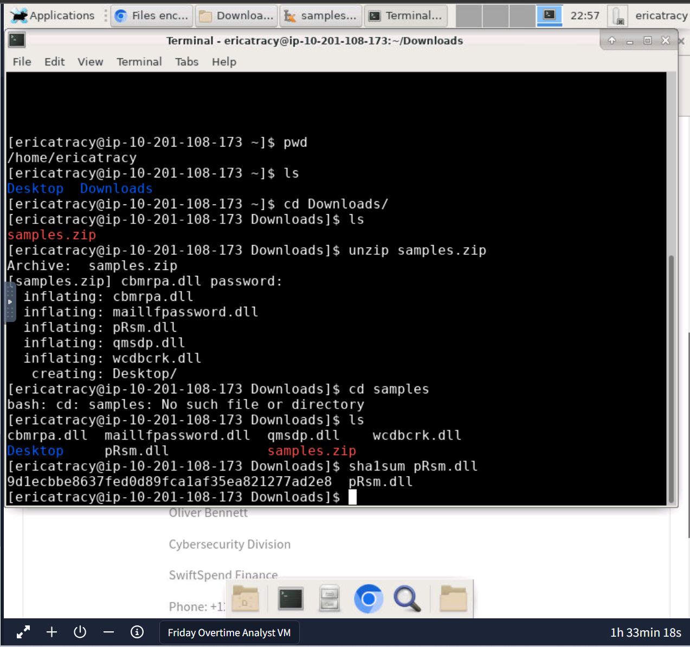
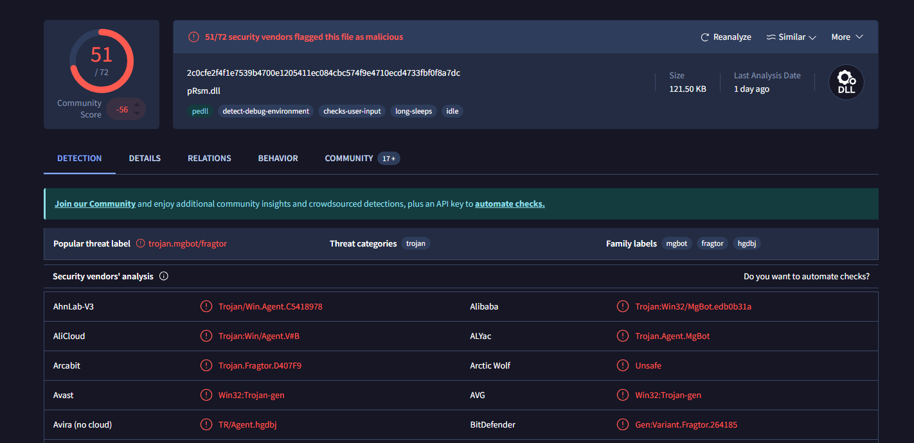
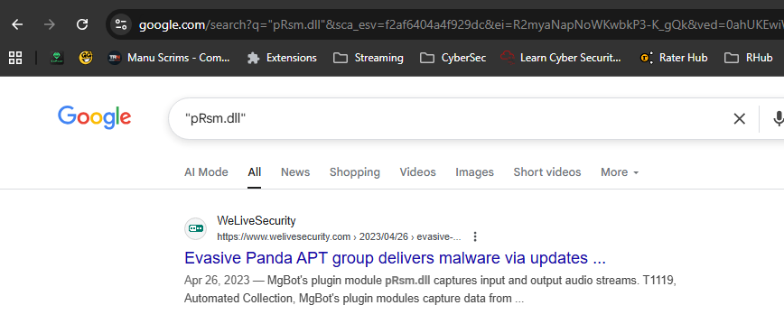
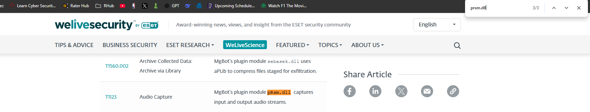
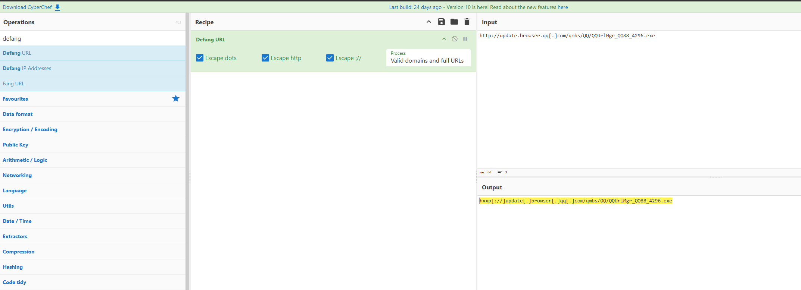
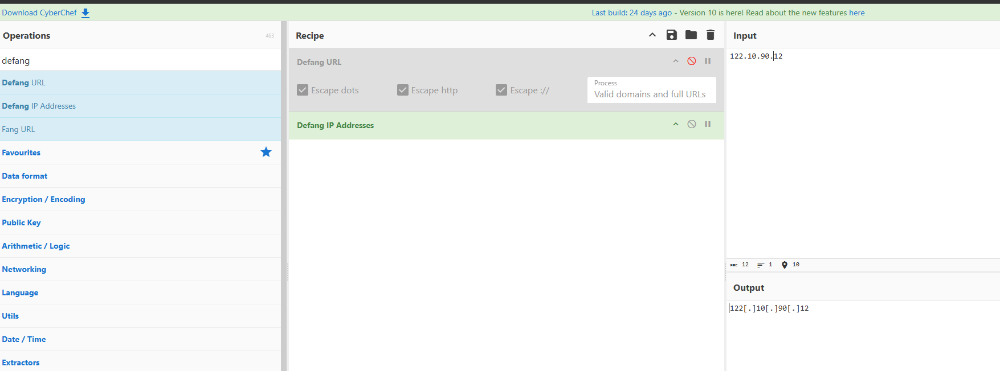
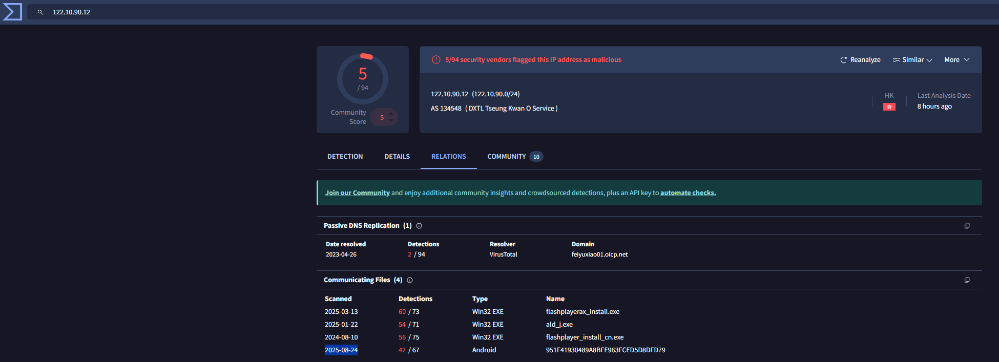
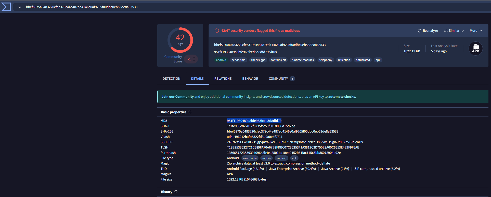

# TryHackMe — Friday Overtime 🕵️‍♂️

[← Back to TryHackMe Labs](README.md) · [← Back to Portfolio](../README.md)

---

## Overview
**Room:** [Friday Overtime](https://tryhackme.com/r/room/fridayovertime)  
**Type:** Cyber Threat Intelligence / Malware Analysis  
**Difficulty:** Intermediate  

---

## My Process

### 1. Connecting to the VM & Extracting Files
The exercise began with connecting to the provided VM and logging into the **DocIntel platform** using supplied credentials. Once inside, I worked within the Linux terminal to navigate and extract files. Some of the commands I used included:

- `pwd` — to check the present working directory  
- `ls` — to list files in the directory  
- `cd` — to change into directories  
- `unzip samples.zip` — to extract the suspicious archive provided  
- `sha1sum pRsm.dll` — to generate the SHA1 hash of the suspicious DLL file  

This showcased my ability to work confidently with the command line, navigating directories and performing essential analysis tasks.



---

### 2. Investigating the Hash with VirusTotal
After generating the SHA1 hash of the suspicious DLL (`9d1ecbbe8637fed0d89fca1af35ea821277ad2e8`), I copied it from the VM and uploaded it to **VirusTotal**. This provided valuable information on detection rates across multiple AV vendors and confirmed the file was malicious.



---

### 3. Identifying the Malware Framework
To go further, I used advanced Google search techniques to look for specific mentions of the suspicious DLL file. This led me to a report from **WeLiveSecurity**, which detailed how the file was linked to the **MgBot malware framework** and noted its association with the **Evasive Panda APT group**.



From this research, I confirmed that the DLL was indeed tied to the MgBot framework and used in attacks attributed to the Evasive Panda APT group.

---

### 4. MITRE ATT&CK Mapping
Correlating data with MITRE ATT&CK revealed the relevant technique:

```
T1123 — Audio Capture
```

This showed that the DLL was capable of capturing audio streams from infected systems, linking the observed activity to a well-documented adversary tactic.



---

### 5. IOC Enrichment with CyberChef
Using **CyberChef**, I defanged URLs and IPs for safe reporting:

- Malicious URL (2020-11-02):  
  ```
  hxxp[://]update[.]browser[.]qq[.]com/qmbs/QQ/QQUrlMgr_QQ88_4296[.]exe
  ```

- C2 Server IP (2020-09-14):  
  ```
  122[.]10[.]90[.]12
  ```



---

### 6. VirusTotal Intelligence
Pivoting on the C2 IP in **VirusTotal** revealed further connections, including **SpyAgent spyware** targeting Android devices. I reviewed the Relations tab to find associated communicating files and extracted the SHA1 hash of the Android spyware:

```
1c1fe906e822012f6235fcc53f601d006d15d7be
```

This confirmed how the same infrastructure was linked to multiple malware families, expanding the threat intelligence picture.




---

### 7. Final Reporting
All findings were compiled into an intelligence report for the fictional company (**SwiftSpend Finance**) to support mitigation and recovery recommendations.



---

## Key Takeaways
- Demonstrated **command-line proficiency** for file handling, extraction, and hashing  
- Practiced **threat hunting workflow**: sample extraction → hashing → framework attribution → IOC enrichment  
- Used **CyberChef** to safely handle indicators  
- Mapped real-world malware artifacts to **MITRE ATT&CK**  
- Applied **OSINT tools** (VirusTotal, WeLiveSecurity research) to correlate evidence  

---

## Skills Demonstrated
- Incident response & malware triage  
- Threat intelligence analysis  
- IOC handling & defanging  
- CyberChef, VirusTotal, and MITRE ATT&CK integration  
- Clear reporting and documentation

---

[← Back to TryHackMe Labs](README.md) · [← Back to Portfolio](../README.md)
