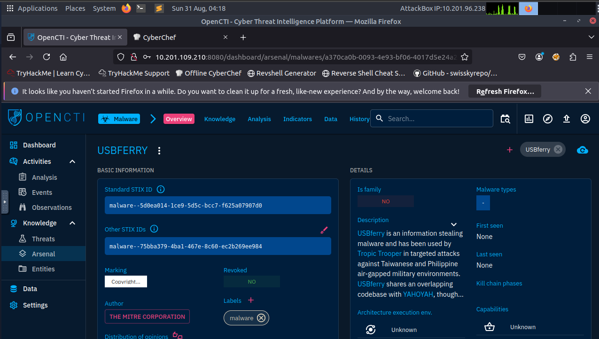
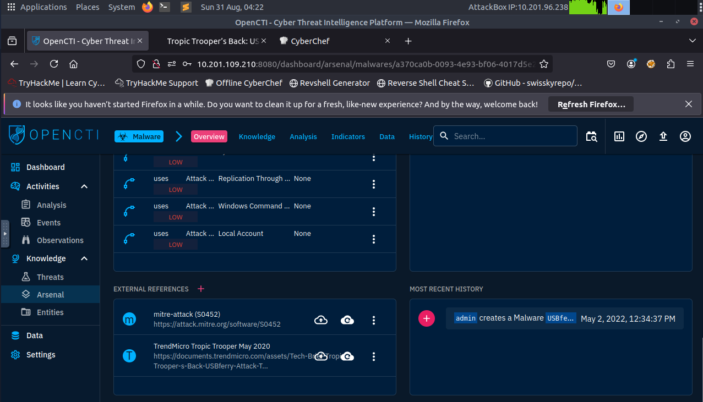
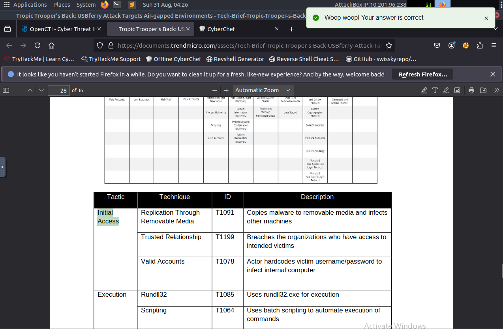
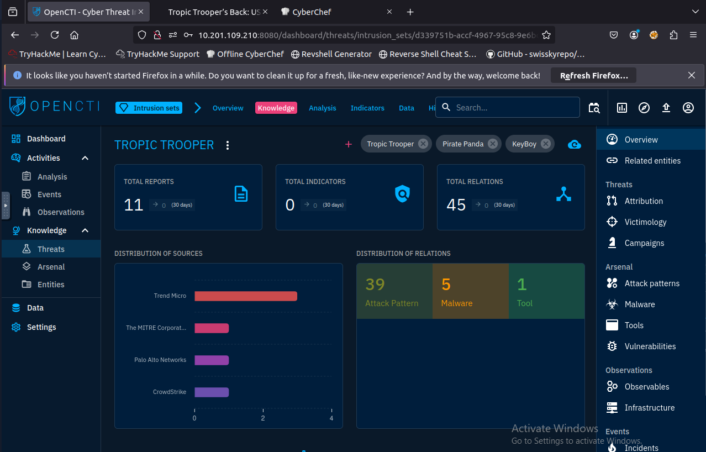
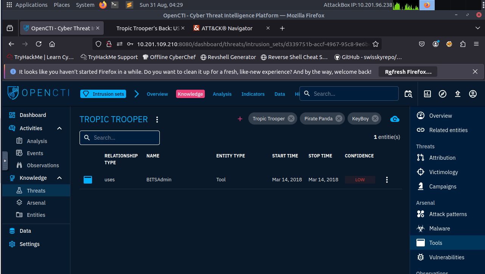
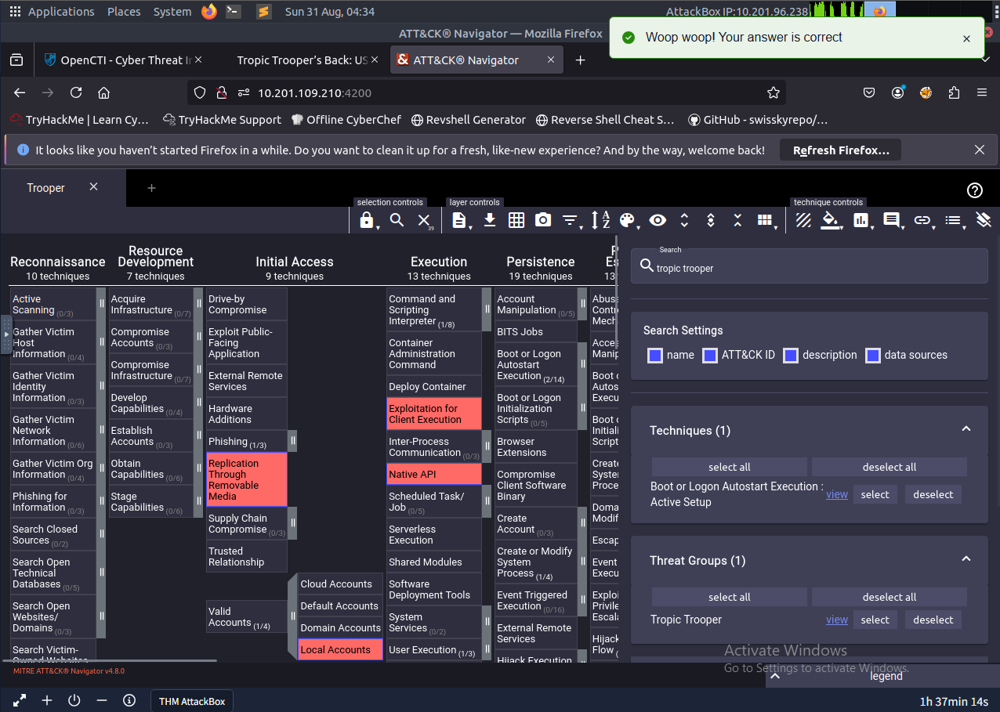
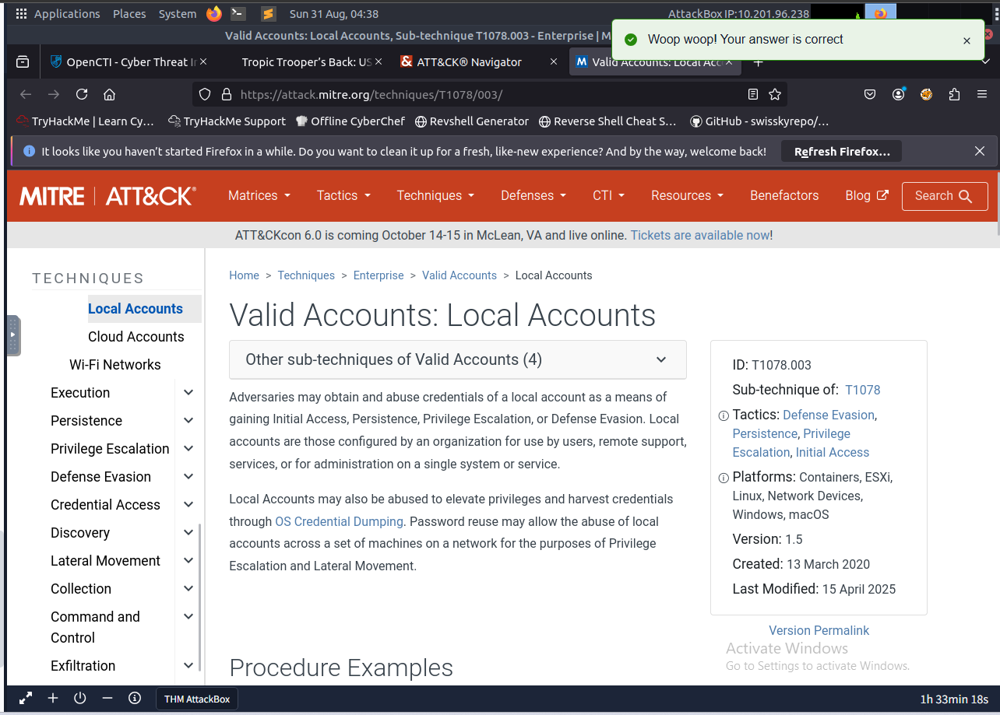
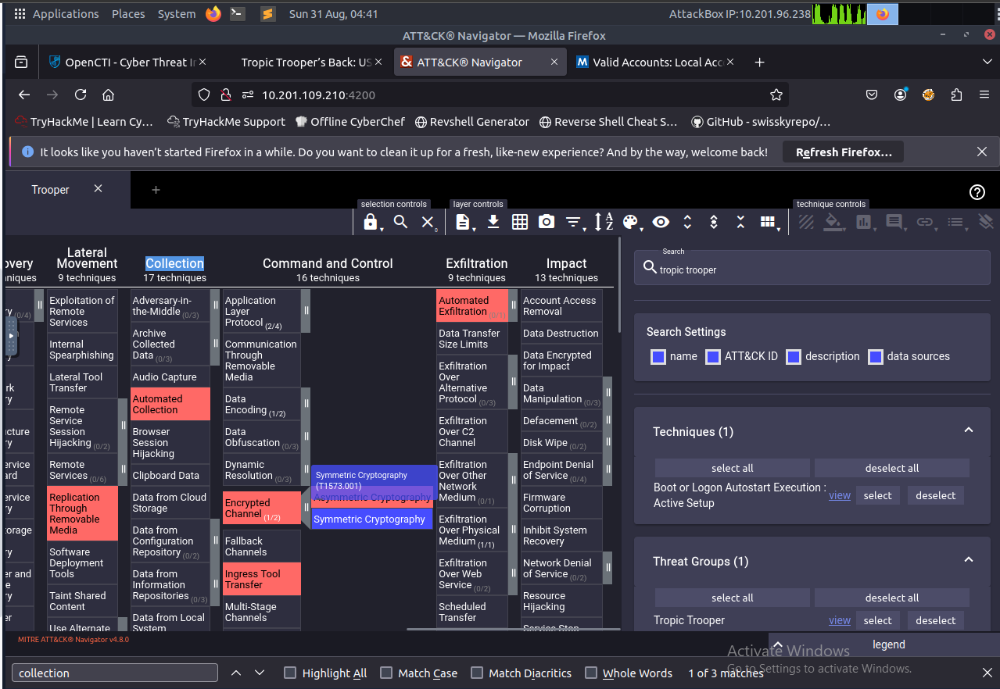

# APT Case Study — Tropic Trooper (USBFerry) 🛡️

## Overview
**Actor:** Tropic Trooper (aka KeyBoy)  
**Malware:** USBFerry  
**Type:** Cyber Threat Intelligence (CTI) / Threat Actor Research  
**Focus:** Initial Access, Malware Usage, ATT&CK Mapping  

---

## My Process

### 1) Review the provided report
Read and analyzed the provided report on the APT; learned they use **phishing** and a malware named **USBFerry**.

---

### 2) OpenCTI lookup for USBFerry (STIX ID)
Used **OpenCTI** to search for more information about the malware and found the **STIX ID** of the malware.

---

### 3) Extra resource → Initial Access tactic
After further reading the OpenCTI page, I found an **extra resource** that identified the **initial access tactic** used by the actor.

---

### 4) Group details: 39 attack patterns & related tool
Next, I found more information about the APT, including that they have **39 different attack patterns** and details about a **related tool**.

---

### 5) MITRE ATT&CK Navigator: more techniques/tactics
I searched through **MITRE ATT&CK Navigator** to find more techniques and tactics commonly associated with the APT. One interesting finding: they use another **initial access** technique named **Local Accounts**.

---

### 6) Tactics that the technique falls under
I then identified **all of the tactics** that this technique falls under.

---

### 7) Collection tactic
Lastly, I found the **Collection** tactic used by the APT.

---

## Key Findings
- Tropic Trooper leverages **spear-phishing emails** for initial access.  
- At least **39 documented attack patterns**; relationships to additional tools.  
- **Local Accounts** appears as another initial access approach in Navigator.  
- The group’s activity spans multiple **MITRE ATT&CK tactics**, including **Automated Collection**.

---

## Skills Demonstrated
- **Open Source Intelligence Gathering**
- **CTI enrichment** (OpenCTI, external resources)  
- **ATT&CK mapping** with Navigator  
- **Structured documentation** with evidence and references
