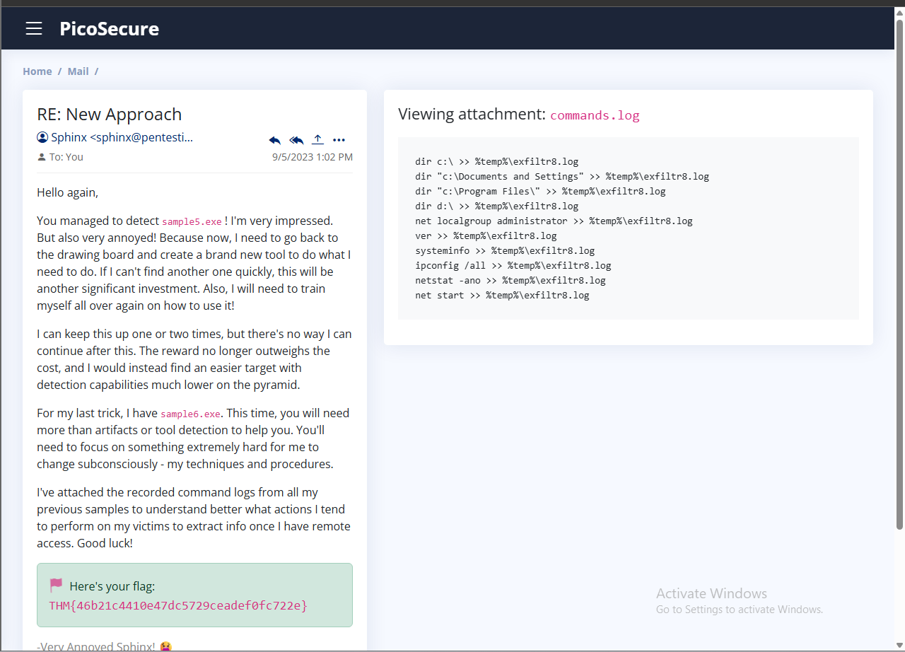

# TryHackMe: Summit Room

[← Back to TryHackMe Labs](README.md) · [← Back to Portfolio](../README.md)

---

## 🔎 Overview
The **Summit** room on TryHackMe follows the **Pyramid of Pain** model, where each stage of the challenge requires detecting and blocking adversary activity using progressively stronger indicators.  
This exercise simulated a **purple team scenario**: an adversary executing malware samples on a workstation while I configured security controls to detect and prevent them.  
I completed all stages, from hash-based detection to building Sigma rules for advanced indicators.

---

### 🧩 Stage 1: Hash-Based Detection
**Process**
1. Submitted `sample1.exe` to the malware sandbox.  

  

2. Retrieved the **SHA256 hash** of the malicious file.  
3. Added the hash to the blocklist using the **Manage Hashes** panel.  

  

4. Earned the flag, which showed that the protections were successful.  

**Key Skills:** Malware sandboxing, hash-based detection  

---

### 🧩 Stage 2: IP Blocking
**Process**
1. Submitted `sample2.exe` for analysis.  

  

  
 
2. Observed network traffic pointing to malicious IP `154.35.10.113`.
3. Created a firewall **egress rule** to block outbound connections to that IP. 

  

4. Earned the flag, which showed that the protections were successful.    

**Key Skills:** Firewall management, egress filtering, network-based detection  

---

### 🧩 Stage 3: DNS Filtering
**Process**
1. Analyzed `sample3.exe` behavior in the sandbox.

  

  
 
2. Identified a suspicious domain (`emudyn.bresonicz.info`).  
3. Configured a **DNS Filter rule** to block the malicious domain.  

  

  
 
4. Verified detection and received the corresponding flag.  

**Key Skills:** DNS analysis, domain blocking, detection engineering  

---

### 🧩 Stage 4: Registry Monitoring with Sigma
**Process**
1. Executed `sample4.exe` and reviewed behavior analysis.  

  

  
 
2. Observed **Windows Defender real-time protection disabled** via registry modification.  
3. Built a **Sigma rule** targeting changes to:  

  

  
 

  

  
 
4. Earned the flag, which showed that the protections were successful.    

**Key Skills:** Sigma rules, Sysmon event logs, MITRE ATT&CK mapping  

---

### 🧩 Stage 5: Outgoing Connections Log
**Process**
1. Reviewed the provided `outgoing_connections.log` file.  

  

  
 

  

  
 
2. Identified repeated connections to IP `51.102.10.19` every 30 minutes over port 443 with fixed packet sizes.  
3. Created a **custom Sigma rule** to detect this pattern in Sysmon event logs.  

  

  

4. Successfully blocked the activity and confirmed the flag.  

**Key Skills:** Log analysis, Sigma rule building, traffic pattern detection  

---

### 🧩 Stage 6: Command and File Exfiltration
**Process**
1. Analyzed `commands.log` output from the adversary malware.  

  

  
 
2. Detected suspicious file creation: `%temp%\exfiltr8.log`.  

  

  
 
3. Built a **Sigma rule** for file creation events pointing to `%temp%` directory with filename `exfiltr8.log`.  
4. Mapped the detection to **MITRE ATT&CK Exfiltration (TA0010)**.  

  

  
 
5. Earned the flag, which showed that the protections were successful.  

**Key Skills:** File activity monitoring, exfiltration detection, ATT&CK alignment  

---

## 🛠 Skills & Tools Used
- **Malware Sandbox** – dynamic malware analysis  
- **Firewall Manager** – egress IP blocking  
- **DNS Filter** – domain-based blocking  
- **Sigma Rule Builder** – custom detection engineering  
- **Sysmon Event Logs** – registry, connection, and file activity monitoring  
- **MITRE ATT&CK Framework** – mapped detections to TTPs  

---

## 📌 Key Takeaways
- Learned how to escalate defenses along the **Pyramid of Pain**, from simple hashes to behavioral rules.  
- Built hands-on experience with **Sigma rule creation** for registry, network, and file activity.  
- Reinforced practical SOC skills in **log analysis, malware detection, and adversary simulation**.  
- Gained confidence in **detection engineering** to counter evolving threats.  

---

[← Back to TryHackMe Labs](README.md) · [← Back to Portfolio](../README.md)
